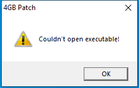

---
title: 4gb_patch.exe | 4gb_patch
excerpt: What is 4gb_patch.exe?
---

# 4gb_patch.exe 

* File Path: `C:\Program Files (x86)\MediaMonkey\4gb_patch.exe`
* Description: 4gb_patch

## Screenshot

## Hashes

Type | Hash
-- | --
MD5 | `96490CFDF3C7DD5AE7EF378C689A8734`
SHA1 | `A9CF666E845CD8448259AA50BB4F5B559CA9C053`
SHA256 | `980BF5EB62D30C749E5FBF7593E9D25094A4D849A959AA2B7B3FC979B1C93B5A`
SHA384 | `85F75BA8B595E56F0FBE9D92F0102A93FFFCD8E7C3C9F12711ED79A61A744473358AEF23E3C3F7C93EEDF34A22179B41`
SHA512 | `7024F7447B1F0F6213C1ECF6F2CBB6B21E2FD9CE107D3EE1B8850C0C56EE7839ABE601029576C6FBBADB62A3CC56460B14F66A1054B28440A8EEB102A991C5E9`
SSDEEP | `768:KVPnnByGt57EhDssh60dEDS2An7poavRofE0D94PY/kC:MPBRtj8Hz7xvN0Dnh`
IMP | `23B1501A82FE975981E4093441B84D51`
PESHA1 | `22F7B8804F832E7F5C549AF7B2117773DD0F413A`
PE256 | `561411CDED4697622EC820777E4CA8FFBEEBDDD1F8D519FA870D59AB75E4EB23`

## Runtime Data

### Window Title:
4GB Patch

### Open Handles:

Path | Type
-- | --
(R-D)   C:\Windows\Fonts\StaticCache.dat | File
(RW-)   C:\Windows | File
(RW-)   C:\Windows\WinSxS\x86_microsoft.windows.common-controls_6595b64144ccf1df_5.82.19041.488_none_89e6152f0b32762e | File
(RW-)   C:\xCyclopedia | File
\BaseNamedObjects\NLS_CodePage_1252_3_2_0_0 | Section
\BaseNamedObjects\NLS_CodePage_437_3_2_0_0 | Section
\Sessions\1\Windows\Theme2547664911 | Section
\Windows\Theme3854699184 | Section

### Loaded Modules:

Path |
-- |
C:\Program Files (x86)\MediaMonkey\4gb_patch.exe |
C:\Windows\SYSTEM32\ntdll.dll |
C:\Windows\System32\wow64.dll |
C:\Windows\System32\wow64cpu.dll |
C:\Windows\System32\wow64win.dll |

## Signature

* Status: The file C:\Program Files (x86)\MediaMonkey\4gb_patch.exe is not digitally signed. You cannot run this script on the current system. For more information about running scripts and setting execution policy, see about_Execution_Policies at https:/go.microsoft.com/fwlink/?LinkID=135170
* Serial: ``
* Thumbprint: ``
* Issuer: 
* Subject: 

## File Metadata

* Original Filename: 4gb_patch.exe
* Product Name: 4gb_patch
* Company Name: 
* File Version: 1, 0, 0, 1
* Product Version: 1, 0, 0, 1
* Language: English
* Legal Copyright:  2007 Daniel Pistelli.  All rights reserved.
* Machine Type: 32-bit

## File Scan

* VirusTotal Detections: 0/67
* VirusTotal Link: https://www.virustotal.com/gui/file/980bf5eb62d30c749e5fbf7593e9d25094a4d849a959aa2b7b3fc979b1c93b5a/detection/

MIT License. Copyright (c) 2020-2021 Strontic.

