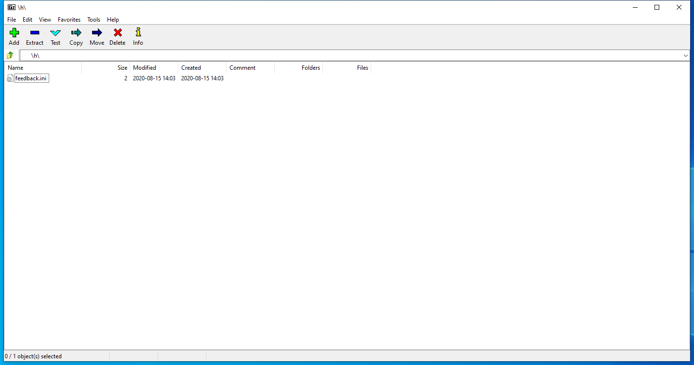

---
title: 7zFM.exe | 7-Zip File Manager
---

# 7zFM.exe 

* File Path: `C:\program files\7-Zip\7zFM.exe`
* Description: 7-Zip File Manager

## Screenshot

## Hashes

Type | Hash
-- | --
MD5 | `C8F40F25F783A52262BDAEDEB5555427`
SHA1 | `E45E198607C8D7398745BAA71780E3E7A2F6DECA`
SHA256 | `E81B44EE7381AE3B630488B6FB7E3D9FFBDD9AC3032181D4CCAAFF3409B57316`
SHA384 | `96E86C676587BAD143F3D7C0167C95BDF6D0C9BF3BCC607120F781CEAA1FFBC5E1A3E2F64B3163377BCE95072F075DA4`
SHA512 | `F5944743F54028EB1DD0F2D68468726B177D33185324DA0DA96CDD20768BAB4CA2E507AE9157B2733FD6240C920B7E15A5F5B9F284EE09D0FD385FC895B97191`
SSDEEP | `12288:9pnF6Ee+Rp4tqkWjQ+iOklku0/04gNphgBBO75nONT3vx2zVP:nZe0p4Ek4niOkl/A04szE87JKTvm`

## Runtime Data

### Window Title:
C:\Users\user\Documents\

### Open Handles:

Path | Type
-- | --
(R-D)   C:\Windows\Fonts\StaticCache.dat | File
(RW-)   C:\Users\user\Documents | File
(RW-)   C:\Windows\WinSxS\amd64_microsoft.windows.common-controls_6595b64144ccf1df_6.0.19041.1_none_b555e41d4684ddec | File
(RWD)   C:\Users\user\AppData\Local\Microsoft\Windows\Explorer\iconcache_16.db | File
(RWD)   C:\Users\user\AppData\Local\Microsoft\Windows\Explorer\iconcache_32.db | File
(RWD)   C:\Users\user\AppData\Local\Microsoft\Windows\Explorer\iconcache_idx.db | File
(RWD)   C:\Users\user\Documents | File
\BaseNamedObjects\__ComCatalogCache__ | Section
\BaseNamedObjects\NLS_CodePage_1252_3_2_0_0 | Section
\BaseNamedObjects\NLS_CodePage_437_3_2_0_0 | Section
\BaseNamedObjects\windows_shell_global_counters | Section
\Sessions\1\BaseNamedObjects\1c64HWNDInterface:d0442 | Section
\Sessions\1\BaseNamedObjects\windows_shell_global_counters | Section
\Sessions\1\Windows\Theme4048709601 | Section
\Windows\Theme603176458 | Section

### Loaded Modules:

Path |
-- |
C:\program files\7-Zip\7zFM.exe |
C:\Windows\System32\ADVAPI32.dll |
C:\Windows\System32\bcryptPrimitives.dll |
C:\Windows\System32\combase.dll |
C:\Windows\System32\comdlg32.dll |
C:\Windows\System32\GDI32.dll |
C:\Windows\System32\gdi32full.dll |
C:\Windows\System32\IMM32.DLL |
C:\Windows\SYSTEM32\kernel.appcore.dll |
C:\Windows\System32\KERNEL32.DLL |
C:\Windows\System32\KERNELBASE.dll |
C:\Windows\System32\MSCTF.dll |
C:\Windows\System32\msvcp_win.dll |
C:\Windows\System32\msvcrt.dll |
C:\Windows\SYSTEM32\ntdll.dll |
C:\Windows\System32\ole32.dll |
C:\Windows\System32\OLEAUT32.dll |
C:\Windows\System32\RPCRT4.dll |
C:\Windows\System32\sechost.dll |
C:\Windows\System32\shcore.dll |
C:\Windows\System32\SHELL32.dll |
C:\Windows\System32\SHLWAPI.dll |
C:\Windows\SYSTEM32\SspiCli.dll |
C:\Windows\System32\ucrtbase.dll |
C:\Windows\System32\USER32.dll |
C:\Windows\system32\uxtheme.dll |
C:\Windows\System32\win32u.dll |
C:\Windows\WinSxS\amd64_microsoft.windows.common-controls_6595b64144ccf1df_6.0.19041.1_none_b555e41d4684ddec\COMCTL32.dll |

## Signature

* Status: The file C:\program files\7-Zip\7zFM.exe is not digitally signed. You cannot run this script on the current system. For more information about running scripts and setting execution policy, see about_Execution_Policies at https:/go.microsoft.com/fwlink/?LinkID=135170
* Serial: ``
* Thumbprint: ``
* Issuer: 
* Subject: 

## File Metadata

* Original Filename: 7zFM.exe
* Product Name: 7-Zip
* Company Name: Igor Pavlov
* File Version: 19.00
* Product Version: 19.00
* Language: English (United States)
* Legal Copyright: Copyright (c) 1999-2018 Igor Pavlov

MIT License. Copyright (c) 2020 Strontic.

