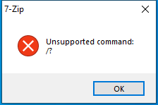

---
title: 7zG.exe | 7-Zip GUI
excerpt: What is 7zG.exe?
---

# 7zG.exe 

* File Path: `C:\program files\7-Zip\7zG.exe`
* Description: 7-Zip GUI

## Screenshot

## Hashes

Type | Hash
-- | --
MD5 | `04FB3AE7F05C8BC333125972BA907398`
SHA1 | `DF22612647E9404A515D48EBAD490349685250DE`
SHA256 | `2FB898BACB587F2484C9C4AA6DA2729079D93D1F923A017BB84BEEF87BF74FEF`
SHA384 | `36D15D1236B44BCB06CCB2C3BAB4F446789A1C0358F21FC5F109E4F9EE0BC2623CC92F4866BB7CAA33309B89BF4B2315`
SHA512 | `94C164A0B884C939ECE30F5038D07B756702998D46786F9F613FBEA2EB30BED4BC19A409F347BB4CC565898473B18155D580B453683223BEAF30ED4079C251B2`
SSDEEP | `12288:Gaplw9U+qMi8CtdVldusIh6BBHCHrKZXCktSzIzWpX5:9YTqMi8CtBd2QHCHmTBW5`

## Runtime Data

### Window Title:
7-Zip

### Open Handles:

Path | Type
-- | --
(R-D)   C:\Windows\Fonts\StaticCache.dat | File
(R-D)   C:\Windows\SystemResources\imageres.dll.mun | File
(RW-)   C:\Users\user\Documents | File
(RW-)   C:\Windows\WinSxS\amd64_microsoft.windows.common-controls_6595b64144ccf1df_6.0.19041.1_none_b555e41d4684ddec | File
\BaseNamedObjects\NLS_CodePage_1252_3_2_0_0 | Section
\BaseNamedObjects\NLS_CodePage_437_3_2_0_0 | Section
\Sessions\1\Windows\Theme4048709601 | Section
\Windows\Theme603176458 | Section

### Loaded Modules:

Path |
-- |
C:\program files\7-Zip\7zG.exe |
C:\Windows\System32\ADVAPI32.dll |
C:\Windows\System32\bcryptPrimitives.dll |
C:\Windows\System32\combase.dll |
C:\Windows\System32\comdlg32.dll |
C:\Windows\System32\GDI32.dll |
C:\Windows\System32\gdi32full.dll |
C:\Windows\System32\IMM32.DLL |
C:\Windows\SYSTEM32\kernel.appcore.dll |
C:\Windows\System32\KERNEL32.DLL |
C:\Windows\System32\KERNELBASE.dll |
C:\Windows\System32\MSCTF.dll |
C:\Windows\System32\msvcp_win.dll |
C:\Windows\System32\msvcrt.dll |
C:\Windows\SYSTEM32\ntdll.dll |
C:\Windows\System32\ole32.dll |
C:\Windows\System32\OLEAUT32.dll |
C:\Windows\System32\RPCRT4.dll |
C:\Windows\System32\sechost.dll |
C:\Windows\System32\shcore.dll |
C:\Windows\System32\SHELL32.dll |
C:\Windows\System32\SHLWAPI.dll |
C:\Windows\SYSTEM32\TextShaping.dll |
C:\Windows\System32\ucrtbase.dll |
C:\Windows\System32\USER32.dll |
C:\Windows\system32\uxtheme.dll |
C:\Windows\System32\win32u.dll |
C:\Windows\WinSxS\amd64_microsoft.windows.common-controls_6595b64144ccf1df_6.0.19041.1_none_b555e41d4684ddec\COMCTL32.dll |

## Signature

* Status: The file C:\program files\7-Zip\7zG.exe is not digitally signed. You cannot run this script on the current system. For more information about running scripts and setting execution policy, see about_Execution_Policies at https:/go.microsoft.com/fwlink/?LinkID=135170
* Serial: ``
* Thumbprint: ``
* Issuer: 
* Subject: 

## File Metadata

* Original Filename: 7zg.exe
* Product Name: 7-Zip
* Company Name: Igor Pavlov
* File Version: 19.00
* Product Version: 19.00
* Language: English (United States)
* Legal Copyright: Copyright (c) 1999-2018 Igor Pavlov

MIT License. Copyright (c) 2020 Strontic.

