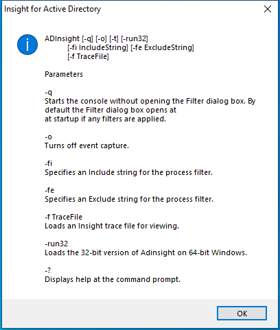

---
title: ADInsight.exe | Active directory LDAP monitor
excerpt: What is ADInsight.exe?
---

# ADInsight.exe 

* File Path: `C:\SysinternalsSuite\ADInsight.exe`
* Description: Active directory LDAP monitor

## Screenshot

## Hashes

Type | Hash
-- | --
MD5 | `B2E3416A5ABF9BD84FAB03989A629E7E`
SHA1 | `0642DD6A0F3666818451F1FC8A3BA5666FCC456C`
SHA256 | `032DC03FA3E7B3DF5714AEA96DDACC0DA1E4D41EF4D24DE2F2103AD03932F194`
SHA384 | `EFC45C836183E04ECE31EE97D383F397DEE51E6EEEC4F72330DAC470A7BAF32AA379C5B5EBB04D4FAC8727D5E9C390C8`
SHA512 | `03DB411F5119DB262B0585FE2D95E62076C108D0F6E98F5331ECE3E8CDBA4D7212EDB25806EEE82EC53519E13654C7E1DFA57422F1156D04E3A051AF0E45DEC0`
SSDEEP | `98304:bpMVnSOMfCs0753075I+nSOMfCs0753075I6:MnSFfC575E757nSFfC575E75L`
IMP | `EF7FAEB241D64D8161D20AA03B76E1CB`
PESHA1 | `7067D98AFFFA949228893D7B8B954FFB8C42F997`
PE256 | `8DFF94227C3A0A7DAB47082BFC7065DE57566456C999AB72CD69085A82C1A8B5`

## Runtime Data

### Child Processes:
ADInsight64.EXE

### Window Title:
Insight for Active Directory

### Open Handles:

Path | Type
-- | --
(R-D)   C:\Windows\System32\en-US\propsys.dll.mui | File
(RW-)   C:\Windows | File
(RW-)   C:\Windows\WinSxS\x86_microsoft.windows.common-controls_6595b64144ccf1df_6.0.19041.488_none_11b1e5df2ffd8627 | File
(RW-)   C:\Windows\WinSxS\x86_microsoft.windows.gdiplus_6595b64144ccf1df_1.1.19041.508_none_429cdbca8a8ffa94 | File
(RW-)   C:\xCyclopedia | File
\BaseNamedObjects\__ComCatalogCache__ | Section
\BaseNamedObjects\C:\*ProgramData\*Microsoft\*Windows\*Caches\*{6AF0698E-D558-4F6E-9B3C-3716689AF493}.2.ver0x0000000000000002.db | Section
\BaseNamedObjects\C:\*ProgramData\*Microsoft\*Windows\*Caches\*{DDF571F2-BE98-426D-8288-1A9A39C3FDA2}.2.ver0x0000000000000002.db | Section
\BaseNamedObjects\C:\*ProgramData\*Microsoft\*Windows\*Caches\*cversions.2 | Section
\BaseNamedObjects\NLS_CodePage_1252_3_2_0_0 | Section
\BaseNamedObjects\NLS_CodePage_437_3_2_0_0 | Section
\BaseNamedObjects\windows_shell_global_counters | Section
\Sessions\1\BaseNamedObjects\UrlZonesSM_user | Section
\Sessions\1\BaseNamedObjects\windows_shell_global_counters | Section

### Loaded Modules:

Path |
-- |
C:\SysinternalsSuite\ADInsight.exe |
C:\Windows\SYSTEM32\ntdll.dll |
C:\Windows\System32\wow64.dll |
C:\Windows\System32\wow64cpu.dll |
C:\Windows\System32\wow64win.dll |

## Signature

* Status: Signature verified.
* Serial: `3300000187721772155940C709000000000187`
* Thumbprint: `2485A7AFA98E178CB8F30C9838346B514AEA4769`
* Issuer: CN=Microsoft Code Signing PCA 2011, O=Microsoft Corporation, L=Redmond, S=Washington, C=US
* Subject: CN=Microsoft Corporation, O=Microsoft Corporation, L=Redmond, S=Washington, C=US

## File Metadata

* Original Filename: ADInsight
* Product Name: ADInsight
* Company Name: Sysinternals - www.sysinternals.com
* File Version: 1.20
* Product Version: 1.20
* Language: English (United States)
* Legal Copyright: Copyright  2007-2015 Mark Russinovich
* Machine Type: 32-bit

## File Scan

* VirusTotal Detections: 0/71
* VirusTotal Link: https://www.virustotal.com/gui/file/032dc03fa3e7b3df5714aea96ddacc0da1e4d41ef4d24de2f2103ad03932f194/detection/

MIT License. Copyright (c) 2020 Strontic.

