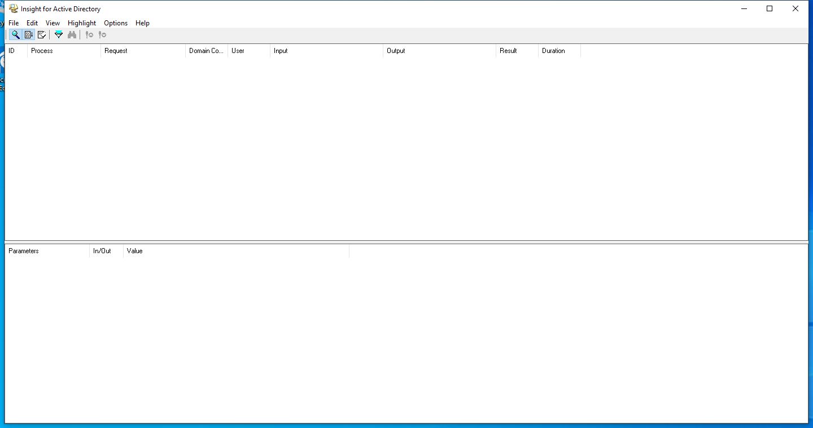

---
title: ADInsight64.exe | Active directory LDAP monitor
excerpt: What is ADInsight64.exe?
---

# ADInsight64.exe 

* File Path: `C:\SysinternalsSuite\ADInsight64.exe`
* Description: Active directory LDAP monitor

## Screenshot

## Hashes

Type | Hash
-- | --
MD5 | `2F646FCC13C2C392C4AF2F2D83A08A25`
SHA1 | `9AC5FAAE7DE79CE79CC4D8DACC078B37C7EC8874`
SHA256 | `38FF6BCB91BD6CBCEEC26BC60007C60031D9F35181FBAE851BD239F361CF38DB`
SHA384 | `D3E19D4C6F5B0350ACFD2AA42D4647E46BFC37153FD00D683807842056DBA43C9D708DFA9A2375C5457CFF07BA3BC323`
SHA512 | `2FE323F45990398CD7BCA29C43E53611C45D08AE4F146BAE6AFD978D1C5EE8F4C5945C146866362E474D9E3D6F2E5C4741AEA8D446A157469BF2D7424B5DBE3C`
SSDEEP | `24576:euUSd9wKpW9E/Cs5MfCG1PooH0oxc5lhH0oxc5l:+SXwKpW9E/BMfCG910om5lF0om5l`
IMP | `96BE6F87D95D39CDB2D6514D1AE9484B`
PESHA1 | `994A86613EC9AADA4856510AE9852E4387EACD3F`
PE256 | `76FCAB4BEEC34F0230AA32D469FDC36173F6AF9DC1C2F49FD3AC35A01466413A`

## Runtime Data

### Window Title:
Insight for Active Directory

### Open Handles:

Path | Type
-- | --
(R-D)   C:\Windows\Fonts\StaticCache.dat | File
(RW-)   C:\Windows\WinSxS\amd64_microsoft.windows.common-controls_6595b64144ccf1df_6.0.19041.488_none_ca04af081b815d21 | File
(RW-)   C:\xCyclopedia | File
\BaseNamedObjects\NLS_CodePage_1252_3_2_0_0 | Section
\BaseNamedObjects\NLS_CodePage_437_3_2_0_0 | Section
\Sessions\1\BaseNamedObjects\AdmonTraceBuffers | Section
\Sessions\1\Windows\Theme2036293991 | Section
\Windows\Theme1324212991 | Section

### Loaded Modules:

Path |
-- |
C:\SysinternalsSuite\ADInsight64.exe |
C:\Windows\System32\ADVAPI32.dll |
C:\Windows\System32\combase.dll |
C:\Windows\System32\COMDLG32.dll |
C:\Windows\System32\GDI32.dll |
C:\Windows\System32\gdi32full.dll |
C:\Windows\System32\IMM32.DLL |
C:\Windows\System32\KERNEL32.DLL |
C:\Windows\System32\KERNELBASE.dll |
C:\Windows\System32\msvcp_win.dll |
C:\Windows\System32\msvcrt.dll |
C:\Windows\SYSTEM32\ntdll.dll |
C:\Windows\System32\OLEAUT32.dll |
C:\Windows\System32\RPCRT4.dll |
C:\Windows\System32\sechost.dll |
C:\Windows\System32\shcore.dll |
C:\Windows\System32\SHELL32.dll |
C:\Windows\System32\SHLWAPI.dll |
C:\Windows\System32\ucrtbase.dll |
C:\Windows\System32\USER32.dll |
C:\Windows\SYSTEM32\VERSION.dll |
C:\Windows\System32\win32u.dll |
C:\Windows\System32\WS2_32.dll |
C:\Windows\WinSxS\amd64_microsoft.windows.common-controls_6595b64144ccf1df_6.0.19041.488_none_ca04af081b815d21\COMCTL32.dll |

## Signature

* Status: Signature verified.
* Serial: `3300000187721772155940C709000000000187`
* Thumbprint: `2485A7AFA98E178CB8F30C9838346B514AEA4769`
* Issuer: CN=Microsoft Code Signing PCA 2011, O=Microsoft Corporation, L=Redmond, S=Washington, C=US
* Subject: CN=Microsoft Corporation, O=Microsoft Corporation, L=Redmond, S=Washington, C=US

## File Metadata

* Original Filename: ADInsight
* Product Name: ADInsight
* Company Name: Sysinternals - www.sysinternals.com
* File Version: 1.20
* Product Version: 1.20
* Language: English (United States)
* Legal Copyright: Copyright  2007-2015 Mark Russinovich
* Machine Type: 64-bit

## File Scan

* VirusTotal Detections: 0/69
* VirusTotal Link: https://www.virustotal.com/gui/file/38ff6bcb91bd6cbceec26bc60007c60031d9f35181fbae851bd239f361cf38db/detection/

MIT License. Copyright (c) 2020 Strontic.

