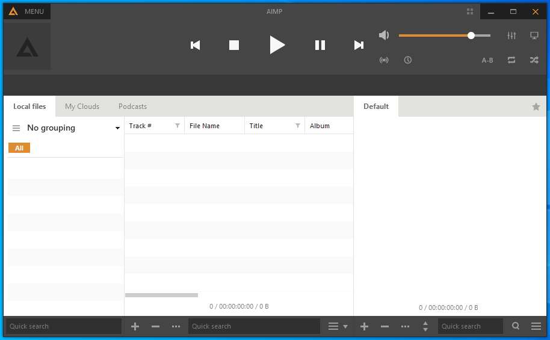

---
title: AIMP.exe | AIMP
excerpt: What is AIMP.exe?
---

# AIMP.exe 

* File Path: `C:\Program Files (x86)\AIMP3\AIMP.exe`
* Description: AIMP
* Comments: Made in Russia

## Screenshot

## Hashes

Type | Hash
-- | --
MD5 | `7C24BE8CDFD77852E65B1A072C754100`
SHA1 | `4F6B9C6ABD5BAF92B35E761DA5F5CFC429C593BF`
SHA256 | `BF35A3B7CAD7790FE0D1F2F7E47FF91150A346656BD14C52E49AFB44B08692F3`
SHA384 | `3FB84E77EA4AE1FA209ADF76EFBBE18D25184D3370079FFBE11199090D5B2CBAAB316053500C9349CF6D1646D853584F`
SHA512 | `A9098A37B03E3C0EB06B648E8A10888A8757D5873484094C4C18408B736B536B59B9C67280FDBB218BE3F6B13A1D97BE3BFE87CD6D46DE7BD2A483CF84F3EA6D`
SSDEEP | `49152:xNyaaT7eoaWVv/k8hpyJQ/0S9wjD0iCTL:nyaaTJyQ/0q`
IMP | `852319CC2898396DCA12C412EFF0065F`
PESHA1 | `9B051E8B5A61FC5E92A00710E62BA44999216F5D`
PE256 | `50A1D29776136A73CA663361E702060E0B8A0CD792C5E579A1E9F04D44E79D8C`

## Runtime Data

### Window Title:
AIMP

### Open Handles:

Path | Type
-- | --
(R-D)   C:\Windows\Fonts\StaticCache.dat | File
(R-D)   C:\Windows\System32\en-US\kernel32.dll.mui | File
(R-D)   C:\Windows\System32\en-US\KernelBase.dll.mui | File
(R-D)   C:\Windows\SysWOW64\en-US\user32.dll.mui | File
(R-D)   C:\Windows\WinSxS\x86_microsoft.windows.c..-controls.resources_6595b64144ccf1df_6.0.19041.1_en-us_130e63d987a738df\comctl32.dll.mui | File
(RW-)   C:\Users\user\AppData\Roaming\AIMP\AudioLibrary\Podcasts.db | File
(RW-)   C:\Users\user\AppData\Roaming\AIMP\CDDB.db | File
(RW-)   C:\Windows | File
(RW-)   C:\Windows\WinSxS\x86_microsoft.windows.c..-controls.resources_6595b64144ccf1df_6.0.19041.1_en-us_130e63d987a738df | File
(RW-)   C:\Windows\WinSxS\x86_microsoft.windows.common-controls_6595b64144ccf1df_6.0.19041.488_none_11b1e5df2ffd8627 | File
(RW-)   C:\Windows\WinSxS\x86_microsoft.windows.gdiplus_6595b64144ccf1df_1.1.19041.508_none_429cdbca8a8ffa94 | File
(RW-)   C:\xCyclopedia | File
\BaseNamedObjects\__ComCatalogCache__ | Section
\BaseNamedObjects\C:\*ProgramData\*Microsoft\*Windows\*Caches\*{6AF0698E-D558-4F6E-9B3C-3716689AF493}.2.ver0x0000000000000003.db | Section
\BaseNamedObjects\C:\*ProgramData\*Microsoft\*Windows\*Caches\*{DDF571F2-BE98-426D-8288-1A9A39C3FDA2}.2.ver0x0000000000000002.db | Section
\BaseNamedObjects\C:\*ProgramData\*Microsoft\*Windows\*Caches\*cversions.2 | Section
\BaseNamedObjects\NLS_CodePage_1252_3_2_0_0 | Section
\BaseNamedObjects\NLS_CodePage_437_3_2_0_0 | Section
\BaseNamedObjects\windows_shell_global_counters | Section
\Sessions\1\BaseNamedObjects\1eb8HWNDInterface:240362 | Section
\Sessions\1\BaseNamedObjects\1eb8HWNDInterface:2b027c | Section
\Sessions\1\BaseNamedObjects\1eb8HWNDInterface:390218 | Section
\Sessions\1\BaseNamedObjects\1eb8HWNDInterface:3d035c | Section
\Sessions\1\BaseNamedObjects\1eb8HWNDInterface:440360 | Section
\Sessions\1\BaseNamedObjects\1eb8HWNDInterface:5f02c8 | Section
\Sessions\1\BaseNamedObjects\1eb8HWNDInterface:6902b0 | Section
\Sessions\1\BaseNamedObjects\1eb8HWNDInterface:8e03c0 | Section
\Sessions\1\BaseNamedObjects\AIMP:KeyboardHookShare | Section
\Sessions\1\BaseNamedObjects\AIMP:MouseHookShare | Section
\Sessions\1\BaseNamedObjects\AIMP2_RemoteInfo | Section
\Sessions\1\BaseNamedObjects\SessionImmersiveColorPreference | Section
\Sessions\1\BaseNamedObjects\TAIMPCOREATOM:AIMP.EXE | Section
\Sessions\1\BaseNamedObjects\windows_shell_global_counters | Section
\Sessions\1\Windows\Theme2547664911 | Section
\Windows\Theme3854699184 | Section

### Loaded Modules:

Path |
-- |
C:\Program Files (x86)\AIMP3\AIMP.exe |
C:\Windows\SYSTEM32\ntdll.dll |
C:\Windows\System32\wow64.dll |
C:\Windows\System32\wow64cpu.dll |
C:\Windows\System32\wow64win.dll |

## Signature

* Status: Signature verified.
* Serial: `192DAF9B87C9EB436FEEB4F6`
* Thumbprint: `3B2311AD9C090BFF0BEFB91BCD5B9AE298A72F6F`
* Issuer: CN=GlobalSign CodeSigning CA - SHA256 - G3, O=GlobalSign nv-sa, C=BE
* Subject: E=support@aimp.ru, CN=IP Izmaylov Artem Andreevich, O=IP Izmaylov Artem Andreevich, L=Tula, S=Tula Oblast, C=RU

## File Metadata

* Original Filename: 
* Product Name: AIMP
* Company Name: AIMP DevTeam
* File Version: 4.70.2227.0
* Product Version: 4.70.2227.0
* Language: Russian (Russia)
* Legal Copyright: Artem Izmaylov
* Machine Type: 32-bit

## File Scan

* VirusTotal Detections: 0/71
* VirusTotal Link: https://www.virustotal.com/gui/file/bf35a3b7cad7790fe0d1f2f7e47ff91150a346656bd14c52e49afb44b08692f3/detection/

## File Similarity (ssdeep match)

File | Score
-- | --
[C:\program files (x86)\AIMP3\AIMP.exe](AIMP.exe-3FE9AEF9058944849CC180868B6370B2.md) | 40

MIT License. Copyright (c) 2020-2021 Strontic.

