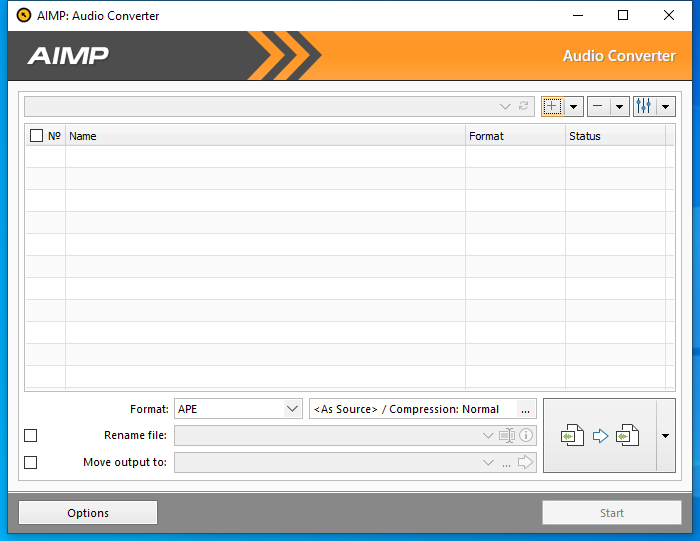

---
title: AIMPac.exe | AIMP Audio Converter
excerpt: What is AIMPac.exe?
---

# AIMPac.exe 

* File Path: `C:\Program Files (x86)\AIMP3\AIMPac.exe`
* Description: AIMP Audio Converter
* Comments: Made in Russia

## Screenshot

## Hashes

Type | Hash
-- | --
MD5 | `6A88C3AE48F7B8E1EC64F944C7D9BD26`
SHA1 | `FD91EE82CCC241F4A6D85B5A5D969525408192DA`
SHA256 | `3BC7C1D8CF4BFCD70392566A3ACBCB890148D06B6157A7F84A0A40D3ABC1C999`
SHA384 | `54C106A1E7B144EFE84C411F011B85E59C8BB5AE353A009877134C7CDFE2FED00601405068E4AAF3D326C9781CB9D474`
SHA512 | `AB80AD003048F3DC6BCBE6D70590833770D213F5165E801160AD813A092167E115F64E89F534735EC979DAD5BD2D895EB3F200E5C03DCBBC059F8D32C45FF6F1`
SSDEEP | `6144:bc71EF0Dw4Cx0sseFsYSCl/N9Efr1w7eHjcKekDFFuPQSjziMin:A71Vf3edNIfJwigK0PQ8OFn`
IMP | `12908E327E33CAB9DDABF63D8264F419`
PESHA1 | `31404E1B88CE9CCEA903E78FE4B1117667BC6BD4`
PE256 | `B5B6BE78CA60A0833CFBE84D45A2F04551000FD7ED2451AB9599482A15E7D359`

## Runtime Data

### Window Title:
AIMP: Audio Converter

### Open Handles:

Path | Type
-- | --
(R-D)   C:\Windows\Fonts\StaticCache.dat | File
(R-D)   C:\Windows\System32\en-US\kernel32.dll.mui | File
(R-D)   C:\Windows\System32\en-US\KernelBase.dll.mui | File
(R-D)   C:\Windows\SysWOW64\en-US\user32.dll.mui | File
(R-D)   C:\Windows\WinSxS\x86_microsoft.windows.c..-controls.resources_6595b64144ccf1df_6.0.19041.1_en-us_130e63d987a738df\comctl32.dll.mui | File
(RW-)   C:\Users\user\AppData\Roaming\AIMP\CDDB.db | File
(RW-)   C:\Windows | File
(RW-)   C:\Windows\WinSxS\x86_microsoft.windows.c..-controls.resources_6595b64144ccf1df_6.0.19041.1_en-us_130e63d987a738df | File
(RW-)   C:\Windows\WinSxS\x86_microsoft.windows.common-controls_6595b64144ccf1df_6.0.19041.488_none_11b1e5df2ffd8627 | File
(RW-)   C:\Windows\WinSxS\x86_microsoft.windows.gdiplus_6595b64144ccf1df_1.1.19041.508_none_429cdbca8a8ffa94 | File
(RW-)   C:\xCyclopedia | File
\BaseNamedObjects\__ComCatalogCache__ | Section
\BaseNamedObjects\NLS_CodePage_1252_3_2_0_0 | Section
\BaseNamedObjects\NLS_CodePage_437_3_2_0_0 | Section
\Sessions\1\BaseNamedObjects\16b8HWNDInterface:6204b0 | Section
\Sessions\1\BaseNamedObjects\AIMP:KeyboardHookShare | Section
\Sessions\1\BaseNamedObjects\TAIMPCOREATOM:AIMPAC.EXE | Section
\Sessions\1\BaseNamedObjects\windows_shell_global_counters | Section
\Sessions\1\Windows\Theme2547664911 | Section
\Windows\Theme3854699184 | Section

### Loaded Modules:

Path |
-- |
C:\Program Files (x86)\AIMP3\AIMPac.exe |
C:\Windows\SYSTEM32\ntdll.dll |
C:\Windows\System32\wow64.dll |
C:\Windows\System32\wow64cpu.dll |
C:\Windows\System32\wow64win.dll |

## Signature

* Status: Signature verified.
* Serial: `192DAF9B87C9EB436FEEB4F6`
* Thumbprint: `3B2311AD9C090BFF0BEFB91BCD5B9AE298A72F6F`
* Issuer: CN=GlobalSign CodeSigning CA - SHA256 - G3, O=GlobalSign nv-sa, C=BE
* Subject: E=support@aimp.ru, CN=IP Izmaylov Artem Andreevich, O=IP Izmaylov Artem Andreevich, L=Tula, S=Tula Oblast, C=RU

## File Metadata

* Original Filename: 
* Product Name: AIMP
* Company Name: AIMP DevTeam
* File Version: 4.70.2227.0
* Product Version: 4.70.2227.0
* Language: Russian (Russia)
* Legal Copyright: Artem Izmaylov
* Machine Type: 32-bit

## File Scan

* VirusTotal Detections: 0/71
* VirusTotal Link: https://www.virustotal.com/gui/file/3bc7c1d8cf4bfcd70392566a3acbcb890148d06b6157a7f84a0a40d3abc1c999/detection/

## File Similarity (ssdeep match)

File | Score
-- | --
[C:\program files (x86)\AIMP3\AIMPac.exe](AIMPac.exe-61DEC6119BE50C6A8188768952A05B09.md) | 88

MIT License. Copyright (c) 2020-2021 Strontic.

