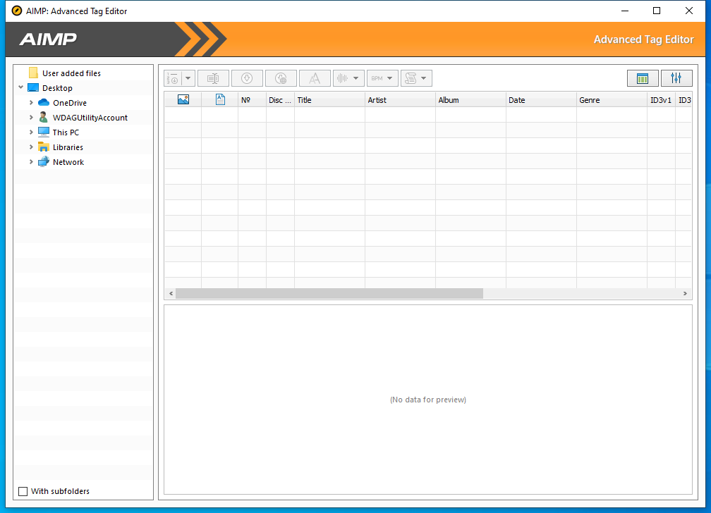

---
title: AIMPate.exe | AIMP Advanced Tag Editor
excerpt: What is AIMPate.exe?
---

# AIMPate.exe 

* File Path: `C:\Program Files (x86)\AIMP3\AIMPate.exe`
* Description: AIMP Advanced Tag Editor
* Comments: Made in Russia

## Screenshot

## Hashes

Type | Hash
-- | --
MD5 | `890D5BEFAC508E3105DAE8AB33D88079`
SHA1 | `5D12920BD2CBEF71262A7635BD0DBFD61C303C68`
SHA256 | `11842061E886834D86B21B8E09053E7E5D1F20C274FAB5908F7D6FDAA7350581`
SHA384 | `24E675EA94C2AE46E006DF9ABA8531F656220DC6BA725E1AE139F26354719A5293F108577FFEB6B26A2FE4D320084101`
SHA512 | `96870D5D3E8CA4283BFFF6E0F00F568359484A31367FEBB3A6E3F00504C9EE18FE41E332968595498E3530244F0AAEA3A4159CB5AFC828B09C30FEF663F1E215`
SSDEEP | `6144:7BJtqQnuoFZcifehjX3m0o8cqZ4sRaTWxtmcGTFjUWDoaVjwjc4hMvekDgH5wSrO:9JtqhYatWGcqvkWucPW1hwglvW5wzPgi`
IMP | `A322EEBE38D3EDD75D39EE52A979D71E`
PESHA1 | `3CE08DC33C51B1B7859ADD30B4A98B3F82780DB3`
PE256 | `FAE0A515DB80C0A416B1BD370BD40CBE8BAFC5F66BA72785E9B8B23A053090E5`

## Runtime Data

### Window Title:
AIMP: Advanced Tag Editor

### Open Handles:

Path | Type
-- | --
(R-D)   C:\Windows\Fonts\StaticCache.dat | File
(R-D)   C:\Windows\System32\en-US\kernel32.dll.mui | File
(R-D)   C:\Windows\System32\en-US\KernelBase.dll.mui | File
(R-D)   C:\Windows\System32\en-US\propsys.dll.mui | File
(R-D)   C:\Windows\System32\en-US\windows.storage.dll.mui | File
(R-D)   C:\Windows\SysWOW64\en-US\user32.dll.mui | File
(R-D)   C:\Windows\WinSxS\x86_microsoft.windows.c..-controls.resources_6595b64144ccf1df_6.0.19041.1_en-us_130e63d987a738df\comctl32.dll.mui | File
(RW-)   C:\Users\user\AppData\Roaming\AIMP\CDDB.db | File
(RW-)   C:\Windows | File
(RW-)   C:\Windows\WinSxS\x86_microsoft.windows.c..-controls.resources_6595b64144ccf1df_6.0.19041.1_en-us_130e63d987a738df | File
(RW-)   C:\Windows\WinSxS\x86_microsoft.windows.common-controls_6595b64144ccf1df_6.0.19041.488_none_11b1e5df2ffd8627 | File
(RW-)   C:\Windows\WinSxS\x86_microsoft.windows.gdiplus_6595b64144ccf1df_1.1.19041.508_none_429cdbca8a8ffa94 | File
(RW-)   C:\xCyclopedia | File
(RWD)   C:\Users\user\AppData\Local\Microsoft\Windows\Explorer\iconcache_16.db | File
(RWD)   C:\Users\user\AppData\Local\Microsoft\Windows\Explorer\iconcache_32.db | File
(RWD)   C:\Users\user\AppData\Local\Microsoft\Windows\Explorer\iconcache_idx.db | File
\BaseNamedObjects\__ComCatalogCache__ | Section
\BaseNamedObjects\C:\*ProgramData\*Microsoft\*Windows\*Caches\*{6AF0698E-D558-4F6E-9B3C-3716689AF493}.2.ver0x0000000000000003.db | Section
\BaseNamedObjects\C:\*ProgramData\*Microsoft\*Windows\*Caches\*{DDF571F2-BE98-426D-8288-1A9A39C3FDA2}.2.ver0x0000000000000002.db | Section
\BaseNamedObjects\C:\*ProgramData\*Microsoft\*Windows\*Caches\*cversions.2 | Section
\BaseNamedObjects\NLS_CodePage_1252_3_2_0_0 | Section
\BaseNamedObjects\NLS_CodePage_437_3_2_0_0 | Section
\BaseNamedObjects\windows_shell_global_counters | Section
\Sessions\1\BaseNamedObjects\10a8HWNDInterface:35033a | Section
\Sessions\1\BaseNamedObjects\AIMP:KeyboardHookShare | Section
\Sessions\1\BaseNamedObjects\TAIMPCOREATOM:AIMPATE.EXE | Section
\Sessions\1\BaseNamedObjects\windows_shell_global_counters | Section
\Sessions\1\Windows\Theme2547664911 | Section
\Windows\Theme3854699184 | Section

### Loaded Modules:

Path |
-- |
C:\Program Files (x86)\AIMP3\AIMPate.exe |
C:\Windows\SYSTEM32\ntdll.dll |
C:\Windows\System32\wow64.dll |
C:\Windows\System32\wow64cpu.dll |
C:\Windows\System32\wow64win.dll |

## Signature

* Status: Signature verified.
* Serial: `192DAF9B87C9EB436FEEB4F6`
* Thumbprint: `3B2311AD9C090BFF0BEFB91BCD5B9AE298A72F6F`
* Issuer: CN=GlobalSign CodeSigning CA - SHA256 - G3, O=GlobalSign nv-sa, C=BE
* Subject: E=support@aimp.ru, CN=IP Izmaylov Artem Andreevich, O=IP Izmaylov Artem Andreevich, L=Tula, S=Tula Oblast, C=RU

## File Metadata

* Original Filename: 
* Product Name: AIMP
* Company Name: AIMP DevTeam
* File Version: 4.70.2227.0
* Product Version: 4.70.2227.0
* Language: Russian (Russia)
* Legal Copyright: Artem Izmaylov
* Machine Type: 32-bit

## File Scan

* VirusTotal Detections: 0/71
* VirusTotal Link: https://www.virustotal.com/gui/file/11842061e886834d86b21b8e09053e7e5d1f20c274fab5908f7d6fdaa7350581/detection/

## File Similarity (ssdeep match)

File | Score
-- | --
[C:\program files (x86)\AIMP3\AIMPate.exe](AIMPate.exe-DD2A31E40DB6381D7C5D1788C5ED1D5B.md) | 94

MIT License. Copyright (c) 2020-2021 Strontic.

