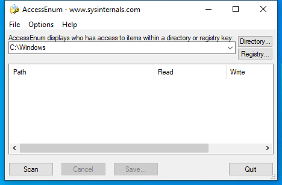

---
title: AccessEnum.exe | AccessEnum
excerpt: What is AccessEnum.exe?
---

# AccessEnum.exe 

* File Path: `C:\SysinternalsSuite\AccessEnum.exe`
* Description: AccessEnum

## Screenshot

## Hashes

Type | Hash
-- | --
MD5 | `F4CD850FDAB64FFBBCC249374BA17F5B`
SHA1 | `90F1ABCBF60E24A03407F049CCF67BC25A945AC5`
SHA256 | `A4CC61F6C7ED716E4622E12B75F05EA17E79A45F0D8BD6855C340A30EC882B47`
SHA384 | `D081B5D2519C65BEB13D65DBC8A009D812AFB9906281C246483D38B6E2D82B6E22A000331CE6D4B492C53BCCDFE72EEB`
SHA512 | `42DAC16B1BCFB9244364820AB4AE9E6DE719C99E70024F1820B80A9EEB049D1C9D90D73FB1045F2459A05A2C5D5A01B265B70489207F88CA06418C768D0CF790`
SSDEEP | `1536:SNxHRK4LGVq5ZrmjZ4KWWdkmVnTA6uv5RwA9YlHaeX:SHs+5ZrmjZ4KXE2sA`
IMP | `83787F51A42290311B4F8E08F0802867`
PESHA1 | `BCE26E0F15489A3245F63BEFAD6DFC6537597636`
PE256 | `46FDD9B2972ECD7A118030693772A9AE56666D0C902BB26D5385CB3A0250124D`

## Runtime Data

### Window Title:
AccessEnum - www.sysinternals.com

### Open Handles:

Path | Type
-- | --
(R-D)   C:\Windows\Fonts\StaticCache.dat | File
(R-D)   C:\Windows\SysWOW64\en-US\user32.dll.mui | File
(RW-)   C:\Windows | File
(RW-)   C:\Windows\WinSxS\x86_microsoft.windows.common-controls_6595b64144ccf1df_6.0.19041.488_none_11b1e5df2ffd8627 | File
(RW-)   C:\xCyclopedia | File
\BaseNamedObjects\NLS_CodePage_1252_3_2_0_0 | Section
\BaseNamedObjects\NLS_CodePage_437_3_2_0_0 | Section
\Sessions\1\Windows\Theme2036293991 | Section
\Windows\Theme1324212991 | Section

### Loaded Modules:

Path |
-- |
C:\SysinternalsSuite\AccessEnum.exe |
C:\Windows\SYSTEM32\ntdll.dll |
C:\Windows\System32\wow64.dll |
C:\Windows\System32\wow64cpu.dll |
C:\Windows\System32\wow64win.dll |

## Signature

* Status: Signature verified.
* Serial: `61469ECB000400000065`
* Thumbprint: `564E01066387F26C912010D06BD78D3CF1E845AB`
* Issuer: CN=Microsoft Code Signing PCA, OU=Copyright (c) 2000 Microsoft Corp., O=Microsoft Corporation, L=Redmond, S=Washington, C=US
* Subject: CN=Microsoft Corporation, O=Microsoft Corporation, L=Redmond, S=Washington, C=US

## File Metadata

* Original Filename: AccessEnum.exe
* Product Name: Sysinternals AccessEnum
* Company Name: Sysinternals - www.sysinternals.com
* File Version: 1.32
* Product Version: 1.32
* Language: English (United States)
* Legal Copyright: Copyright  2002-2005 Bryce Cogswell
* Machine Type: 32-bit

## File Scan

* VirusTotal Detections: 0/68
* VirusTotal Link: https://www.virustotal.com/gui/file/a4cc61f6c7ed716e4622e12b75f05ea17e79a45f0d8bd6855c340a30ec882b47/detection/

## File Similarity (ssdeep match)

File | Score
-- | --
[C:\SysinternalsSuite\adrestore.exe](adrestore.exe-03B7E47241775016B74BEC1B10894974.md) | 47
[C:\SysinternalsSuite\Cacheset.exe](Cacheset.exe-99936EC7843663C081BA7AD33AAB9D17.md) | 43
[C:\SysinternalsSuite\ctrl2cap.exe](ctrl2cap.exe-C100EA4F0C45C916C795860FD1EB74CC.md) | 41
[C:\SysinternalsSuite\Diskmon.exe](Diskmon.exe-0942C078FE8941282372BB6B5D73E2C8.md) | 24
[C:\SysinternalsSuite\efsdump.exe](efsdump.exe-4CEF8412C762F4840349E5622A05A307.md) | 44
[C:\SysinternalsSuite\ldmdump.exe](ldmdump.exe-202119E519DD179DE64AFD195F0DDA42.md) | 47
[C:\SysinternalsSuite\pagedfrg.exe](pagedfrg.exe-24898BA51CBAAD01A046541CC0A8D26F.md) | 40

MIT License. Copyright (c) 2020 Strontic.

