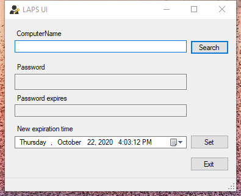

---
title: AdmPwd.UI.exe | AdmPwd.UI
excerpt: What is AdmPwd.UI.exe?
---

# AdmPwd.UI.exe 

* File Path: `C:\Program Files\LAPS\AdmPwd.UI.exe`
* Description: AdmPwd.UI
* Comments: UI for AdmPwd management

## Screenshot

## Hashes

Type | Hash
-- | --
MD5 | `EB1F189A47442D38EF3D1F39CDE6D6D5`
SHA1 | `AFC8051AFDB3298F3131095E8B269C7EF84211E1`
SHA256 | `EBE04BA22BB944169E14A61C5D834CCD9DED9C9F7294A2EBEDC5AECD653168B9`
SHA384 | `FAF118905F53ABC1BCB02B9F7A6F4B32FB7F3ACD79A03B3DFB0E4EB580133E9FBFE69C0AE796E15BA0305169D0FBF440`
SHA512 | `5A5C1E1D6DA6FAC213A4CA049B974BC11F50FDDB3AF41909208C3A033DB874BABCAD1001CBBC2AD79593AFA473F65E41F9E4E47B627BA6E5965F17659D3AFB8C`
SSDEEP | `768:4aKOme4rkssYBzw51isIPM3mIdKisIPasilVEB4S1:h4jdzwOsIPMbdsIPasQEB40`
IMP | `F34D5F2D4577ED6D9CEEC516C1F5A744`
PESHA1 | `008942A0C4752B2B858B6FBF744A0C036BED4D19`
PE256 | `87CE1821226DA93A63861A4A6CF487F9AAC4E64F676F3C7699D9B6D605F4F90B`

## Runtime Data

### Window Title:
LAPS UI

### Open Handles:

Path | Type
-- | --
(R-D)   C:\Windows\Fonts\StaticCache.dat | File
(R-D)   C:\Windows\Microsoft.NET\assembly\GAC_64\mscorlib\v4.0_4.0.0.0__b77a5c561934e089\mscorlib.dll | File
(R-D)   C:\Windows\Microsoft.NET\assembly\GAC_MSIL\Accessibility\v4.0_4.0.0.0__b03f5f7f11d50a3a\Accessibility.dll | File
(R-D)   C:\Windows\Microsoft.NET\assembly\GAC_MSIL\System.Configuration\v4.0_4.0.0.0__b03f5f7f11d50a3a\System.Configuration.dll | File
(R-D)   C:\Windows\Microsoft.NET\assembly\GAC_MSIL\System.Drawing\v4.0_4.0.0.0__b03f5f7f11d50a3a\System.Drawing.dll | File
(R-D)   C:\Windows\Microsoft.NET\assembly\GAC_MSIL\System.Windows.Forms\v4.0_4.0.0.0__b77a5c561934e089\System.Windows.Forms.dll | File
(R-D)   C:\Windows\Microsoft.NET\assembly\GAC_MSIL\System.Xml\v4.0_4.0.0.0__b77a5c561934e089\System.XML.dll | File
(R-D)   C:\Windows\Microsoft.NET\assembly\GAC_MSIL\System\v4.0_4.0.0.0__b77a5c561934e089\System.dll | File
(R-D)   C:\Windows\System32\en-US\user32.dll.mui | File
(R-D)   C:\Windows\WinSxS\amd64_microsoft.windows.c..-controls.resources_6595b64144ccf1df_6.0.19041.1_en-us_cb612d02732b0fd9\comctl32.dll.mui | File
(RW-)   C:\Windows\WinSxS\amd64_microsoft.windows.c..-controls.resources_6595b64144ccf1df_6.0.19041.1_en-us_cb612d02732b0fd9 | File
(RW-)   C:\Windows\WinSxS\amd64_microsoft.windows.common-controls_6595b64144ccf1df_5.82.19041.488_none_4238de57f6b64d28 | File
(RW-)   C:\Windows\WinSxS\amd64_microsoft.windows.common-controls_6595b64144ccf1df_6.0.19041.488_none_ca04af081b815d21 | File
(RW-)   C:\Windows\WinSxS\amd64_microsoft.windows.gdiplus_6595b64144ccf1df_1.1.19041.572_none_fae9a23b76193bbb | File
(RW-)   C:\xCyclopedia | File
\...\Cor_SxSPublic_IPCBlock | Section
\BaseNamedObjects\Cor_Private_IPCBlock_v4_4580 | Section
\BaseNamedObjects\NLS_CodePage_1252_3_2_0_0 | Section
\BaseNamedObjects\NLS_CodePage_437_3_2_0_0 | Section
\Sessions\1\BaseNamedObjects\windows_shell_global_counters | Section
\Sessions\1\Windows\Theme289354956 | Section
\Windows\Theme1665484522 | Section

### Loaded Modules:

Path |
-- |
C:\Program Files\LAPS\AdmPwd.UI.exe |
C:\Windows\Microsoft.NET\Framework64\v4.0.30319\mscoreei.dll |
C:\Windows\System32\ADVAPI32.dll |
C:\Windows\System32\KERNEL32.dll |
C:\Windows\System32\KERNELBASE.dll |
C:\Windows\SYSTEM32\MSCOREE.DLL |
C:\Windows\System32\msvcrt.dll |
C:\Windows\SYSTEM32\ntdll.dll |
C:\Windows\System32\RPCRT4.dll |
C:\Windows\System32\sechost.dll |
C:\Windows\System32\SHLWAPI.dll |

## Signature

* Status: Signature verified.
* Serial: `330000014096A9EE7056FECC07000100000140`
* Thumbprint: `98ED99A67886D020C564923B7DF25E9AC019DF26`
* Issuer: CN=Microsoft Code Signing PCA, O=Microsoft Corporation, L=Redmond, S=Washington, C=US
* Subject: CN=Microsoft Corporation, OU=MOPR, O=Microsoft Corporation, L=Redmond, S=Washington, C=US

## File Metadata

* Original Filename: AdmPwd.UI.exe
* Product Name: AdmPwd.UI
* Company Name: Microsoft Corporation
* File Version: 6.2.0.0
* Product Version: 6.2.0.0
* Language: Language Neutral
* Legal Copyright: Copyright  Microsoft Corporation
* Machine Type: 32-bit

## File Scan

* VirusTotal Detections: 0/71
* VirusTotal Link: https://www.virustotal.com/gui/file/ebe04ba22bb944169e14a61c5d834ccd9ded9c9f7294a2ebedc5aecd653168b9/detection/

MIT License. Copyright (c) 2020 Strontic.

