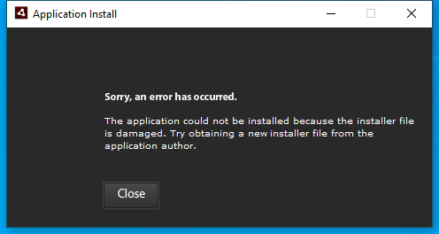

---
title: Adobe AIR Application Installer.exe | Adobe AIR Application Installer
---

# Adobe AIR Application Installer.exe 

* File Path: `C:\program files (x86)\Common Files\Adobe AIR\Versions\1.0\Adobe AIR Application Installer.exe`
* Description: Adobe AIR Application Installer

## Screenshot



## Hashes

Type | Hash
-- | --
MD5 | `4B6220989B1BF38AAFC42D024401424C`
SHA1 | `D663948B0EFD8DB4FBD7BE32BACCEE48252C80DA`
SHA256 | `8B9B8D0C7234EF27ACC2B64E8EFED625B7D871D1F5AF9E22814D7FB871A6AEC2`
SHA384 | `8BCA667F06FB8CC0582C09E57F17FE4589B6EF6E1AB98F6DA04DFEDDC1638CF39CB77464A357978D2032139C0C55A7D9`
SHA512 | `D33D69339D402BE4B3526CEF206BDBAE01A7AE3A299E5F07BA5BB5E541EF6D190484574BC6DD89BEF3D3D0DCE3C90BE551D2C727800AA1EF906F178EE9DC8373`
SSDEEP | `3072:WH25hogaS00EoVEf0y4ac5KNi01x/joc1CkM7MpiigEsMkFB:+bSQZiaQMkFB`

## Runtime Data

### Usage (stdout):
```Batchfile
unexpected error: ArgumentError: Absolute path of the air file needs to be specified.

```

### Window Title:
Application Install

### Open Handles:

Path | Type
-- | --
(R-D)   C:\Windows\Fonts\StaticCache.dat | File
(R-D)   C:\Windows\SysWOW64\en-US\user32.dll.mui | File
(RW-)   C:\Users\user\Documents | File
(RW-)   C:\Windows | File
(RW-)   C:\Windows\WinSxS\x86_microsoft.windows.common-controls_6595b64144ccf1df_5.82.19041.1_none_92e69152510a8cb1 | File
(RW-)   C:\Windows\WinSxS\x86_microsoft.windows.common-controls_6595b64144ccf1df_6.0.19041.1_none_fd031af45b0106f2 | File
\BaseNamedObjects\__ComCatalogCache__ | Section
\BaseNamedObjects\NLS_CodePage_1252_3_2_0_0 | Section
\BaseNamedObjects\NLS_CodePage_437_3_2_0_0 | Section
\Sessions\1\BaseNamedObjects\e64HWNDInterface:2500f8 | Section
\Sessions\1\BaseNamedObjects\windows_shell_global_counters | Section
\Sessions\1\Windows\Theme4048709601 | Section
\Windows\Theme603176458 | Section


### Loaded Modules:

Path |
-- |
C:\program files (x86)\Common Files\Adobe AIR\Versions\1.0\Adobe AIR Application Installer.exe |
C:\Windows\SYSTEM32\ntdll.dll |
C:\Windows\System32\wow64.dll |
C:\Windows\System32\wow64cpu.dll |
C:\Windows\System32\wow64win.dll |


## Signature

* Status: Signature verified.
* Serial: `0D2CACCD3E9EEC06738410BA31BF6595`
* Thumbprint: `9F664D9A5BCA4D3B2FB7FBAC7827F96DC565CC4C`
* Issuer: CN=DigiCert EV Code Signing CA (SHA2), OU=www.digicert.com, O=DigiCert Inc, C=US
* Subject: CN=Adobe Inc., OU=Flash Player, O=Adobe Inc., L=San Jose, S=ca, C=US, SERIALNUMBER=2748129, OID.2.5.4.15=Private Organization, OID.1.3.6.1.4.1.311.60.2.1.2=Delaware, OID.1.3.6.1.4.1.311.60.2.1.3=US

## File Metadata

* Original Filename: Adobe AIR Application Installer.exe
* Product Name: Adobe AIR 
* Company Name: Adobe
* File Version: 32.0.0.125
* Product Version: 32.0
* Language: English (United States)
* Legal Copyright: Copyright 2007-2019, Adobe


MIT License. Copyright (c) 2020 Strontic.


