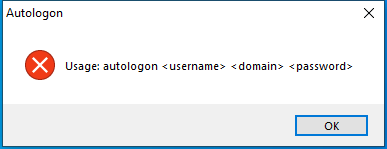

---
title: Autologon.exe | Autologon configuration
excerpt: What is Autologon.exe?
---

# Autologon.exe 

* File Path: `C:\SysinternalsSuite\Autologon.exe`
* Description: Autologon configuration

## Screenshot

## Hashes

Type | Hash
-- | --
MD5 | `C6377C648AC8775FCC8302C1DB14A8AA`
SHA1 | `2B5FAA68D1C9FF2572210A6420B39E9B2D4394C9`
SHA256 | `DF6589654ABFACB1490A9F19E9C0E32623E73F2A1B852E8A8379B7873D03A33A`
SHA384 | `0486D84C22FD6EC6759E0491A9C653531EA079D86D90FEE78C8D3FDBCACB204C9103EEB9DA99E75A598F0D747707F229`
SHA512 | `DFB7EA7EB049847F0EBEBBD74B4FE39B464B61CA0CB161186F5A40CB8E96978F73DF200CE43B0E69A8707150F2026D6171109DBD60CB498AA74465E9D96E909F`
SSDEEP | `6144:1mqSKewaoO79XXu2JdgYBQczQUgAaBfrLXNLhqLyXljoMol:UKewO79X+27RAlJx8Eporl`
IMP | `2BBE1701F3DFA2AF6BE3B4EDAED0F081`
PESHA1 | `6F0F9857EC965F4B12B30531D0254EB78470766D`
PE256 | `D34FA576F258ABE3C57CCFEF04B1385AF5FC7CA70CA73028C636510186F7F825`

## Runtime Data

### Window Title:
Autologon

### Open Handles:

Path | Type
-- | --
(R-D)   C:\Windows\Fonts\StaticCache.dat | File
(R-D)   C:\Windows\SystemResources\imageres.dll.mun | File
(RW-)   C:\Windows | File
(RW-)   C:\Windows\WinSxS\x86_microsoft.windows.common-controls_6595b64144ccf1df_6.0.19041.488_none_11b1e5df2ffd8627 | File
(RW-)   C:\xCyclopedia | File
\BaseNamedObjects\NLS_CodePage_1252_3_2_0_0 | Section
\BaseNamedObjects\NLS_CodePage_437_3_2_0_0 | Section
\Sessions\1\Windows\Theme2036293991 | Section
\Windows\Theme1324212991 | Section

### Loaded Modules:

Path |
-- |
C:\SysinternalsSuite\Autologon.exe |
C:\Windows\SYSTEM32\ntdll.dll |
C:\Windows\System32\wow64.dll |
C:\Windows\System32\wow64cpu.dll |
C:\Windows\System32\wow64win.dll |

## Signature

* Status: Signature verified.
* Serial: `33000001519E8D8F4071A30E41000000000151`
* Thumbprint: `62009AAABDAE749FD47D19150958329BF6FF4B34`
* Issuer: CN=Microsoft Code Signing PCA 2011, O=Microsoft Corporation, L=Redmond, S=Washington, C=US
* Subject: CN=Microsoft Corporation, O=Microsoft Corporation, L=Redmond, S=Washington, C=US

## File Metadata

* Original Filename: Autolog.exe
* Product Name: Sysinternals Autologon
* Company Name: Sysinternals - www.sysinternals.com
* File Version: 3.10
* Product Version: 3.10
* Language: English (United States)
* Legal Copyright: Copyright  2000-2016 Mark Russinovich
* Machine Type: 32-bit

## File Scan

* VirusTotal Detections: 0/70
* VirusTotal Link: https://www.virustotal.com/gui/file/df6589654abfacb1490a9f19e9c0e32623e73f2a1b852e8a8379b7873d03a33a/detection/

MIT License. Copyright (c) 2020-2021 Strontic.

