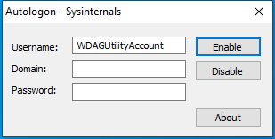

---
title: Autologon64.exe | Autologon configuration
excerpt: What is Autologon64.exe?
---

# Autologon64.exe 

* File Path: `C:\SysinternalsSuite\Autologon64.exe`
* Description: Autologon configuration

## Screenshot

## Hashes

Type | Hash
-- | --
MD5 | `FFCA2FBCC7E4637F2ACC0A8A3B0DBAAA`
SHA1 | `3697F037E527A31C013A2FF3EE2F6C373E67A2A7`
SHA256 | `5D96BBC4E5B726D87C7CF547F5FE98F8F05434EC2130BD60CBF5671FD3A7381B`
SHA384 | `4B0A098CA7E002D0F8100FE3CFB4EDE2A6213A95B25B57277D287A7477B1AC1EA07C5CD3D7476C06195B30F8429C740F`
SHA512 | `3D9BB3641BDB7D89D30A7D552C8ECA7355AB64E56D6D1657DBFE4F4F66C93CED1AA75FFB1FC0326F5E06310BAD6E51C94D57E7EF74E9DB215AC2C72DA1A20FAF`
SSDEEP | `12288:WD+k3HVJ5xDfp4D7/SAOZi+5v4+rcKfth:UJVJTt4D7/SAOZi+5v48cKf3`
IMP | `ECFE7428CD2A05B3F34F531B0AD9CCB7`
PESHA1 | `59DAF36078E9F5110ED7D42147724F82C7506393`
PE256 | `19B7352096A9F9E4831BB3F02031B7ECA461B932FED29AC5E7C0CB40177EB07E`

## Runtime Data

### Window Title:
Autologon

### Open Handles:

Path | Type
-- | --
(R-D)   C:\Windows\Fonts\StaticCache.dat | File
(R-D)   C:\Windows\SystemResources\imageres.dll.mun | File
(RW-)   C:\Windows\WinSxS\amd64_microsoft.windows.common-controls_6595b64144ccf1df_6.0.19041.488_none_ca04af081b815d21 | File
(RW-)   C:\xCyclopedia | File
\BaseNamedObjects\NLS_CodePage_1252_3_2_0_0 | Section
\BaseNamedObjects\NLS_CodePage_437_3_2_0_0 | Section
\Sessions\1\Windows\Theme2036293991 | Section
\Windows\Theme1324212991 | Section

### Loaded Modules:

Path |
-- |
C:\SysinternalsSuite\Autologon64.exe |
C:\Users\user\AppData\Local\Temp\ADInsightDll64.dll |
C:\Windows\System32\ADVAPI32.dll |
C:\Windows\System32\combase.dll |
C:\Windows\System32\COMDLG32.dll |
C:\Windows\System32\GDI32.dll |
C:\Windows\System32\gdi32full.dll |
C:\Windows\System32\imagehlp.dll |
C:\Windows\System32\IMM32.DLL |
C:\Windows\System32\KERNEL32.DLL |
C:\Windows\System32\KERNELBASE.dll |
C:\Windows\System32\msvcp_win.dll |
C:\Windows\System32\msvcrt.dll |
C:\Windows\SYSTEM32\ntdll.dll |
C:\Windows\System32\RPCRT4.dll |
C:\Windows\System32\sechost.dll |
C:\Windows\SYSTEM32\Secur32.dll |
C:\Windows\System32\shcore.dll |
C:\Windows\System32\SHELL32.dll |
C:\Windows\System32\SHLWAPI.dll |
C:\Windows\SYSTEM32\SSPICLI.DLL |
C:\Windows\System32\ucrtbase.dll |
C:\Windows\System32\USER32.dll |
C:\Windows\System32\win32u.dll |
C:\Windows\WinSxS\amd64_microsoft.windows.common-controls_6595b64144ccf1df_6.0.19041.488_none_ca04af081b815d21\COMCTL32.dll |

## Signature

* Status: Signature verified.
* Serial: `33000001519E8D8F4071A30E41000000000151`
* Thumbprint: `62009AAABDAE749FD47D19150958329BF6FF4B34`
* Issuer: CN=Microsoft Code Signing PCA 2011, O=Microsoft Corporation, L=Redmond, S=Washington, C=US
* Subject: CN=Microsoft Corporation, O=Microsoft Corporation, L=Redmond, S=Washington, C=US

## File Metadata

* Original Filename: Autolog.exe
* Product Name: Sysinternals Autologon
* Company Name: Sysinternals - www.sysinternals.com
* File Version: 3.10
* Product Version: 3.10
* Language: English (United States)
* Legal Copyright: Copyright  2000-2016 Mark Russinovich
* Machine Type: 64-bit

## File Scan

* VirusTotal Detections: 0/68
* VirusTotal Link: https://www.virustotal.com/gui/file/5d96bbc4e5b726d87c7cf547f5fe98f8f05434ec2130bd60cbf5671fd3a7381b/detection/

MIT License. Copyright (c) 2020 Strontic.

