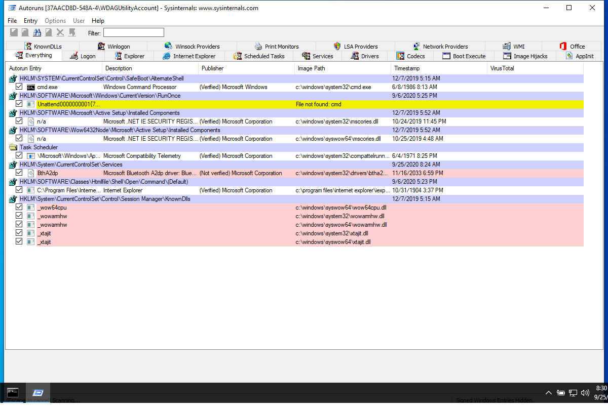
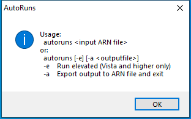

---
title: Autoruns.exe | Autostart program viewer
excerpt: What is Autoruns.exe?
---

# Autoruns.exe 

* File Path: `C:\SysinternalsSuite\Autoruns.exe`
* Description: Autostart program viewer

## Screenshot

## Hashes

Type | Hash
-- | --
MD5 | `9CD73AEFE18224EAC6DF0855A98609D6`
SHA1 | `0E508DF15680656192FE9DF2E137D77163813851`
SHA256 | `B302C37F5DB7FC17805CE69C931AEBF5CDD97A5312E91340F54459230C4DAF47`
SHA384 | `80F7DB10E33558B75C194346D2C6707595C35FA6395112E73CE4E972FF53046C3F9C5188FEF18BFFB11E545806F597F4`
SHA512 | `74E7B883BBC1C7B3E65055872CBB1F020954844CF53B86ED00FC1FE204979F60AE16D8F934CBEFC0EBED1BBAD492A3A481D41BA2118555914B0FF1DC4EE265D0`
SSDEEP | `12288:erREFjJ0lKvxFx8fuzlcg12A7ABNxJYMulf+M3HwO+I9Tx5:erOFjJ1jxSuz21NxuMulf+M3QOd9Tx5`
IMP | `F89DEE2F98BC16270FA209C75AE7A66D`
PESHA1 | `5A1DA02EF12290E6716B61A0D3101B2D3537C0F3`
PE256 | `6340A6D6BB3BBDA909047100076E9ED170865D9937D5DE1C6133CD42B5EE0B83`

## Runtime Data

### Window Title:
AutoRuns

### Open Handles:

Path | Type
-- | --
(R-D)   C:\Windows\Fonts\StaticCache.dat | File
(R-D)   C:\Windows\System32\en-US\KernelBase.dll.mui | File
(R-D)   C:\Windows\SystemResources\imageres.dll.mun | File
(R-D)   C:\Windows\SysWOW64\en-US\user32.dll.mui | File
(RW-)   C:\Windows | File
(RW-)   C:\Windows\WinSxS\x86_microsoft.windows.common-controls_6595b64144ccf1df_6.0.19041.488_none_11b1e5df2ffd8627 | File
(RW-)   C:\xCyclopedia | File
\BaseNamedObjects\NLS_CodePage_1252_3_2_0_0 | Section
\BaseNamedObjects\NLS_CodePage_437_3_2_0_0 | Section
\Sessions\1\Windows\Theme2036293991 | Section
\Windows\Theme1324212991 | Section

### Loaded Modules:

Path |
-- |
C:\SysinternalsSuite\Autoruns.exe |
C:\Windows\SYSTEM32\ntdll.dll |
C:\Windows\System32\wow64.dll |
C:\Windows\System32\wow64cpu.dll |
C:\Windows\System32\wow64win.dll |

## Signature

* Status: Signature verified.
* Serial: `33000001519E8D8F4071A30E41000000000151`
* Thumbprint: `62009AAABDAE749FD47D19150958329BF6FF4B34`
* Issuer: CN=Microsoft Code Signing PCA 2011, O=Microsoft Corporation, L=Redmond, S=Washington, C=US
* Subject: CN=Microsoft Corporation, O=Microsoft Corporation, L=Redmond, S=Washington, C=US

## File Metadata

* Original Filename: autoruns.exe
* Product Name: Sysinternals autoruns
* Company Name: Sysinternals - www.sysinternals.com
* File Version: 13.98
* Product Version: 13.98
* Language: English (United States)
* Legal Copyright: Copyright (C) 2002-2019 Mark Russinovich
* Machine Type: 32-bit

## File Scan

* VirusTotal Detections: 0/70
* VirusTotal Link: https://www.virustotal.com/gui/file/b302c37f5db7fc17805ce69c931aebf5cdd97a5312e91340f54459230c4daf47/detection/

## Possible Misuse

*The following table contains possible examples of `Autoruns.exe` being misused. While `Autoruns.exe` is **not** inherently malicious, its legitimate functionality can be abused for malicious purposes.*

Source | Source File | Example | License
-- | -- | -- | --
[sigma](https://github.com/Neo23x0/sigma) | [win_susp_rundll32_setupapi_installhinfsection.yml](https://github.com/Neo23x0/sigma/blob/master/rules/windows/process_creation/win_susp_rundll32_setupapi_installhinfsection.yml) | `- https://raw.githubusercontent.com/huntresslabs/evading-autoruns/master/shady.inf`{:.highlight .language-yaml} | [DRL 1.0](https://github.com/Neo23x0/sigma/blob/master/LICENSE.Detection.Rules.md)
[sigma](https://github.com/Neo23x0/sigma) | [sysmon_asep_reg_keys_modification.yml](https://github.com/Neo23x0/sigma/blob/master/rules/windows/registry_event/sysmon_asep_reg_keys_modification.yml) | `- https://docs.microsoft.com/en-us/sysinternals/downloads/autoruns`{:.highlight .language-yaml} | [DRL 1.0](https://github.com/Neo23x0/sigma/blob/master/LICENSE.Detection.Rules.md)
[sigma](https://github.com/Neo23x0/sigma) | [sysmon_reg_silentprocessexit.yml](https://github.com/Neo23x0/sigma/blob/master/rules/windows/registry_event/sysmon_reg_silentprocessexit.yml) | `- https://oddvar.moe/2018/04/10/persistence-using-globalflags-in-image-file-execution-options-hidden-from-autoruns-exe/`{:.highlight .language-yaml} | [DRL 1.0](https://github.com/Neo23x0/sigma/blob/master/LICENSE.Detection.Rules.md)
[sigma](https://github.com/Neo23x0/sigma) | [sysmon_reg_silentprocessexit_lsass.yml](https://github.com/Neo23x0/sigma/blob/master/rules/windows/registry_event/sysmon_reg_silentprocessexit_lsass.yml) | `- https://oddvar.moe/2018/04/10/persistence-using-globalflags-in-image-file-execution-options-hidden-from-autoruns-exe/`{:.highlight .language-yaml} | [DRL 1.0](https://github.com/Neo23x0/sigma/blob/master/LICENSE.Detection.Rules.md)
[sigma](https://github.com/Neo23x0/sigma) | [sysmon_win_reg_persistence.yml](https://github.com/Neo23x0/sigma/blob/master/rules/windows/registry_event/sysmon_win_reg_persistence.yml) | `- https://oddvar.moe/2018/04/10/persistence-using-globalflags-in-image-file-execution-options-hidden-from-autoruns-exe/`{:.highlight .language-yaml} | [DRL 1.0](https://github.com/Neo23x0/sigma/blob/master/LICENSE.Detection.Rules.md)
[LOLBAS](https://github.com/LOLBAS-Project/LOLBAS) | [Bitsadmin.yml](https://github.com/LOLBAS-Project/LOLBAS/blob/master/yml/OSBinaries/Bitsadmin.yml) | `- Command: bitsadmin /create 1 bitsadmin /addfile 1 https://live.sysinternals.com/autoruns.exe c:\data\playfolder\autoruns.exe bitsadmin /RESUME 1 bitsadmin /complete 1`{:.highlight .language-yaml} | 
[LOLBAS](https://github.com/LOLBAS-Project/LOLBAS) | [Infdefaultinstall.yml](https://github.com/LOLBAS-Project/LOLBAS/blob/master/yml/OSBinaries/Infdefaultinstall.yml) | `- Link: https://blog.conscioushacker.io/index.php/2017/10/25/evading-microsofts-autoruns/`{:.highlight .language-yaml} | 
[LOLBAS](https://github.com/LOLBAS-Project/LOLBAS) | [Makecab.yml](https://github.com/LOLBAS-Project/LOLBAS/blob/master/yml/OSBinaries/Makecab.yml) | `- Command: makecab c:\ADS\autoruns.exe c:\ADS\cabtest.txt:autoruns.cab`{:.highlight .language-yaml} | 
[LOLBAS](https://github.com/LOLBAS-Project/LOLBAS) | [Setupapi.yml](https://github.com/LOLBAS-Project/LOLBAS/blob/master/yml/OSLibraries/Setupapi.yml) | `- Code: https://raw.githubusercontent.com/huntresslabs/evading-autoruns/master/shady.inf`{:.highlight .language-yaml} | 
[LOLBAS](https://github.com/LOLBAS-Project/LOLBAS) | [Setupapi.yml](https://github.com/LOLBAS-Project/LOLBAS/blob/master/yml/OSLibraries/Setupapi.yml) | `- Link: https://github.com/huntresslabs/evading-autoruns`{:.highlight .language-yaml} | 
[LOLBAS](https://github.com/LOLBAS-Project/LOLBAS) | [Syssetup.yml](https://github.com/LOLBAS-Project/LOLBAS/blob/master/yml/OSLibraries/Syssetup.yml) | `- Code: https://raw.githubusercontent.com/huntresslabs/evading-autoruns/master/shady.inf`{:.highlight .language-yaml} | 
[malware-ioc](https://github.com/eset/malware-ioc) | [misp-dukes-operation-ghost-event.json](https://github.com/eset/malware-ioc/blob/master/dukes/misp-dukes-operation-ghost-event.json) | `"https://oddvar.moe/2018/03/21/persistence-using-runonceex-hidden-from-autoruns-exe/",`{:.highlight .language-cmhg} | [© ESET 2014-2018](https://github.com/eset/malware-ioc/blob/master/LICENSE)
[malware-ioc](https://github.com/eset/malware-ioc) | [misp_invisimole.json](https://github.com/eset/malware-ioc/blob/master/invisimole/misp_invisimole.json) | `"https://oddvar.moe/2018/03/21/persistence-using-runonceex-hidden-from-autoruns-exe/",`{:.highlight .language-cmhg} | [© ESET 2014-2018](https://github.com/eset/malware-ioc/blob/master/LICENSE)
[malware-ioc](https://github.com/eset/malware-ioc) | [oceanlotus-rtf_ocx_campaigns.misp.event.json](https://github.com/eset/malware-ioc/blob/master/oceanlotus/oceanlotus-rtf_ocx_campaigns.misp.event.json) | `"description": "When operating systems boot up, they can start programs or applications called services that perform background system functions. (Citation: TechNet Services) A service's configuration information, including the file path to the service's executable, is stored in the Windows Registry. \n\nAdversaries may install a new service that can be configured to execute at startup by using utilities to interact with services or by directly modifying the Registry. The service name may be disguised by using a name from a related operating system or benign software with Masquerading. Services may be created with administrator privileges but are executed under SYSTEM privileges, so an adversary may also use a service to escalate privileges from administrator to SYSTEM. Adversaries may also directly start services through Service Execution.\n\nDetection: Monitor service creation through changes in the Registry and common utilities using command-line invocation. New, benign services may be created during installation of new software. Data and events should not be viewed in isolation, but as part of a chain of behavior that could lead to other activities, such as network connections made for Command and Control, learning details about the environment through Discovery, and Lateral Movement.\n\nTools such as Sysinternals Autoruns may also be used to detect system changes that could be attempts at persistence. (Citation: TechNet Autoruns) Look for changes to services that do not correlate with known software, patch cycles, etc. Suspicious program execution through services may show up as outlier processes that have not been seen before when compared against historical data.\n\nMonitor processes and command-line arguments for actions that could create services. Remote access tools with built-in features may interact directly with the Windows API to perform these functions outside of typical system utilities. Services may also be created through Windows system management tools such as Windows Management Instrumentation and PowerShell, so additional logging may need to be configured to gather the appropriate data.\n\nPlatforms: Windows\n\nData Sources: Windows Registry, Process monitoring, Process command-line parameters\n\nEffective Permissions: SYSTEM\n\nPermissions Required: Administrator, SYSTEM",`{:.highlight .language-cmhg} | [© ESET 2014-2018](https://github.com/eset/malware-ioc/blob/master/LICENSE)
[malware-ioc](https://github.com/eset/malware-ioc) | [oceanlotus-rtf_ocx_campaigns.misp.event.json](https://github.com/eset/malware-ioc/blob/master/oceanlotus/oceanlotus-rtf_ocx_campaigns.misp.event.json) | `"description": "Adding an entry to the \"run keys\" in the Registry or startup folder will cause the program referenced to be executed when a user logs in. (Citation: Microsoft Run Key) The program will be executed under the context of the user and will have the account's associated permissions level.\n\nAdversaries can use these configuration locations to execute malware, such as remote access tools, to maintain persistence through system reboots. Adversaries may also use Masquerading to make the Registry entries look as if they are associated with legitimate programs.\n\nDetection: Monitor Registry for changes to run keys that do not correlate with known software, patch cycles, etc. Monitor the start folder for additions or changes. Tools such as Sysinternals Autoruns may also be used to detect system changes that could be attempts at persistence, including listing the run keys' Registry locations and startup folders. (Citation: TechNet Autoruns) Suspicious program execution as startup programs may show up as outlier processes that have not been seen before when compared against historical data.\n\nChanges to these locations typically happen under normal conditions when legitimate software is installed. To increase confidence of malicious activity, data and events should not be viewed in isolation, but as part of a chain of behavior that could lead to other activities, such as network connections made for Command and Control, learning details about the environment through Discovery, and Lateral Movement.\n\nPlatforms: Windows\n\nData Sources: Windows Registry, File monitoring\n\nPermissions Required: User, Administrator",`{:.highlight .language-cmhg} | [© ESET 2014-2018](https://github.com/eset/malware-ioc/blob/master/LICENSE)
[malware-ioc](https://github.com/eset/malware-ioc) | [oceanlotus-rtf_ocx_campaigns.misp.event.json](https://github.com/eset/malware-ioc/blob/master/oceanlotus/oceanlotus-rtf_ocx_campaigns.misp.event.json) | `"description": "Utilities such as at and schtasks, along with the Windows Task Scheduler, can be used to schedule programs or scripts to be executed at a date and time. A task can also be scheduled on a remote system, provided the proper authentication is met to use RPC and file and printer sharing is turned on. Scheduling a task on a remote system typically required being a member of the Administrators group on the the remote system. (Citation: TechNet Task Scheduler Security)\n\nAn adversary may use task scheduling to execute programs at system startup or on a scheduled basis for persistence, to conduct remote Execution as part of Lateral Movement, to gain SYSTEM privileges, or to run a process under the context of a specified account.\n\nDetection: Monitor scheduled task creation from common utilities using command-line invocation. Legitimate scheduled tasks may be created during installation of new software or through system administration functions. Monitor process execution from the <code>svchost.exe<\/code> in Windows 10 and the Windows Task Scheduler <code>taskeng.exe<\/code> for older versions of Windows. (Citation: Twitter Leoloobeek Scheduled Task) If scheduled tasks are not used for persistence, then the adversary is likely to remove the task when the action is complete. Monitor Windows Task Scheduler stores in <code>%systemroot%\\System32\\Tasks<\/code> for change entries related to scheduled tasks that do not correlate with known software, patch cycles, etc. Data and events should not be viewed in isolation, but as part of a chain of behavior that could lead to other activities, such as network connections made for Command and Control, learning details about the environment through Discovery, and Lateral Movement.\n\nConfigure event logging for scheduled task creation and changes by enabling the \"Microsoft-Windows-TaskScheduler\/Operational\" setting within the event logging service. (Citation: TechNet Forum Scheduled Task Operational Setting) Several events will then be logged on scheduled task activity, including: (Citation: TechNet Scheduled Task Events)\n\n*Event ID 106 - Scheduled task registered\n*Event ID 140 - Scheduled task updated\n*Event ID 141 - Scheduled task removed\n\nTools such as Sysinternals Autoruns may also be used to detect system changes that could be attempts at persistence, including listing current scheduled tasks. (Citation: TechNet Autoruns) Look for changes to tasks that do not correlate with known software, patch cycles, etc. Suspicious program execution through scheduled tasks may show up as outlier processes that have not been seen before when compared against historical data.\n\nMonitor processes and command-line arguments for actions that could be taken to create tasks. Remote access tools with built-in features may interact directly with the Windows API to perform these functions outside of typical system utilities. Tasks may also be created through Windows system management tools such as Windows Management Instrumentation and PowerShell, so additional logging may need to be configured to gather the appropriate data.\n\nPlatforms: Windows\n\nData Sources: File monitoring, Process command-line parameters, Process monitoring, Windows event logs\n\nEffective Permissions: Administrator, SYSTEM, User\n\nPermissions Required: Administrator, SYSTEM, User\n\nRemote Support: Yes\n\nContributors: Travis Smith, Tripwire, Leo Loobeek, @leoloobeek, Alain Homewood, Insomnia Security",`{:.highlight .language-cmhg} | [© ESET 2014-2018](https://github.com/eset/malware-ioc/blob/master/LICENSE)
[atomic-red-team](https://github.com/redcanaryco/atomic-red-team) | [T1564.004.md](https://github.com/redcanaryco/atomic-red-team/blob/master/atomics/T1564.004/T1564.004.md) | makecab #{path}\autoruns.exe #{path}\cabtest.txt:autoruns.cab | [MIT License. © 2018 Red Canary](https://github.com/redcanaryco/atomic-red-team/blob/master/LICENSE.txt)
[atomic-red-team](https://github.com/redcanaryco/atomic-red-team) | [T1564.004.md](https://github.com/redcanaryco/atomic-red-team/blob/master/atomics/T1564.004/T1564.004.md) | print /D:#{path}\file.txt:autoruns.exe #{path}\Autoruns.exe | [MIT License. © 2018 Red Canary](https://github.com/redcanaryco/atomic-red-team/blob/master/LICENSE.txt)
[atomic-red-team](https://github.com/redcanaryco/atomic-red-team) | [T1564.004.md](https://github.com/redcanaryco/atomic-red-team/blob/master/atomics/T1564.004/T1564.004.md) | esentutl.exe /y #{path}\autoruns.exe /d #{path}\file.txt:autoruns.exe /o | [MIT License. © 2018 Red Canary](https://github.com/redcanaryco/atomic-red-team/blob/master/LICENSE.txt)
[signature-base](https://github.com/Neo23x0/signature-base) | [gen_susp_lnk_files.yar](https://github.com/Neo23x0/signature-base/blob/master/yara/gen_susp_lnk_files.yar) | description = "detect APT lnk files that run double extraction and launch routines with autoruns" | [CC BY-NC 4.0](https://github.com/Neo23x0/signature-base/blob/master/LICENSE)
[stockpile](https://github.com/mitre/stockpile) | [7a6ba833-de40-466a-8969-5c37b13603e0.yml](https://github.com/mitre/stockpile/blob/master/data/abilities/defense-evasion/7a6ba833-de40-466a-8969-5c37b13603e0.yml) | `"autoruns",`{:.highlight .language-yaml} | [Apache-2.0](https://github.com/mitre/stockpile/blob/master/LICENSE)

MIT License. Copyright (c) 2020-2021 Strontic.

