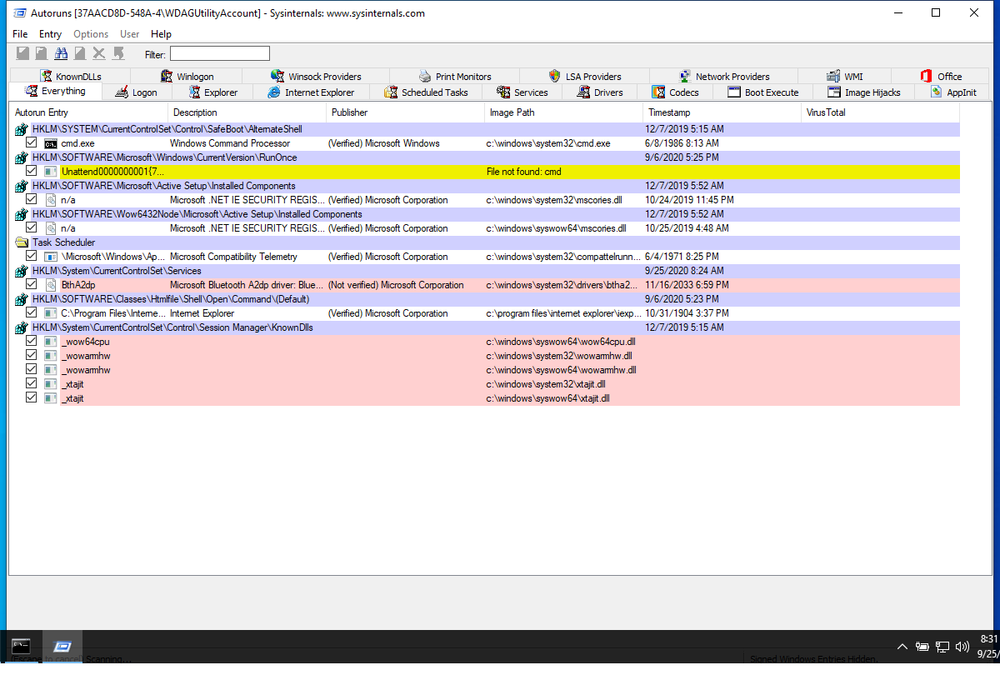

---
title: Autoruns64.exe | Autostart program viewer
excerpt: What is Autoruns64.exe?
---

# Autoruns64.exe 

* File Path: `C:\SysinternalsSuite\Autoruns64.exe`
* Description: Autostart program viewer

## Screenshot

## Hashes

Type | Hash
-- | --
MD5 | `467F8EAE55485B4C763EE1C7B197B257`
SHA1 | `1DDAE5B6B41641708344DC4829CC31244411AB37`
SHA256 | `76AA211322398AC0CF8F6F69EE0A5251F53DDC5A785D923ABBE5BB742EEB3854`
SHA384 | `EB8B7A125149523D6C7A65E4A8E38A241ED33F2D45285AE5A923698C2FE8E2091EC635F2BB58A806D2E181903EFAB902`
SHA512 | `AD271CC2BE5E3A32223CE9138B6943A0EE910AABDC2C84330E6EA2C56EB95CD6CEF0592D4E52CC405EE6FE2D08BB5E7ED940BD52E3F5FBE24041B4C38497A33E`
SSDEEP | `12288:moyeDBI2CaNjF3qtgUHrjk+JOlevkS5sfa5kwO8:moyABHNNjF3AgOrBJBc8w8O8`
IMP | `65805CD3944705B949805E8FA39DB8ED`
PESHA1 | `D8988B5DDC72ECAA1AC1BE590F7A171BE9765A04`
PE256 | `F9094899997720BD0DCE357B6CD52D175A7CD8D98424E4556559F54C99F1056F`

## Runtime Data

### Window Title:
AutoRuns

### Open Handles:

Path | Type
-- | --
(R-D)   C:\Windows\Fonts\StaticCache.dat | File
(R-D)   C:\Windows\System32\en-US\KernelBase.dll.mui | File
(R-D)   C:\Windows\System32\en-US\user32.dll.mui | File
(R-D)   C:\Windows\SystemResources\imageres.dll.mun | File
(RW-)   C:\Windows\WinSxS\amd64_microsoft.windows.common-controls_6595b64144ccf1df_6.0.19041.488_none_ca04af081b815d21 | File
(RW-)   C:\xCyclopedia | File
\BaseNamedObjects\NLS_CodePage_1252_3_2_0_0 | Section
\BaseNamedObjects\NLS_CodePage_437_3_2_0_0 | Section
\Sessions\1\Windows\Theme2036293991 | Section
\Windows\Theme1324212991 | Section

### Loaded Modules:

Path |
-- |
C:\SysinternalsSuite\Autoruns64.exe |
C:\Windows\System32\ADVAPI32.dll |
C:\Windows\System32\combase.dll |
C:\Windows\System32\COMDLG32.dll |
C:\Windows\System32\CRYPT32.dll |
C:\Windows\System32\GDI32.dll |
C:\Windows\System32\gdi32full.dll |
C:\Windows\System32\IMM32.DLL |
C:\Windows\System32\KERNEL32.DLL |
C:\Windows\System32\KERNELBASE.dll |
C:\Windows\SYSTEM32\MSASN1.dll |
C:\Windows\System32\msvcp_win.dll |
C:\Windows\System32\msvcrt.dll |
C:\Windows\SYSTEM32\ntdll.dll |
C:\Windows\System32\ole32.dll |
C:\Windows\System32\OLEAUT32.dll |
C:\Windows\System32\RPCRT4.dll |
C:\Windows\System32\sechost.dll |
C:\Windows\System32\shcore.dll |
C:\Windows\System32\SHELL32.dll |
C:\Windows\System32\SHLWAPI.dll |
C:\Windows\System32\ucrtbase.dll |
C:\Windows\System32\USER32.dll |
C:\Windows\SYSTEM32\uxtheme.dll |
C:\Windows\SYSTEM32\VERSION.dll |
C:\Windows\System32\win32u.dll |
C:\Windows\SYSTEM32\WINHTTP.dll |
C:\Windows\System32\WINTRUST.dll |
C:\Windows\WinSxS\amd64_microsoft.windows.common-controls_6595b64144ccf1df_6.0.19041.488_none_ca04af081b815d21\COMCTL32.dll |

## Signature

* Status: Signature verified.
* Serial: `33000001519E8D8F4071A30E41000000000151`
* Thumbprint: `62009AAABDAE749FD47D19150958329BF6FF4B34`
* Issuer: CN=Microsoft Code Signing PCA 2011, O=Microsoft Corporation, L=Redmond, S=Washington, C=US
* Subject: CN=Microsoft Corporation, O=Microsoft Corporation, L=Redmond, S=Washington, C=US

## File Metadata

* Original Filename: autoruns.exe
* Product Name: Sysinternals autoruns
* Company Name: Sysinternals - www.sysinternals.com
* File Version: 13.98
* Product Version: 13.98
* Language: English (United States)
* Legal Copyright: Copyright (C) 2002-2019 Mark Russinovich
* Machine Type: 64-bit

## File Scan

* VirusTotal Detections: 0/68
* VirusTotal Link: https://www.virustotal.com/gui/file/76aa211322398ac0cf8f6f69ee0a5251f53ddc5a785d923abbe5bb742eeb3854/detection/

## Possible Misuse

*The following table contains possible examples of `Autoruns64.exe` being misused. While `Autoruns64.exe` is **not** inherently malicious, its legitimate functionality can be abused for malicious purposes.*

Source | Source File | Example | License
-- | -- | -- | --
[stockpile](https://github.com/mitre/stockpile) | [7a6ba833-de40-466a-8969-5c37b13603e0.yml](https://github.com/mitre/stockpile/blob/master/data/abilities/defense-evasion/7a6ba833-de40-466a-8969-5c37b13603e0.yml) | `"autoruns64",`{:.highlight .language-yaml} | [Apache-2.0](https://github.com/mitre/stockpile/blob/master/LICENSE)

MIT License. Copyright (c) 2020-2021 Strontic.

