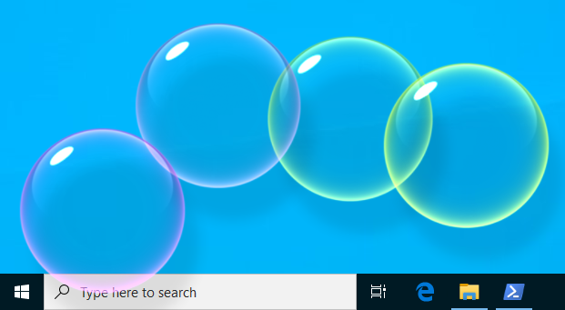
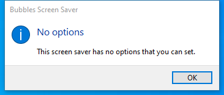

---
title: Bubbles.scr | Bubbles Screen Saver
excerpt: What is Bubbles.scr?
---

# Bubbles.scr 

* File Path: `C:\Windows\system32\Bubbles.scr`
* Description: Bubbles Screen Saver

## Screenshot

## Hashes

Type | Hash
-- | --
MD5 | `8A16A50A6106CC00F73ED75605512F3D`
SHA1 | `B961E57B8A9B99B085FE66F658D829694C0EDBBE`
SHA256 | `A4976A58E6A767C13499AD8DDDF6BECA7F703AB93A2AB746C9254042CDED9D9A`
SHA384 | `B3B7811A03407C4F2E7221168C060A4A8D5F98A8BCB3CA6BB275408CBFD26665366A919B2EEF17FC11A64B9CF6272C04`
SHA512 | `1AD9FA2297AD46CC7F766577FC41E96D33D4C22E8178A07D8CBB264ED934FB33056FECB65E6C4A318D9DF254ED2CF825CF9D6EFF59AF02B5D53BB2544824333A`
SSDEEP | `6144:uBP2+IT45mp24qNporbwOj8q/BBFrHMObAnTjy6Vg:uIJTDp`
IMP | `9FD0DA3B45662CE4010F6917A5927834`
PESHA1 | `ED1E4962144DB60A3C65E27DD13700C0E733BBD7`
PE256 | `7768C2AA4FB893C2E28CCF6FE4682E029A835FDE47BEFB625B4E02B752D9E346`

## Runtime Data

### Window Title:
Bubbles

### Open Handles:

Path | Type
-- | --
(R-D)   C:\Windows\System32\en-US\Bubbles.scr.mui | File
(RW-)   C:\Users\user | File
(RW-)   C:\Windows\WinSxS\amd64_microsoft.windows.common-controls_6595b64144ccf1df_6.0.19041.746_none_ca02b4b61b8320a4 | File
\BaseNamedObjects\C:\*ProgramData\*Microsoft\*Windows\*Caches\*{6AF0698E-D558-4F6E-9B3C-3716689AF493}.2.ver0x0000000000000002.db | Section
\BaseNamedObjects\C:\*ProgramData\*Microsoft\*Windows\*Caches\*{DDF571F2-BE98-426D-8288-1A9A39C3FDA2}.2.ver0x0000000000000002.db | Section
\BaseNamedObjects\C:\*ProgramData\*Microsoft\*Windows\*Caches\*cversions.2 | Section
\BaseNamedObjects\NLS_CodePage_1252_3_2_0_0 | Section
\BaseNamedObjects\NLS_CodePage_437_3_2_0_0 | Section
\Sessions\1\Windows\Theme3205582532 | Section
\Windows\Theme3800351183 | Section

### Loaded Modules:

Path |
-- |
C:\Windows\System32\ADVAPI32.dll |
C:\Windows\system32\Bubbles.scr |
C:\Windows\System32\GDI32.dll |
C:\Windows\System32\KERNEL32.DLL |
C:\Windows\System32\KERNELBASE.dll |
C:\Windows\System32\msvcrt.dll |
C:\Windows\SYSTEM32\ntdll.dll |
C:\Windows\System32\RPCRT4.dll |
C:\Windows\System32\sechost.dll |

## Signature

* Status: Signature verified.
* Serial: `3300000266BD1580EFA75CD6D3000000000266`
* Thumbprint: `A4341B9FD50FB9964283220A36A1EF6F6FAA7840`
* Issuer: CN=Microsoft Windows Production PCA 2011, O=Microsoft Corporation, L=Redmond, S=Washington, C=US
* Subject: CN=Microsoft Windows, O=Microsoft Corporation, L=Redmond, S=Washington, C=US

## File Metadata

* Original Filename: Bubbles
* Product Name: Microsoft Windows Operating System
* Company Name: Microsoft Corporation
* File Version: 10.0.19041.1 (WinBuild.160101.0800)
* Product Version: 10.0.19041.1
* Language: English (United States)
* Legal Copyright:  Microsoft Corporation. All rights reserved.
* Machine Type: 64-bit

## File Scan

* VirusTotal Detections: 0/76
* VirusTotal Link: https://www.virustotal.com/gui/file/a4976a58e6a767c13499ad8dddf6beca7f703ab93a2ab746c9254042cded9d9a/detection

MIT License. Copyright (c) 2020-2021 Strontic.

