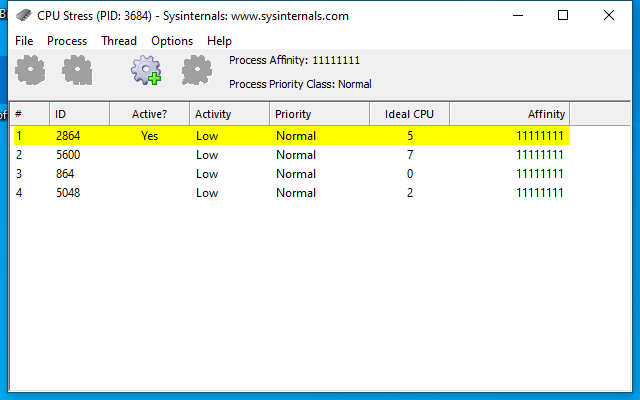

---
title: CPUSTRES.EXE | CPU Stress
excerpt: What is CPUSTRES.EXE?
---

# CPUSTRES.EXE 

* File Path: `C:\SysinternalsSuite\CPUSTRES.EXE`
* Description: CPU Stress

## Screenshot

## Hashes

Type | Hash
-- | --
MD5 | `8BB9004490C51AAFA9C8259BD9F7E7FF`
SHA1 | `DC36FCF5EF6D225DA49082A981D20866BA183BB5`
SHA256 | `5497724E096B66788E284BC2C90F480A1DC8B79EAB6B616F7F5615F62A651519`
SHA384 | `331DA36ED9A54B85AEBFF030AC6EAA5EE4B80B9C38421A49D48B0D34E5A5850FC79F88E8E9D1BFEC04A7DBA523E3A6E2`
SHA512 | `1A22A7D6B75C9C8B80823E0858FA1ADEE1C06CB45787AC851C17BD83E11E528F763EED6DE3164FA40DF60833DEB8BA21AC7615A11CF7E04EA4555C5220BB91F4`
SSDEEP | `49152:oKEE/nIxbeX+CN+JmVAjDwwkkJ4OSbPQ/ManCDXmHq:xE2IxFCQJmVAjEFPOSb4/Man6XmK`
IMP | `A9B620F86458E0BDA53D087EE7D49A79`
PESHA1 | `A696C6AD986F3885502CB17EDA3F728864F300EA`
PE256 | `100DD6F785A6BDC95F34DF6112135D13C5245ACE4ACB42C12174A3303B49200E`

## Runtime Data

### Window Title:
CPU Stress (PID: 5928) - Sysinternals: www.sysinternals.com

### Open Handles:

Path | Type
-- | --
(R-D)   C:\Windows\Fonts\StaticCache.dat | File
(RW-)   C:\Windows | File
(RW-)   C:\Windows\WinSxS\x86_microsoft.windows.common-controls_6595b64144ccf1df_6.0.19041.488_none_11b1e5df2ffd8627 | File
(RW-)   C:\Windows\WinSxS\x86_microsoft.windows.gdiplus_6595b64144ccf1df_1.1.19041.508_none_429cdbca8a8ffa94 | File
(RW-)   C:\xCyclopedia | File
\BaseNamedObjects\NLS_CodePage_1252_3_2_0_0 | Section
\BaseNamedObjects\NLS_CodePage_437_3_2_0_0 | Section
\Sessions\1\Windows\Theme2036293991 | Section
\Windows\Theme1324212991 | Section

### Loaded Modules:

Path |
-- |
C:\SysinternalsSuite\CPUSTRES.EXE |
C:\Windows\SYSTEM32\ntdll.dll |
C:\Windows\System32\wow64.dll |
C:\Windows\System32\wow64cpu.dll |
C:\Windows\System32\wow64win.dll |

## Signature

* Status: Signature verified.
* Serial: `33000001B1DDEDBA54E965B85F0001000001B1`
* Thumbprint: `9DC17888B5CFAD98B3CB35C1994E96227F061675`
* Issuer: CN=Microsoft Code Signing PCA, O=Microsoft Corporation, L=Redmond, S=Washington, C=US
* Subject: CN=Microsoft Corporation, O=Microsoft Corporation, L=Redmond, S=Washington, C=US

## File Metadata

* Original Filename: CPUSTRES
* Product Name: Sysinternals CPUSTRES
* Company Name: Sysinternals - www.sysinternals.com
* File Version: 1.0.0.0
* Product Version: 2.0
* Language: English (United States)
* Legal Copyright: Copyright (C) 2016 by Pavel Yosifovich
* Machine Type: 32-bit

## File Scan

* VirusTotal Detections: 0/73
* VirusTotal Link: https://www.virustotal.com/gui/file/5497724e096b66788e284bc2c90f480a1dc8b79eab6b616f7f5615f62a651519/detection/

MIT License. Copyright (c) 2020 Strontic.

