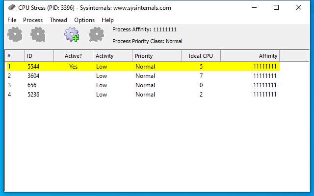

---
title: CPUSTRES64.EXE | CPU Stress
excerpt: What is CPUSTRES64.EXE?
---

# CPUSTRES64.EXE 

* File Path: `C:\SysinternalsSuite\CPUSTRES64.EXE`
* Description: CPU Stress

## Screenshot

## Hashes

Type | Hash
-- | --
MD5 | `D51054D4E40934110FAF1713FBFE5DE5`
SHA1 | `E64E47C8EEE8CD55FAE8234103A610D0DD782563`
SHA256 | `85EAB30BE67A554CCDA5E708D6820B84B74AFC9D4DA517BD471D95CAB23380D6`
SHA384 | `CB4EBF1DEB1F6B9E6ECB85568735751D0EF8DBEEE25EBA4336F04B9A271344FF7F6FE718F08FA74FEDB06B1C18E5495D`
SHA512 | `67EC16F47F9F6546594A691B0E37DE3A19B3DB7D3038B4D2FA8FA9147CF50756AF8312BD80678237878908594C628A58B425DF67641D0A6FA1C11EA643C1BBB2`
SSDEEP | `49152:k+MtvOZnNioy/c8Q8tJVWbn9v85ixJH3b695Q:L+cGVWbne5ixdbZ`
IMP | `0DD8D40CDE90CC2CCF6AF505BBDA4049`
PESHA1 | `816CC173FF75056DC0AE024BBA892F0ECAF14582`
PE256 | `E98C29AE5528E5ABF4F088CFF2F2D0BA4D21742474F611280D22A0CDD341CFB0`

## Runtime Data

### Window Title:
CPU Stress (PID: 88) - Sysinternals: www.sysinternals.com

### Open Handles:

Path | Type
-- | --
(R-D)   C:\Windows\Fonts\StaticCache.dat | File
(RW-)   C:\Windows\WinSxS\amd64_microsoft.windows.common-controls_6595b64144ccf1df_6.0.19041.488_none_ca04af081b815d21 | File
(RW-)   C:\Windows\WinSxS\amd64_microsoft.windows.gdiplus_6595b64144ccf1df_1.1.19041.508_none_faefa4f37613d18e | File
(RW-)   C:\xCyclopedia | File
\BaseNamedObjects\NLS_CodePage_1252_3_2_0_0 | Section
\BaseNamedObjects\NLS_CodePage_437_3_2_0_0 | Section
\Sessions\1\Windows\Theme2036293991 | Section
\Windows\Theme1324212991 | Section

### Loaded Modules:

Path |
-- |
C:\SysinternalsSuite\CPUSTRES64.EXE |
C:\Windows\System32\ADVAPI32.dll |
C:\Windows\System32\combase.dll |
C:\Windows\System32\COMDLG32.dll |
C:\Windows\System32\GDI32.dll |
C:\Windows\System32\gdi32full.dll |
C:\Windows\System32\IMM32.dll |
C:\Windows\System32\KERNEL32.DLL |
C:\Windows\System32\KERNELBASE.dll |
C:\Windows\SYSTEM32\MSIMG32.dll |
C:\Windows\System32\msvcp_win.dll |
C:\Windows\System32\msvcrt.dll |
C:\Windows\SYSTEM32\ntdll.dll |
C:\Windows\System32\ole32.dll |
C:\Windows\SYSTEM32\OLEACC.dll |
C:\Windows\System32\OLEAUT32.dll |
C:\Windows\System32\RPCRT4.dll |
C:\Windows\System32\sechost.dll |
C:\Windows\System32\shcore.dll |
C:\Windows\System32\SHELL32.dll |
C:\Windows\System32\SHLWAPI.dll |
C:\Windows\System32\ucrtbase.dll |
C:\Windows\System32\USER32.dll |
C:\Windows\SYSTEM32\UxTheme.dll |
C:\Windows\System32\win32u.dll |
C:\Windows\SYSTEM32\WINMM.dll |
C:\Windows\SYSTEM32\WINSPOOL.DRV |
C:\Windows\WinSxS\amd64_microsoft.windows.common-controls_6595b64144ccf1df_6.0.19041.488_none_ca04af081b815d21\COMCTL32.dll |
C:\Windows\WinSxS\amd64_microsoft.windows.gdiplus_6595b64144ccf1df_1.1.19041.508_none_faefa4f37613d18e\gdiplus.dll |

## Signature

* Status: Signature verified.
* Serial: `33000001B1DDEDBA54E965B85F0001000001B1`
* Thumbprint: `9DC17888B5CFAD98B3CB35C1994E96227F061675`
* Issuer: CN=Microsoft Code Signing PCA, O=Microsoft Corporation, L=Redmond, S=Washington, C=US
* Subject: CN=Microsoft Corporation, O=Microsoft Corporation, L=Redmond, S=Washington, C=US

## File Metadata

* Original Filename: CPUSTRES
* Product Name: Sysinternals CPUSTRES
* Company Name: Sysinternals - www.sysinternals.com
* File Version: 1.0.0.0
* Product Version: 2.0
* Language: English (United States)
* Legal Copyright: Copyright (C) 2016 by Pavel Yosifovich
* Machine Type: 64-bit

## File Scan

* VirusTotal Detections: 0/67
* VirusTotal Link: https://www.virustotal.com/gui/file/85eab30be67a554ccda5e708d6820b84b74afc9d4da517bd471d95cab23380d6/detection/

MIT License. Copyright (c) 2020 Strontic.

