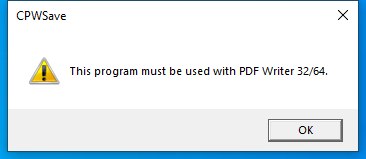

---
title: CPWSave.exe | CutePDF Writer
excerpt: What is CPWSave.exe?
---

# CPWSave.exe 

* File Path: `C:\Program Files (x86)\CutePDF Writer\CPWSave.exe`
* Description: CutePDF Writer

## Screenshot

## Hashes

Type | Hash
-- | --
MD5 | `01DC8E97A26C15F9E36C25ACDE2B4D41`
SHA1 | `06A38B2ED5EF9972DF00CB78BFD163E3168E7713`
SHA256 | `1EBC98B529DD6499FB7EC4CBBD20C474CA8AD31FA10B07CCA6D64FED5B906D04`
SHA384 | `9105436B4F5BF974B7756884EFCB82BB354E40AD79721D89C945BA452C2BA7ECE5520A43AC5623EF7C4848B510218AFC`
SHA512 | `0E1C5AA4727796B74B363DC55548F3FE86BB3832FC57DC1C68E7BBAC8D17F71F1DC521EF8B6D5F0C2E0E50FEB9118DA65644DA2CF5B57E725D19D1D86A980648`
SSDEEP | `49152:WVM7aIZIToF6H0rN4lhZuoNbhd/iWlSYoFOYnGF1EtUfAPRzjapwkqQmmiFnB:x6hNld/hUIYnG7fA5zWuesnB`
IMP | `5C0F5834E7BCB70C6737762986AE0E83`
PESHA1 | `3C1228A7369EC8396B2B464F49E4A5EE3807046A`
PE256 | `09BDB0D86793F5405CE0156EB5CA01B859041A71C24C1933867F0245D086F7A6`

## Runtime Data

### Window Title:
CPWSave

### Open Handles:

Path | Type
-- | --
(R-D)   C:\Windows\Fonts\StaticCache.dat | File
(RW-)   C:\Windows\WinSxS\amd64_microsoft.windows.gdiplus_6595b64144ccf1df_1.1.19041.508_none_faefa4f37613d18e | File
(RW-)   C:\xCyclopedia | File
\BaseNamedObjects\NLS_CodePage_1252_3_2_0_0 | Section
\BaseNamedObjects\NLS_CodePage_437_3_2_0_0 | Section
\Sessions\1\Windows\Theme2547664911 | Section
\Windows\Theme3854699184 | Section

### Loaded Modules:

Path |
-- |
C:\Program Files (x86)\CutePDF Writer\CPWSave.exe |
C:\Windows\System32\ADVAPI32.dll |
C:\Windows\System32\GDI32.dll |
C:\Windows\System32\gdi32full.dll |
C:\Windows\System32\KERNEL32.DLL |
C:\Windows\System32\KERNELBASE.dll |
C:\Windows\System32\msvcp_win.dll |
C:\Windows\System32\msvcrt.dll |
C:\Windows\SYSTEM32\ntdll.dll |
C:\Windows\System32\RPCRT4.dll |
C:\Windows\System32\sechost.dll |
C:\Windows\System32\SHLWAPI.dll |
C:\Windows\System32\ucrtbase.dll |
C:\Windows\System32\USER32.dll |
C:\Windows\SYSTEM32\USERENV.dll |
C:\Windows\System32\win32u.dll |
C:\Windows\SYSTEM32\WTSAPI32.dll |

## Signature

* Status: Signature verified.
* Serial: `47B7E6145C69CEBD`
* Thumbprint: `F14207D01AD434CEB8915DC853CD522C3D78364D`
* Issuer: CN=Go Daddy Secure Certificate Authority - G2, OU=http://certs.godaddy.com/repository/, O="GoDaddy.com, Inc.", L=Scottsdale, S=Arizona, C=US
* Subject: CN=Acro Software Inc, O=Acro Software Inc, L=Haymarket, S=Virginia, C=US

## File Metadata

* Original Filename: CPWSave.EXE
* Product Name: CutePDF Writer Application
* Company Name: Acro Software Inc.
* File Version: 4.0.0.4
* Product Version: 4, 0, 0, 1
* Language: English (United States)
* Legal Copyright: Copyright  2020 by Acro Software Inc., All Rights Reserved
* Machine Type: 64-bit

## File Scan

* VirusTotal Detections: 0/72
* VirusTotal Link: https://www.virustotal.com/gui/file/1ebc98b529dd6499fb7ec4cbbd20c474ca8ad31fa10b07cca6d64fed5b906d04/detection/

MIT License. Copyright (c) 2020-2021 Strontic.

