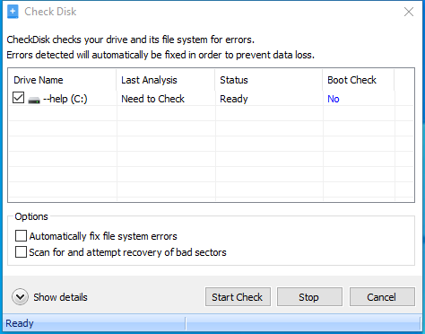

---
title: CheckDisk.exe | Glary Utilities CheckDisk
excerpt: What is CheckDisk.exe?
---

# CheckDisk.exe 

* File Path: `C:\program files (x86)\Glary Utilities 5\CheckDisk.exe`
* Description: Glary Utilities CheckDisk

## Screenshot

## Hashes

Type | Hash
-- | --
MD5 | `92B2309732120B31FA7465A80EA36228`
SHA1 | `70441B79AD3A94BDA4AA78887CCC0AB415AA1780`
SHA256 | `28EA8D1A50D45D1BEA108BAE82B5B2642717C1A38FF91D29CF10C43B8E965162`
SHA384 | `22F624D1DABBC69849502C314B5748412E3BAB91582EF1BCCE470DACAAAE07044DB79E7A72590C010D41E48D38A719CA`
SHA512 | `C4C23512FE3AB822C6D328CA680C48729923E8CF40B6DAA23854769D822552938EF280866966394D73FEA2D368015F7F273E993DA2B6407A43B26AD4FAB86D68`
SSDEEP | `768:SW+28DOtuzzzzzzzzzzSzzzzzzzzzz5zzzNzzzzezzIzzzz6zz/zzzzexzVzHzzQ:/+rOtuzzzzzzzzzzSzzzzzzzzzz5zzz0`

## Runtime Data

### Window Title:
Check Disk

### Open Handles:

Path | Type
-- | --
(R-D)   C:\Windows\Fonts\StaticCache.dat | File
(R-D)   C:\Windows\System32\en-US\windows.storage.dll.mui | File
(RW-)   C:\Program Files (x86)\Glary Utilities 5 | File
(RW-)   C:\Users\user\Documents | File
(RW-)   C:\Windows | File
(RW-)   C:\Windows\WinSxS\x86_microsoft.vc90.crt_1fc8b3b9a1e18e3b_9.0.30729.9625_none_508ef7e4bcbbe589 | File
(RW-)   C:\Windows\WinSxS\x86_microsoft.windows.common-controls_6595b64144ccf1df_6.0.19041.1_none_fd031af45b0106f2 | File
(RW-)   C:\Windows\WinSxS\x86_microsoft.windows.gdiplus_6595b64144ccf1df_1.1.19041.450_none_4294d6e08a97344a | File
(RWD)   C:\Users\user\AppData\Local\Microsoft\Windows\Explorer\iconcache_16.db | File
(RWD)   C:\Users\user\AppData\Local\Microsoft\Windows\Explorer\iconcache_idx.db | File
\BaseNamedObjects\__ComCatalogCache__ | Section
\BaseNamedObjects\C:\*ProgramData\*Microsoft\*Windows\*Caches\*{6AF0698E-D558-4F6E-9B3C-3716689AF493}.2.ver0x0000000000000002.db | Section
\BaseNamedObjects\C:\*ProgramData\*Microsoft\*Windows\*Caches\*{DDF571F2-BE98-426D-8288-1A9A39C3FDA2}.2.ver0x0000000000000001.db | Section
\BaseNamedObjects\C:\*ProgramData\*Microsoft\*Windows\*Caches\*cversions.2.ro | Section
\BaseNamedObjects\NLS_CodePage_1252_3_2_0_0 | Section
\BaseNamedObjects\NLS_CodePage_437_3_2_0_0 | Section
\BaseNamedObjects\windows_shell_global_counters | Section
\Sessions\1\BaseNamedObjects\windows_shell_global_counters | Section
\Sessions\1\Windows\Theme4048709601 | Section
\Windows\Theme603176458 | Section

### Loaded Modules:

Path |
-- |
C:\program files (x86)\Glary Utilities 5\CheckDisk.exe |
C:\Windows\SYSTEM32\ntdll.dll |
C:\Windows\System32\wow64.dll |
C:\Windows\System32\wow64cpu.dll |
C:\Windows\System32\wow64win.dll |

## Signature

* Status: Signature verified.
* Serial: `0F05AE21CDC17B9F3CF09D7BFC659BA3`
* Thumbprint: `362EBB303E088105BDCC07D94E6B7875D30C0D06`
* Issuer: CN=DigiCert Assured ID Code Signing CA-1, OU=www.digicert.com, O=DigiCert Inc, C=US
* Subject: CN=Glarysoft LTD, O=Glarysoft LTD, S=Beijing, C=CN

## File Metadata

* Original Filename: CheckDisk.exe
* Product Name: Glary Utilities
* Company Name: Glarysoft Ltd
* File Version: 5, 0, 0, 21
* Product Version: 5.0.0.1
* Language: Chinese (Simplified, China)
* Legal Copyright: Copyright (c) 2003-2014 Glarysoft Ltd

## File Similarity (ssdeep match)

File | Score
-- | --
[C:\Program Files (x86)\Glary Utilities 5\CheckDisk.exe](CheckDisk.exe-01F274589D09109E693102ADCF40DD18.md) | 97
[C:\Program Files (x86)\Glary Utilities 5\CheckDisk.exe](CheckDisk.exe-EE6490BE0422B1FE26CD2C888F8DBE89.md) | 97

MIT License. Copyright (c) 2020 Strontic.

