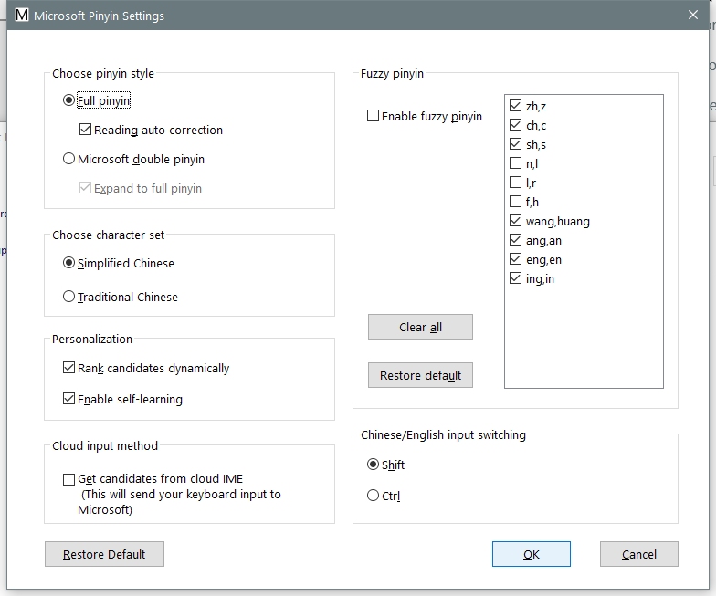

---
title: ChxPropertyUI.exe | Microsoft IME
---

# ChxPropertyUI.exe 

* File Path: `C:\WINDOWS\system32\InputMethod\SHARED\ChxPropertyUI.exe`
* Description: Microsoft IME

## Screenshot

## Hashes

Type | Hash
-- | --
MD5 | `491DC412719C612CF256403E918616CB`
SHA1 | `2F7092A58680094154A08F7DDB9F83B0FCD5BA42`
SHA256 | `8184EEF321C9A9A26848C73419242C664A366CF7F3119416B5528759852EE354`
SHA384 | `3B0FEF1880D05D58C3965A5C22D19A0F0D9D94A5C05422E7EA208EEE73B162FE8D9C431B6CB4B8DC5D97BC7E70F5905F`
SHA512 | `E5E42EBDBD1A7829A109C295A4616A206A1BEEEAFAE7D1157BDBC2DEA7028F1A07920E0E878128554910630ACEC67ECDA80CFFF72C2185E43CF282EDA6AF5F43`
SSDEEP | `768:kEpTU3rrlG9P2HQjUhz4XvCPn9CwJtMGUt:kSUflGRRy0/eJk`

### Loaded Modules:

Path |
-- |
C:\Windows\System32\ADVAPI32.dll |
C:\Windows\System32\GDI32.dll |
C:\Windows\System32\gdi32full.dll |
C:\Windows\system32\InputMethod\CHT\ChtIME.exe |
C:\Windows\System32\KERNEL32.DLL |
C:\Windows\System32\KERNELBASE.dll |
C:\Windows\System32\msvcp_win.dll |
C:\Windows\System32\msvcrt.dll |
C:\Windows\SYSTEM32\ntdll.dll |
C:\Windows\System32\RPCRT4.dll |
C:\Windows\System32\sechost.dll |
C:\Windows\System32\ucrtbase.dll |
C:\Windows\System32\USER32.dll |
C:\Windows\System32\win32u.dll |

## Signature

* Status: The file C:\WINDOWS\system32\InputMethod\SHARED\ChxPropertyUI.exe is not digitally signed. You cannot run this script on the current system. For more information about running scripts and setting execution policy, see about_Execution_Policies at https:/go.microsoft.com/fwlink/?LinkID=135170
* Serial: ``
* Thumbprint: ``
* Issuer: 
* Subject: 

## File Metadata

* Original Filename: ChxPropertyUI.exe
* Product Name: Microsoft Windows Operating System
* Company Name: Microsoft Corporation
* File Version: 6.3.9600.17415 (winblue_r4.141028-1500)
* Product Version: 6.3.9600.17415
* Language: English (United States)
* Legal Copyright:  Microsoft Corporation. All rights reserved.

MIT License. Copyright (c) 2020 Strontic.

