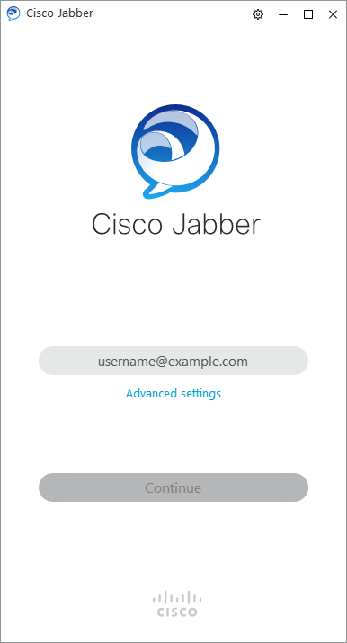

---
title: CiscoJabber.exe | Cisco Jabber
excerpt: What is CiscoJabber.exe?
---

# CiscoJabber.exe 

* File Path: `C:\Program Files (x86)\Cisco Systems\Cisco Jabber\CiscoJabber.exe`
* Description: Cisco Jabber

## Screenshot

## Hashes

Type | Hash
-- | --
MD5 | `EAD2257B89BFB14E314C3D84C4415D34`
SHA1 | `A0F1952BE06B77D49DDE344A7ADC2821EFE54151`
SHA256 | `CF3843D68AE3921ECC9E811361AA28F35C6E45BC235B5F06379E7BCA7CF6B985`
SHA384 | `79F91E12A16AAF3DFEEF1600BCCDB399759E10DD2D50A11DAB6CA00F90671F2C3113BFEA09372A640DDAF6DD663FB342`
SHA512 | `932333873C66797D69BC6EFED939CF5121261CB72C2E5A0F5F0C2F0E987D3E4F8ADE7933576973189A1864F18A45A039BE16CDDA3B82F85D402D93199EFD424F`
SSDEEP | `3072:tRfAkGbgr7Q/IHJ6UYAD9ftdTfmB7xjYxxvsqVgkEpdvS:zfJdCAD9fTfmvji+Fc`
IMP | `FCAED1B3F70885549EA933064191152E`
PESHA1 | `7EF1DD1088FA5042AB27CD33A918ACDF632F0AA5`
PE256 | `507C6D3F02F5AFEB925A8380901C2630B0ED2E202AD107283E6ADD77D084E7DA`

## Runtime Data

### Child Processes:
CiscoJabber.exe CiscoJabber.exe WMIC.exe

### Window Title:
Cisco Jabber

### Open Handles:

Path | Type
-- | --
(R-D)   C:\Windows\Fonts\StaticCache.dat | File
(R-D)   C:\Windows\System32\en-US\kernel32.dll.mui | File
(R-D)   C:\Windows\System32\en-US\KernelBase.dll.mui | File
(R-D)   C:\Windows\System32\en-US\wdmaud.drv.mui | File
(R-D)   C:\Windows\SysWOW64\en-US\msvfw32.dll.mui | File
(RW-)   C:\Program Files (x86)\Cisco Systems\Cisco Jabber | File
(RW-)   C:\Program Files (x86)\Cisco Systems\Cisco Jabber\cef.pak | File
(RW-)   C:\Program Files (x86)\Cisco Systems\Cisco Jabber\cef_100_percent.pak | File
(RW-)   C:\Program Files (x86)\Cisco Systems\Cisco Jabber\cef_200_percent.pak | File
(RW-)   C:\Program Files (x86)\Cisco Systems\Cisco Jabber\cef_extensions.pak | File
(RW-)   C:\Program Files (x86)\Cisco Systems\Cisco Jabber\devtools_resources.pak | File
(RW-)   C:\Program Files (x86)\Cisco Systems\Cisco Jabber\icudtl.dat | File
(RW-)   C:\Program Files (x86)\Cisco Systems\Cisco Jabber\locales\en-US.pak | File
(RW-)   C:\Program Files (x86)\Cisco Systems\Cisco Jabber\natives_blob.bin | File
(RW-)   C:\Program Files (x86)\Cisco Systems\Cisco Jabber\v8_context_snapshot.bin | File
(RW-)   C:\Users\user\AppData\Local\Cisco\Unified Communications\Jabber\CSF\cef_cache\Visited Links | File
(RW-)   C:\Users\user\AppData\Local\Cisco\Unified Communications\Jabber\CSF\Logs\jabber.log.cef | File
(RW-)   C:\Windows | File
(RW-)   C:\Windows\WinSxS\x86_microsoft.windows.common-controls_6595b64144ccf1df_6.0.19041.488_none_11b1e5df2ffd8627 | File
(RW-)   C:\Windows\WinSxS\x86_microsoft.windows.gdiplus_6595b64144ccf1df_1.1.19041.508_none_429cdbca8a8ffa94 | File
(RWD)   C:\Users\user\AppData\Local\Cisco\Unified Communications\Jabber\CSF\cef_cache\GPUCache\data_0 | File
(RWD)   C:\Users\user\AppData\Local\Cisco\Unified Communications\Jabber\CSF\cef_cache\GPUCache\data_1 | File
(RWD)   C:\Users\user\AppData\Local\Cisco\Unified Communications\Jabber\CSF\cef_cache\GPUCache\data_2 | File
(RWD)   C:\Users\user\AppData\Local\Cisco\Unified Communications\Jabber\CSF\cef_cache\GPUCache\data_3 | File
(RWD)   C:\Users\user\AppData\Local\Cisco\Unified Communications\Jabber\CSF\cef_cache\GPUCache\index | File
(RWD)   C:\Windows\Fonts\segoeui.ttf | File
(RWD)   C:\Windows\System32\drivers\etc | File
\BaseNamedObjects\__ComCatalogCache__ | Section
\BaseNamedObjects\C:\*ProgramData\*Microsoft\*Windows\*Caches\*{6AF0698E-D558-4F6E-9B3C-3716689AF493}.2.ver0x0000000000000006.db | Section
\BaseNamedObjects\C:\*ProgramData\*Microsoft\*Windows\*Caches\*{DDF571F2-BE98-426D-8288-1A9A39C3FDA2}.2.ver0x0000000000000002.db | Section
\BaseNamedObjects\C:\*ProgramData\*Microsoft\*Windows\*Caches\*cversions.2 | Section
\BaseNamedObjects\NLS_CodePage_1252_3_2_0_0 | Section
\BaseNamedObjects\NLS_CodePage_437_3_2_0_0 | Section
\BaseNamedObjects\windows_shell_global_counters | Section
\Sessions\1\BaseNamedObjects\1060HWNDInterface:280364 | Section
\Sessions\1\BaseNamedObjects\1060HWNDInterface:2c0422 | Section
\Sessions\1\BaseNamedObjects\1060HWNDInterface:4002ee | Section
\Sessions\1\BaseNamedObjects\windows_ie_global_counters | Section
\Sessions\1\BaseNamedObjects\windows_shell_global_counters | Section
\Sessions\1\Windows\Theme64749523 | Section
\Windows\Theme1120315852 | Section

### Loaded Modules:

Path |
-- |
C:\Program Files (x86)\Cisco Systems\Cisco Jabber\CiscoJabber.exe |
C:\Windows\SYSTEM32\ntdll.dll |
C:\Windows\System32\wow64.dll |
C:\Windows\System32\wow64cpu.dll |
C:\Windows\System32\wow64win.dll |

## Signature

* Status: Signature verified.
* Serial: `59C5C9F46EA82C4C743981566B64BD6C`
* Thumbprint: `475DAEE5A6CC149389EFDE176DEA526C627D203A`
* Issuer: CN=Symantec Class 3 SHA256 Code Signing CA - G2, OU=Symantec Trust Network, O=Symantec Corporation, C=US
* Subject: CN=Cisco Systems Inc., O=Cisco Systems Inc., L=San Jose, S=California, C=US

## File Metadata

* Original Filename: CiscoJabber.exe
* Product Name: Cisco Jabber Application
* Company Name: Cisco Systems, Inc
* File Version: 12.9.2.54247
* Product Version: 12.9.2.54247
* Language: English (Ireland)
* Legal Copyright: Copyright (C) 2012-2015 Cisco Systems Inc.
* Machine Type: 32-bit

## File Scan

* VirusTotal Detections: 0/70
* VirusTotal Link: https://www.virustotal.com/gui/file/cf3843d68ae3921ecc9e811361aa28f35c6e45bc235b5f06379e7bca7cf6b985/detection/

MIT License. Copyright (c) 2020-2021 Strontic.

