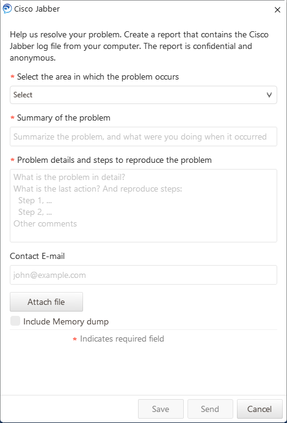

---
title: CiscoJabberPrt.exe | Cisco Jabber Problem Report Tool
excerpt: What is CiscoJabberPrt.exe?
---

# CiscoJabberPrt.exe 

* File Path: `C:\Program Files (x86)\Cisco Systems\Cisco Jabber\CiscoJabberPrt.exe`
* Description: Cisco Jabber Problem Report Tool

## Screenshot

## Hashes

Type | Hash
-- | --
MD5 | `800EE14C1426AA04B9DCA9DA20F97A89`
SHA1 | `1281EAF9F90FF9569BD95C05BFAF63FAD4874BAB`
SHA256 | `5A73F14695839DD90BF4C5E6F848352E9DD1BCA88B2AB9C3E69A3E1D14521369`
SHA384 | `A37570F81EDC2828CE7097F79C53B29EFF2504D5D805A9513C099F2AED97A8030568624289890298BD9EA976EC967ABA`
SHA512 | `3C2F27393D62A30BB489AF0C024F56C72AAC27597E8CF40B00E8BA140170AD60DD580861D85AD9D30D2F8F78AE33AA6018FD1A346BF08618B2373277D500C320`
SSDEEP | `12288:XSHfwY6OeFffXrhubJX1ET3ATTBYGsfahINErO7qIGKU5ZU:GeubJFET3ATTBOforO7qEUbU`
IMP | `A91AD9776113C93AC98F0479C80A74EF`
PESHA1 | `26ABB10A12A6A165A493D71D742F8776CF8A8A50`
PE256 | `DEC3A5D850D326AA1951081C240505A6D2D51E4512EF93A57CFB2B74EBA78892`

## Runtime Data

### Child Processes:
cmd.exe

### Window Title:
Cisco Jabber problem reporting

### Open Handles:

Path | Type
-- | --
(R-D)   C:\Windows\Fonts\StaticCache.dat | File
(RW-)   C:\Users\user\Documents | File
(RW-)   C:\Windows | File
(RW-)   C:\Windows\WinSxS\x86_microsoft.windows.common-controls_6595b64144ccf1df_5.82.19041.488_none_89e6152f0b32762e | File
(RW-)   C:\Windows\WinSxS\x86_microsoft.windows.gdiplus_6595b64144ccf1df_1.1.19041.508_none_429cdbca8a8ffa94 | File
\BaseNamedObjects\__ComCatalogCache__ | Section
\BaseNamedObjects\NLS_CodePage_1252_3_2_0_0 | Section
\BaseNamedObjects\NLS_CodePage_437_3_2_0_0 | Section
\Sessions\1\BaseNamedObjects\windows_shell_global_counters | Section
\Sessions\1\Windows\Theme64749523 | Section
\Windows\Theme1120315852 | Section

### Loaded Modules:

Path |
-- |
C:\Program Files (x86)\Cisco Systems\Cisco Jabber\CiscoJabberPrt.exe |
C:\Windows\SYSTEM32\ntdll.dll |
C:\Windows\System32\wow64.dll |
C:\Windows\System32\wow64cpu.dll |
C:\Windows\System32\wow64win.dll |

## Signature

* Status: Signature verified.
* Serial: `59C5C9F46EA82C4C743981566B64BD6C`
* Thumbprint: `475DAEE5A6CC149389EFDE176DEA526C627D203A`
* Issuer: CN=Symantec Class 3 SHA256 Code Signing CA - G2, OU=Symantec Trust Network, O=Symantec Corporation, C=US
* Subject: CN=Cisco Systems Inc., O=Cisco Systems Inc., L=San Jose, S=California, C=US

## File Metadata

* Original Filename: CiscoJabberPrt.exe
* Product Name: Cisco Jabber
* Company Name: Cisco Systems, Inc
* File Version: 12.9.2.54247
* Product Version: 12.9.2.54247
* Language: English (United States)
* Legal Copyright: Copyright (C) 2012-2015 Cisco Systems Inc.
* Machine Type: 32-bit

## File Scan

* VirusTotal Detections: 0/70
* VirusTotal Link: https://www.virustotal.com/gui/file/5a73f14695839dd90bf4c5e6f848352e9dd1bca88b2ab9c3e69a3e1d14521369/detection/

## File Similarity (ssdeep match)

File | Score
-- | --
[C:\Program Files (x86)\Cisco Systems\Cisco Jabber\CiscoJabberPrtC.exe](CiscoJabberPrtC.exe-530A40F7846A3205E7B5A42001067E24.md) | 41

MIT License. Copyright (c) 2020 Strontic.

