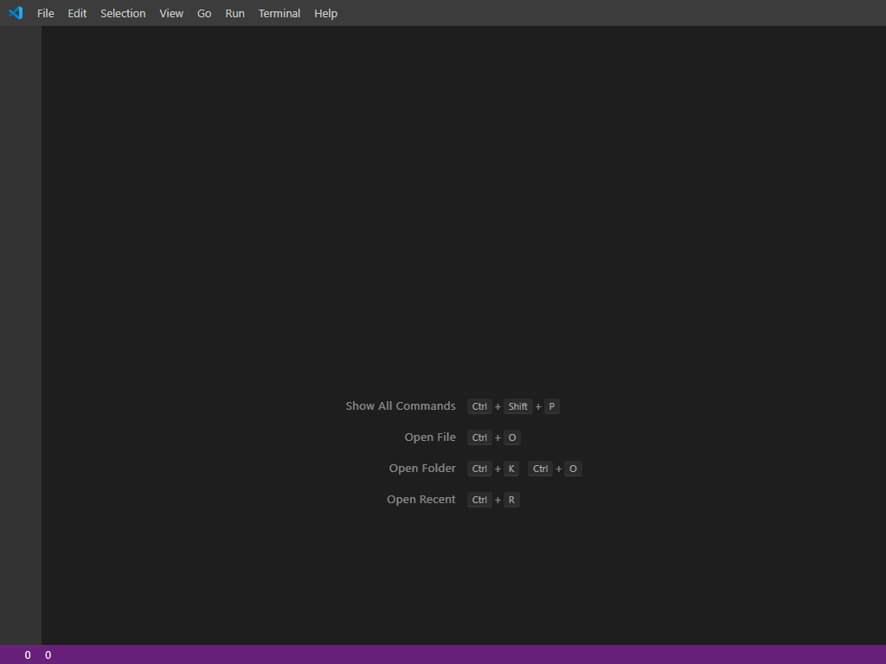

---
title: Code.exe | Visual Studio Code
excerpt: What is Code.exe?
---

# Code.exe 

* File Path: `C:\Program Files\Microsoft VS Code\Code.exe`
* Description: Visual Studio Code

## Screenshot



## Hashes

Type | Hash
-- | --
MD5 | `51C687B9F501188060644C12152BE7A4`
SHA1 | `B2C7FE93A18B9596399ABB87BFC0D604DD1932E2`
SHA256 | `65BB2758B1F8B3F4CAE9534840A816802AE2B4CA3B2FA4389FB566D1215991EA`
SHA384 | `1E38F69A91F0AE1F18E84F40C6B587D414662C6AF655143ED8DFA287596E63C720590360D244D3E0D0F2723D12D3FFEE`
SHA512 | `3D345F2F52C98BDCB2881B22272BD6A0CD574F581D873B65961903F35A09BB2F1DE87347C1C0602B3996FA1566CCB3A041944D396064A1EE81F61B9FB49574AD`
SSDEEP | `786432:cB7NUH/fmU2BjeYIb0pki24Xxb5Jr/0nO6XjqSyS:ckHn6Bjexb06EXxb5Jr/EO6Xjv`
IMP | `0D2A7AE0373D8B723267BC30DEDA17CF`
PESHA1 | `096E76180EF52AE990296ACB132397646A103F38`
PE256 | `794D192E4D599B318CB7D66413F86FC324D078EB3FB054BCEB5C12B3385463B9`

## Runtime Data

### Usage (stdout):
```cmhg

Warning: 'e' is not in the list of known options, but still passed to Electron/Chromium.
Warning: 'l' is not in the list of known options, but still passed to Electron/Chromium.
Warning: 'p' is not in the list of known options, but still passed to Electron/Chromium.
[main 2020-09-24T22:12:28.732Z] update#setState idle

```

### Child Processes:
Code.exe Code.exe Code.exe Code.exe

### Window Title:
Visual Studio Code

### Open Handles:

Path | Type
-- | --
(R--)   C:\Users\user\AppData\Roaming\Code\logs\20200924T181239\main.log | File
(R-D)   C:\Windows\Fonts\StaticCache.dat | File
(R-D)   C:\Windows\System32\en-US\mswsock.dll.mui | File
(R-D)   C:\Windows\System32\en-US\user32.dll.mui | File
(RW-)   C:\Program Files\Microsoft VS Code | File
(RW-)   C:\Program Files\Microsoft VS Code\chrome_100_percent.pak | File
(RW-)   C:\Program Files\Microsoft VS Code\chrome_200_percent.pak | File
(RW-)   C:\Program Files\Microsoft VS Code\icudtl.dat | File
(RW-)   C:\Program Files\Microsoft VS Code\locales\en-US.pak | File
(RW-)   C:\Program Files\Microsoft VS Code\resources.pak | File
(RW-)   C:\Program Files\Microsoft VS Code\resources\app\node_modules.asar | File
(RW-)   C:\Program Files\Microsoft VS Code\v8_context_snapshot.bin | File
(RW-)   C:\Users\user\AppData\Roaming\Code\Local Storage\leveldb\000003.log | File
(RW-)   C:\Users\user\AppData\Roaming\Code\Local Storage\leveldb\LOCK | File
(RW-)   C:\Users\user\AppData\Roaming\Code\Local Storage\leveldb\LOG | File
(RW-)   C:\Users\user\AppData\Roaming\Code\Local Storage\leveldb\MANIFEST-000001 | File
(RW-)   C:\Users\user\AppData\Roaming\Code\User\globalStorage\state.vscdb | File
(RW-)   C:\Windows\WinSxS\amd64_microsoft.windows.common-controls_6595b64144ccf1df_6.0.19041.488_none_ca04af081b815d21 | File
(RWD)   C:\Users\user\AppData\Roaming\Code\User | File
(RWD)   C:\Windows\System32\drivers\etc | File
\BaseNamedObjects\__ComCatalogCache__ | Section
\BaseNamedObjects\C:\*ProgramData\*Microsoft\*Windows\*Caches\*{6AF0698E-D558-4F6E-9B3C-3716689AF493}.2.ver0x0000000000000003.db | Section
\BaseNamedObjects\C:\*ProgramData\*Microsoft\*Windows\*Caches\*{DDF571F2-BE98-426D-8288-1A9A39C3FDA2}.2.ver0x0000000000000002.db | Section
\BaseNamedObjects\C:\*ProgramData\*Microsoft\*Windows\*Caches\*cversions.2 | Section
\BaseNamedObjects\NLS_CodePage_1252_3_2_0_0 | Section
\BaseNamedObjects\NLS_CodePage_437_3_2_0_0 | Section
\BaseNamedObjects\windows_shell_global_counters | Section
\Sessions\1\BaseNamedObjects\1394HWNDInterface:390762 | Section
\Sessions\1\BaseNamedObjects\node-debug-handler-5012 | Section
\Sessions\1\BaseNamedObjects\windows_shell_global_counters | Section
\Sessions\1\Windows\Theme2547664911 | Section
\Windows\Theme3854699184 | Section


### Loaded Modules:

Path |
-- |
C:\Program Files\Microsoft VS Code\Code.exe |
C:\Program Files\Microsoft VS Code\ffmpeg.dll |
C:\Windows\System32\advapi32.dll |
C:\Windows\System32\combase.dll |
C:\Windows\System32\COMDLG32.dll |
C:\Windows\System32\CRYPT32.dll |
C:\Windows\SYSTEM32\d3d11.dll |
C:\Windows\SYSTEM32\d3d9.dll |
C:\Windows\SYSTEM32\dbghelp.dll |
C:\Windows\SYSTEM32\dhcpcsvc.DLL |
C:\Windows\SYSTEM32\dwmapi.dll |
C:\Windows\SYSTEM32\DWrite.dll |
C:\Windows\SYSTEM32\dxgi.dll |
C:\Windows\SYSTEM32\dxva2.dll |
C:\Windows\System32\GDI32.dll |
C:\Windows\System32\gdi32full.dll |
C:\Windows\SYSTEM32\HID.DLL |
C:\Windows\SYSTEM32\iertutil.dll |
C:\Windows\System32\IMM32.dll |
C:\Windows\SYSTEM32\IPHLPAPI.DLL |
C:\Windows\SYSTEM32\kernel.appcore.dll |
C:\Windows\System32\KERNEL32.DLL |
C:\Windows\System32\KERNELBASE.dll |
C:\Windows\SYSTEM32\MSIMG32.dll |
C:\Windows\System32\msvcp_win.dll |
C:\Windows\System32\msvcrt.dll |
C:\Windows\SYSTEM32\ncrypt.dll |
C:\Windows\SYSTEM32\ntdll.dll |
C:\Windows\SYSTEM32\OLEACC.dll |
C:\Windows\System32\OLEAUT32.dll |
C:\Windows\SYSTEM32\PROPSYS.dll |
C:\Windows\System32\RPCRT4.dll |
C:\Windows\System32\sechost.dll |
C:\Windows\SYSTEM32\Secur32.dll |
C:\Windows\System32\shcore.dll |
C:\Windows\System32\SHELL32.dll |
C:\Windows\System32\SHLWAPI.dll |
C:\Windows\SYSTEM32\SSPICLI.DLL |
C:\Windows\System32\ucrtbase.dll |
C:\Windows\SYSTEM32\UIAutomationCore.DLL |
C:\Windows\SYSTEM32\urlmon.dll |
C:\Windows\System32\USER32.dll |
C:\Windows\SYSTEM32\USERENV.dll |
C:\Windows\SYSTEM32\USP10.dll |
C:\Windows\SYSTEM32\UxTheme.dll |
C:\Windows\SYSTEM32\VERSION.dll |
C:\Windows\System32\win32u.dll |
C:\Windows\SYSTEM32\windows.storage.dll |
C:\Windows\SYSTEM32\WINHTTP.dll |
C:\Windows\SYSTEM32\WINMM.dll |
C:\Windows\SYSTEM32\Wldp.dll |
C:\Windows\System32\WS2_32.dll |
C:\Windows\SYSTEM32\WTSAPI32.dll |
C:\Windows\WinSxS\amd64_microsoft.windows.common-controls_6595b64144ccf1df_6.0.19041.488_none_ca04af081b815d21\COMCTL32.dll |


## Signature

* Status: Signature verified.
* Serial: `3300000187721772155940C709000000000187`
* Thumbprint: `2485A7AFA98E178CB8F30C9838346B514AEA4769`
* Issuer: CN=Microsoft Code Signing PCA 2011, O=Microsoft Corporation, L=Redmond, S=Washington, C=US
* Subject: CN=Microsoft Corporation, O=Microsoft Corporation, L=Redmond, S=Washington, C=US

## File Metadata

* Original Filename: electron.exe
* Product Name: Visual Studio Code
* Company Name: Microsoft Corporation
* File Version: 1.49.1
* Product Version: 1.49.1
* Language: English (United States)
* Legal Copyright: Copyright (C) 2019 Microsoft. All rights reserved
* Machine Type: 64-bit

## File Scan

* VirusTotal Detections: 0/68
* VirusTotal Link: https://www.virustotal.com/gui/file/65bb2758b1f8b3f4cae9534840a816802ae2b4ca3b2fa4389fb566d1215991ea/detection/


MIT License. Copyright (c) 2020 Strontic.


