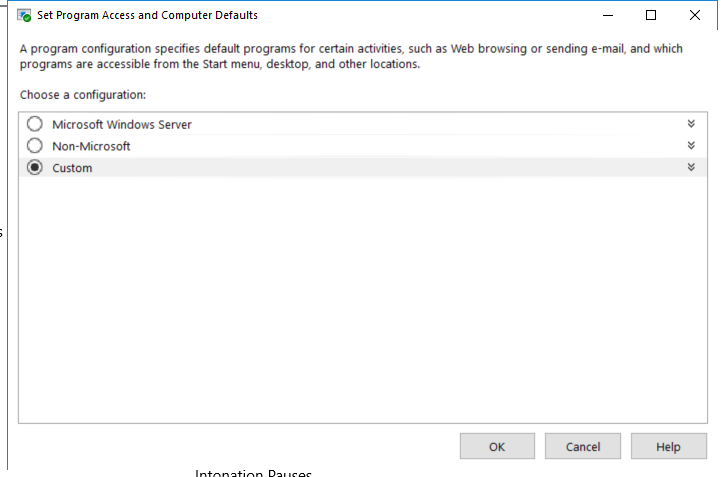

---
title: ComputerDefaults.exe | Set Program Access and Computer Defaults Control Panel
excerpt: What is ComputerDefaults.exe?
---

# ComputerDefaults.exe 

* File Path: `C:\Windows\system32\ComputerDefaults.exe`
* Description: Set Program Access and Computer Defaults Control Panel

## Screenshot

## Hashes

Type | Hash
-- | --
MD5 | `D25A9E160E3B74EF2242023726F15416`
SHA1 | `27A9BB9D7628D442F9B5CF47711C906E3315755B`
SHA256 | `7B0334C329E40A542681BCAFF610AE58ADA8B1F77FF6477734C1B8B9A951EF4C`
SHA384 | `3C7A69579ECD5A4953FEE1EBEC0C9C752D268153093A0008BDA114225B93A9F1C6651D8997E8D84CD38F895525D14C87`
SHA512 | `BAFAEE786C90C96A2F76D4BBCDDBBF397A1AFD82D55999081727900F3C2DE8D2EBA6B77D25C622DE0C1E91C54259116BC37BC9F29471D1B387F78AAA4D276910`
SSDEEP | `1536:DayE7ffgaxRF71ry9vmt486MypQKURDoq4OZZZLlCIibz:Y3ganFp4NpqRD68wbz`
IMP | `00B74CCF8A4820BD574431AE64ECF0C5`
PESHA1 | `9028D08B690C437B26F6124EE97FBA31C01FF907`
PE256 | `11D8AC4CD8675361BE1C8A17A15F345C62C98C1C173D13EDC2396A6B3696BB57`

## Runtime Data

### Loaded Modules:

Path |
-- |
C:\Windows\System32\ADVAPI32.dll |
C:\Windows\system32\ComputerDefaults.exe |
C:\Windows\System32\GDI32.dll |
C:\Windows\System32\gdi32full.dll |
C:\Windows\System32\IMM32.DLL |
C:\Windows\System32\KERNEL32.DLL |
C:\Windows\System32\KERNELBASE.dll |
C:\Windows\System32\msvcp_win.dll |
C:\Windows\System32\msvcrt.dll |
C:\Windows\SYSTEM32\ntdll.dll |
C:\Windows\System32\RPCRT4.dll |
C:\Windows\System32\sechost.dll |
C:\Windows\System32\SHELL32.dll |
C:\Windows\System32\ucrtbase.dll |
C:\Windows\System32\USER32.dll |
C:\Windows\System32\win32u.dll |

## Signature

* Status: Signature verified.
* Serial: `3300000266BD1580EFA75CD6D3000000000266`
* Thumbprint: `A4341B9FD50FB9964283220A36A1EF6F6FAA7840`
* Issuer: CN=Microsoft Windows Production PCA 2011, O=Microsoft Corporation, L=Redmond, S=Washington, C=US
* Subject: CN=Microsoft Windows, O=Microsoft Corporation, L=Redmond, S=Washington, C=US

## File Metadata

* Original Filename: ComputerDefaults.EXE.MUI
* Product Name: Microsoft Windows Operating System
* Company Name: Microsoft Corporation
* File Version: 10.0.19041.1 (WinBuild.160101.0800)
* Product Version: 10.0.19041.1
* Language: English (United States)
* Legal Copyright:  Microsoft Corporation. All rights reserved.
* Machine Type: 64-bit

## File Scan

* VirusTotal Detections: 0/75
* VirusTotal Link: https://www.virustotal.com/gui/file/7b0334c329e40a542681bcaff610ae58ada8b1f77ff6477734c1b8b9a951ef4c/detection

## File Similarity (ssdeep match)

File | Score
-- | --
[C:\Windows\system32\ComputerDefaults.exe](ComputerDefaults.exe-3F032A1BDF4D7DF2F43FE7C0410AC175.md) | 50
[C:\WINDOWS\system32\ComputerDefaults.exe](ComputerDefaults.exe-495F18535BBBA007A18EC5EE708318FE.md) | 49
[C:\Windows\system32\ComputerDefaults.exe](ComputerDefaults.exe-AC4C3945A3E6DFFF98145096DA4EDA93.md) | 49
[C:\windows\system32\ComputerDefaults.exe](ComputerDefaults.exe-C18B586CA8F414A47D9CBA263361692B.md) | 54
[C:\Windows\system32\xwizard.exe](xwizard.exe-10B8BDC83EF7CFBBD344F2587453AD29.md) | 44
[C:\windows\system32\xwizard.exe](xwizard.exe-2AFA70B713D8AF4279C9FDAE7AD08A9D.md) | 50
[C:\Windows\system32\xwizard.exe](xwizard.exe-30C784340F42DB44A84C7958C240E394.md) | 46
[C:\WINDOWS\system32\xwizard.exe](xwizard.exe-30D89280E86DFB29C2F232194642125E.md) | 43
[C:\Windows\system32\xwizard.exe](xwizard.exe-C0CCC55F9E988ACB8B624EFD0EC8B92B.md) | 46
[C:\windows\SysWOW64\ComputerDefaults.exe](ComputerDefaults.exe-1A506E36A76AD897490E77313CD3259A.md) | 55
[C:\WINDOWS\SysWOW64\ComputerDefaults.exe](ComputerDefaults.exe-455CCBB47F4BEF02A9E0034859CE59E2.md) | 46
[C:\Windows\SysWOW64\ComputerDefaults.exe](ComputerDefaults.exe-4A007FCF54D0379B75D1FA50F840D62B.md) | 50
[C:\Windows\SysWOW64\ComputerDefaults.exe](ComputerDefaults.exe-CFA65B13918526579371C138108A7DDB.md) | 50
[C:\Windows\SysWOW64\ComputerDefaults.exe](ComputerDefaults.exe-FF2E0EABBB610CD9D4F06C8C0E33B92F.md) | 46
[C:\Windows\SysWOW64\xwizard.exe](xwizard.exe-3C70F039EE4C07511ABD82B5664FB91B.md) | 52
[C:\Windows\SysWOW64\xwizard.exe](xwizard.exe-759CF84292251AB50E1791CBC0C4E8C5.md) | 49
[C:\windows\SysWOW64\xwizard.exe](xwizard.exe-7E421CBAF3DB19860413EC55C5B03F61.md) | 47
[C:\Windows\SysWOW64\xwizard.exe](xwizard.exe-8581F29C5F84B72C053DBCC5372C5DB6.md) | 46
[C:\WINDOWS\SysWOW64\xwizard.exe](xwizard.exe-CB72CA2B130AA4B776FAF32E18453CF6.md) | 47

## Possible Misuse

*The following table contains possible examples of `ComputerDefaults.exe` being misused. While `ComputerDefaults.exe` is **not** inherently malicious, its legitimate functionality can by abused for malicious purposes.*

Source | Source File | Example | License
-- | -- | -- | --
[atomic-red-team](https://github.com/redcanaryco/atomic-red-team) | [index.md](https://github.com/redcanaryco/atomic-red-team/blob/master/atomics/Indexes/Indexes-Markdown/index.md) | - Atomic Test #5: Bypass UAC using ComputerDefaults (PowerShell) [windows] | [MIT License. © 2018 Red Canary](https://github.com/redcanaryco/atomic-red-team/blob/master/LICENSE.txt)
[atomic-red-team](https://github.com/redcanaryco/atomic-red-team) | [windows-index.md](https://github.com/redcanaryco/atomic-red-team/blob/master/atomics/Indexes/Indexes-Markdown/windows-index.md) | - Atomic Test #5: Bypass UAC using ComputerDefaults (PowerShell) [windows] | [MIT License. © 2018 Red Canary](https://github.com/redcanaryco/atomic-red-team/blob/master/LICENSE.txt)
[atomic-red-team](https://github.com/redcanaryco/atomic-red-team) | [T1548.002.md](https://github.com/redcanaryco/atomic-red-team/blob/master/atomics/T1548.002/T1548.002.md) | - [Atomic Test #5 - Bypass UAC using ComputerDefaults (PowerShell)](#atomic-test-5---bypass-uac-using-computerdefaults-powershell) | [MIT License. © 2018 Red Canary](https://github.com/redcanaryco/atomic-red-team/blob/master/LICENSE.txt)
[atomic-red-team](https://github.com/redcanaryco/atomic-red-team) | [T1548.002.md](https://github.com/redcanaryco/atomic-red-team/blob/master/atomics/T1548.002/T1548.002.md) | ## Atomic Test #5 - Bypass UAC using ComputerDefaults (PowerShell) | [MIT License. © 2018 Red Canary](https://github.com/redcanaryco/atomic-red-team/blob/master/LICENSE.txt)
[atomic-red-team](https://github.com/redcanaryco/atomic-red-team) | [T1548.002.md](https://github.com/redcanaryco/atomic-red-team/blob/master/atomics/T1548.002/T1548.002.md) | PowerShell code to bypass User Account Control using ComputerDefaults.exe on Windows 10 | [MIT License. © 2018 Red Canary](https://github.com/redcanaryco/atomic-red-team/blob/master/LICENSE.txt)
[atomic-red-team](https://github.com/redcanaryco/atomic-red-team) | [T1548.002.md](https://github.com/redcanaryco/atomic-red-team/blob/master/atomics/T1548.002/T1548.002.md) | Start-Process "C:\Windows\System32\ComputerDefaults.exe" | [MIT License. © 2018 Red Canary](https://github.com/redcanaryco/atomic-red-team/blob/master/LICENSE.txt)

MIT License. Copyright (c) 2020 Strontic.

