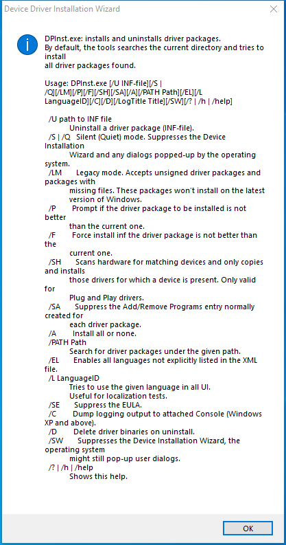

---
title: DPInst32.exe | Driver Package Installer
excerpt: What is DPInst32.exe?
---

# DPInst32.exe 

* File Path: `C:\program files (x86)\Glary Utilities 5\DPInst32.exe`
* Description: Driver Package Installer

## Screenshot

## Hashes

Type | Hash
-- | --
MD5 | `3F442906B29B552F1C9FEC1E221D90B7`
SHA1 | `77FA9F9255D8577AA28357F97E09838C9C43DE34`
SHA256 | `E12BF594F98A878DA912D7A70743CC486238EAC645A4B8E603CAE8FEECBDE549`
SHA384 | `FA97945368F81338F81DBADAA802A27898A8DDD5A0323A21BBFEC820563234233164C3C46A3E4C5967E0847E9C9427E2`
SHA512 | `EDB4770F83A15E1F1F1B8C1ADFFB3F7AD188AA0E8570CD9D5A4482DF4DD5E1A6AE5B7DF30540ADB7F71507B097D3490EE685E92AB50B7E72C5C5B55AD60BBFB3`
SSDEEP | `6144:F2BG1lkWPemh/CsOs5Un05pJg6fjlhFbLdG3sBtbIPjVXH+u8s5NwOPL6k:wc19PtCsOsCn01g6L9aPM26OPL`

## Runtime Data

### Window Title:
Device Driver Installation Wizard

### Open Handles:

Path | Type
-- | --
(R-D)   C:\Windows\Fonts\StaticCache.dat | File
(R-D)   C:\Windows\SystemResources\imageres.dll.mun | File
(RW-)   C:\Users\user\Documents | File
(RW-)   C:\Windows | File
(RW-)   C:\Windows\DPINST.LOG | File
(RW-)   C:\Windows\WinSxS\x86_microsoft.windows.common-controls_6595b64144ccf1df_6.0.19041.1_none_fd031af45b0106f2 | File
\BaseNamedObjects\NLS_CodePage_1252_3_2_0_0 | Section
\BaseNamedObjects\NLS_CodePage_437_3_2_0_0 | Section
\Sessions\1\Windows\Theme4048709601 | Section
\Windows\Theme603176458 | Section

### Loaded Modules:

Path |
-- |
C:\program files (x86)\Glary Utilities 5\DPInst32.exe |
C:\Windows\SYSTEM32\ntdll.dll |
C:\Windows\System32\wow64.dll |
C:\Windows\System32\wow64cpu.dll |
C:\Windows\System32\wow64win.dll |

## Signature

* Status: Signature verified.
* Serial: `6110C352000000000003`
* Thumbprint: `5C4D0AED88959C9D30C1B30F9AA916BE57544CF6`
* Issuer: CN=Microsoft Windows Verification Intermediate PCA, O=Microsoft Corporation, L=Redmond, S=Washington, C=US
* Subject: CN=Microsoft Windows Component Publisher, O=Microsoft Corporation, L=Redmond, S=Washington, C=US

## File Metadata

* Original Filename: DPInst.exe
* Product Name: Driver Package Installer (DPInst)
* Company Name: Microsoft Corporation
* File Version: 2.1
* Product Version: 2.1
* Language: English (United States)
* Legal Copyright:  Microsoft Corporation. All rights reserved.

MIT License. Copyright (c) 2020 Strontic.

