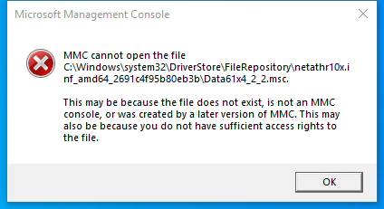

---
title: Data61x4_2_2.msc | 
excerpt: What is Data61x4_2_2.msc?
---

# Data61x4_2_2.msc 

* File Path: `C:\Windows\system32\DriverStore\FileRepository\netathr10x.inf_amd64_2691c4f95b80eb3b\Data61x4_2_2.msc`
* Description: Microsoft Management Console (Window Title)

## Screenshot

## Hashes

Type | Hash
-- | --
MD5 | `345B4D382AC78DEBE516B841B6DBF1E6`
SHA1 | `108DFC6F32158FE3C616631617F3A35860867999`
SHA256 | `57138D4E94D4ADFAF801EA9A3D4B69353843514AFA3F6BF9631586780AE783A6`
SHA384 | `364E8D5407002B61289A70C16100FD31C81B135A89EBC3CD24AB45CEEB28F04CE308F7E0E99F8CCA6D062CBF765B9A20`
SHA512 | `2327BC2C1B480D14BE5D9AA13667317C1A38FE6C317891CFF3E5641BD23FF0F1A6965E088C08D18B61F627460FB343CB269E37FB9B59C094989417986C3569AB`
SSDEEP | `1536:t9cH9qzshcZidUhpSy7Zbi/CrXcnjPMSUf:t3shcZidUhpSyFbMCDcnjPMSUf`
PESHA1 | `108DFC6F32158FE3C616631617F3A35860867999`
PE256 | `57138D4E94D4ADFAF801EA9A3D4B69353843514AFA3F6BF9631586780AE783A6`

## Runtime Data

### Window Title:
Microsoft Management Console

### Open Handles:

Path | Type
-- | --
(R-D)   C:\Windows\Fonts\StaticCache.dat | File
(R-D)   C:\Windows\System32\en-US\KernelBase.dll.mui | File
(R-D)   C:\Windows\System32\en-US\MFC42u.dll.mui | File
(R-D)   C:\Windows\System32\en-US\mmc.exe.mui | File
(R-D)   C:\Windows\System32\en-US\mmcbase.dll.mui | File
(R-D)   C:\Windows\System32\en-US\msxml6r.dll.mui | File
(R-D)   C:\Windows\System32\en-US\netmsg.dll.mui | File
(RW-)   C:\Users\user | File
(RW-)   C:\Windows\WinSxS\amd64_microsoft.windows.common-controls_6595b64144ccf1df_6.0.19041.746_none_ca02b4b61b8320a4 | File
\BaseNamedObjects\__ComCatalogCache__ | Section
\BaseNamedObjects\C:\*ProgramData\*Microsoft\*Windows\*Caches\*{6AF0698E-D558-4F6E-9B3C-3716689AF493}.2.ver0x0000000000000002.db | Section
\BaseNamedObjects\C:\*ProgramData\*Microsoft\*Windows\*Caches\*{DDF571F2-BE98-426D-8288-1A9A39C3FDA2}.2.ver0x0000000000000002.db | Section
\BaseNamedObjects\C:\*ProgramData\*Microsoft\*Windows\*Caches\*cversions.2 | Section
\BaseNamedObjects\NLS_CodePage_1252_3_2_0_0 | Section
\BaseNamedObjects\NLS_CodePage_437_3_2_0_0 | Section
\Sessions\1\BaseNamedObjects\windows_shell_global_counters | Section
\Sessions\1\Windows\Theme3205582532 | Section
\Windows\Theme3800351183 | Section

### Loaded Modules:

Path |
-- |
C:\Windows\SYSTEM32\apphelp.dll |
C:\Windows\System32\KERNEL32.DLL |
C:\Windows\System32\KERNELBASE.dll |
C:\Windows\SYSTEM32\mmc.exe |
C:\Windows\SYSTEM32\ntdll.dll |

## Signature

* Status: Signature verified.
* Serial: `3300000266BD1580EFA75CD6D3000000000266`
* Thumbprint: `A4341B9FD50FB9964283220A36A1EF6F6FAA7840`
* Issuer: CN=Microsoft Windows Production PCA 2011, O=Microsoft Corporation, L=Redmond, S=Washington, C=US
* Subject: CN=Microsoft Windows, O=Microsoft Corporation, L=Redmond, S=Washington, C=US

## File Metadata

* Original Filename: 
* Product Name: 
* Company Name: 
* File Version: 
* Product Version: 
* Language: 
* Legal Copyright: 

## File Scan

* VirusTotal Detections: 0/70
* VirusTotal Link: https://www.virustotal.com/gui/file/57138d4e94d4adfaf801ea9a3d4b69353843514afa3f6bf9631586780ae783a6/detection

## File Similarity (ssdeep match)

File | Score
-- | --
[C:\Windows\system32\DriverStore\FileRepository\netathr10x.inf_amd64_2691c4f95b80eb3b\Data9377_2_0.msc](Data9377_2_0.msc-0DDA727D9AA01947D6651E9864F81BCB.md) | 99

MIT License. Copyright (c) 2020-2021 Strontic.

