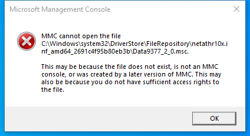

---
title: Data9377_2_0.msc | 
excerpt: What is Data9377_2_0.msc?
---

# Data9377_2_0.msc 

* File Path: `C:\Windows\system32\DriverStore\FileRepository\netathr10x.inf_amd64_2691c4f95b80eb3b\Data9377_2_0.msc`
* Description: Microsoft Management Console (Window Title)

## Screenshot

## Hashes

Type | Hash
-- | --
MD5 | `0DDA727D9AA01947D6651E9864F81BCB`
SHA1 | `C8EC34A580E36A99CE8DEF910B58562B51B01242`
SHA256 | `6175EDAD1433FF1A9D93F36C30D96C421A1A5691BBC0D64DC6B5548F33CFF784`
SHA384 | `4A3BB86704C58B182F25BBE807FAD04D23BEEA47B86659DAAC9A4F1D5D4C7134F8CFB61B4BFDA883AB42599EDBD5638F`
SHA512 | `7887E051D3A31E647E6C5B75B805A661FEF3DAF20170F5056774F5F474F4614DD473AD52B39199CBA0B5EE2265F5174E3630E63BCC2C8C1A920B2471DF4E1961`
SSDEEP | `1536:tGcH9qzshcZidUhpSy7Zbi/CrXcnjPMSUf:tyshcZidUhpSyFbMCDcnjPMSUf`
PESHA1 | `C8EC34A580E36A99CE8DEF910B58562B51B01242`
PE256 | `6175EDAD1433FF1A9D93F36C30D96C421A1A5691BBC0D64DC6B5548F33CFF784`

## Runtime Data

### Window Title:
Microsoft Management Console

### Open Handles:

Path | Type
-- | --
(R-D)   C:\Windows\Fonts\StaticCache.dat | File
(R-D)   C:\Windows\System32\en-US\KernelBase.dll.mui | File
(R-D)   C:\Windows\System32\en-US\MFC42u.dll.mui | File
(R-D)   C:\Windows\System32\en-US\mmc.exe.mui | File
(R-D)   C:\Windows\System32\en-US\mmcbase.dll.mui | File
(R-D)   C:\Windows\System32\en-US\msxml6r.dll.mui | File
(R-D)   C:\Windows\System32\en-US\netmsg.dll.mui | File
(RW-)   C:\Users\user | File
(RW-)   C:\Windows\WinSxS\amd64_microsoft.windows.common-controls_6595b64144ccf1df_6.0.19041.746_none_ca02b4b61b8320a4 | File
\BaseNamedObjects\__ComCatalogCache__ | Section
\BaseNamedObjects\C:\*ProgramData\*Microsoft\*Windows\*Caches\*{6AF0698E-D558-4F6E-9B3C-3716689AF493}.2.ver0x0000000000000002.db | Section
\BaseNamedObjects\C:\*ProgramData\*Microsoft\*Windows\*Caches\*{DDF571F2-BE98-426D-8288-1A9A39C3FDA2}.2.ver0x0000000000000002.db | Section
\BaseNamedObjects\C:\*ProgramData\*Microsoft\*Windows\*Caches\*cversions.2 | Section
\BaseNamedObjects\NLS_CodePage_1252_3_2_0_0 | Section
\BaseNamedObjects\NLS_CodePage_437_3_2_0_0 | Section
\Sessions\1\BaseNamedObjects\windows_shell_global_counters | Section
\Sessions\1\Windows\Theme3205582532 | Section
\Windows\Theme3800351183 | Section

### Loaded Modules:

Path |
-- |
C:\Windows\SYSTEM32\apphelp.dll |
C:\Windows\System32\KERNEL32.DLL |
C:\Windows\System32\KERNELBASE.dll |
C:\Windows\SYSTEM32\mmc.exe |
C:\Windows\SYSTEM32\ntdll.dll |

## Signature

* Status: Signature verified.
* Serial: `3300000266BD1580EFA75CD6D3000000000266`
* Thumbprint: `A4341B9FD50FB9964283220A36A1EF6F6FAA7840`
* Issuer: CN=Microsoft Windows Production PCA 2011, O=Microsoft Corporation, L=Redmond, S=Washington, C=US
* Subject: CN=Microsoft Windows, O=Microsoft Corporation, L=Redmond, S=Washington, C=US

## File Metadata

* Original Filename: 
* Product Name: 
* Company Name: 
* File Version: 
* Product Version: 
* Language: 
* Legal Copyright: 

## File Scan

* VirusTotal Detections: 0/73
* VirusTotal Link: https://www.virustotal.com/gui/file/6175edad1433ff1a9d93f36c30d96c421a1a5691bbc0d64dc6b5548f33cff784/detection

## File Similarity (ssdeep match)

File | Score
-- | --
[C:\Windows\system32\DriverStore\FileRepository\netathr10x.inf_amd64_2691c4f95b80eb3b\Data61x4_2_2.msc](Data61x4_2_2.msc-345B4D382AC78DEBE516B841B6DBF1E6.md) | 99

MIT License. Copyright (c) 2020-2021 Strontic.

