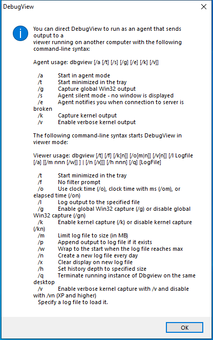

---
title: Dbgview.exe | DebugView
excerpt: What is Dbgview.exe?
---

# Dbgview.exe 

* File Path: `C:\SysinternalsSuite\Dbgview.exe`
* Description: DebugView

## Screenshot

## Hashes

Type | Hash
-- | --
MD5 | `938CF99E2D28B3EE0C21D50F64964C66`
SHA1 | `B61A4B0E348AA1509C2B785C7D86511ED9E003A0`
SHA256 | `374136C3136DFE14EB3B18908F64FA21B00EB0D8456D2DE9E135D3B29CD1DE2F`
SHA384 | `D06CB4A72FAC4074F0AEBBB60A0A425374D743E14707785AF85F81980893D6A73A79FA7930D12806E724BD5E2706D3A0`
SHA512 | `E80455B2D9667DD340BAFE3AA52D2BD24F6232C37ABB63583EDD57FF2CAAA1C6FEF9667E5E0B4C3EDECBF787343FFD5A5B60E70D45B806F14D3CDD212946B747`
SSDEEP | `12288:KyxyFuueC89L9SG8X6UdLJmpXYu2Yd0dABHokf4DxX84MoqSmn1eyD3jt/B0rpOJ:X+1YeABIkf4DxXpISsMOOOHk5zQ/ERg`
IMP | `1E1114D83AE11299940AFC2459EE7BC5`
PESHA1 | `D1D6AE5D12429AC46ABECBB32D5359F691E785E3`
PE256 | `BFBDD88D85258485D70541F28430C45FA140BF519C12763510AE0D48226A5220`

## Runtime Data

### Window Title:
Log File Open Error

### Open Handles:

Path | Type
-- | --
(R-D)   C:\Windows\Fonts\StaticCache.dat | File
(R-D)   C:\Windows\SystemResources\imageres.dll.mun | File
(RW-)   C:\Windows | File
(RW-)   C:\Windows\WinSxS\x86_microsoft.windows.common-controls_6595b64144ccf1df_6.0.19041.488_none_11b1e5df2ffd8627 | File
(RW-)   C:\xCyclopedia | File
\BaseNamedObjects\NLS_CodePage_1252_3_2_0_0 | Section
\BaseNamedObjects\NLS_CodePage_437_3_2_0_0 | Section
\Sessions\1\BaseNamedObjects\DBWIN_BUFFER | Section
\Sessions\1\Windows\Theme2036293991 | Section
\Windows\Theme1324212991 | Section

### Loaded Modules:

Path |
-- |
C:\SysinternalsSuite\Dbgview.exe |
C:\Windows\SYSTEM32\ntdll.dll |
C:\Windows\System32\wow64.dll |
C:\Windows\System32\wow64cpu.dll |
C:\Windows\System32\wow64win.dll |

## Signature

* Status: Signature verified.
* Serial: `3300000187721772155940C709000000000187`
* Thumbprint: `2485A7AFA98E178CB8F30C9838346B514AEA4769`
* Issuer: CN=Microsoft Code Signing PCA 2011, O=Microsoft Corporation, L=Redmond, S=Washington, C=US
* Subject: CN=Microsoft Corporation, O=Microsoft Corporation, L=Redmond, S=Washington, C=US

## File Metadata

* Original Filename: Dbgview.exe
* Product Name: Sysinternals Debugview
* Company Name: Sysinternals
* File Version: 4.90
* Product Version: 4.90
* Language: English (United States)
* Legal Copyright: Copyright  1998-2019 Mark Russinovich
* Machine Type: 32-bit

## File Scan

* VirusTotal Detections: 1/70
* VirusTotal Link: https://www.virustotal.com/gui/file/374136c3136dfe14eb3b18908f64fa21b00eb0d8456d2de9e135d3b29cd1de2f/detection/

## Possible Misuse

*The following table contains possible examples of `Dbgview.exe` being misused. While `Dbgview.exe` is **not** inherently malicious, its legitimate functionality can by abused for malicious purposes.*

Source | Source File | Example | License
-- | -- | -- | --
[sigma](https://github.com/Neo23x0/sigma) | [win_susp_renamed_debugview.yml](https://github.com/Neo23x0/sigma/blob/master/rules/windows/process_creation/win_susp_renamed_debugview.yml) | `OriginalFilename: 'Dbgview.exe'` | [DRL 1.0](https://github.com/Neo23x0/sigma/blob/master/LICENSE.Detection.Rules.md)
[sigma](https://github.com/Neo23x0/sigma) | [win_susp_renamed_debugview.yml](https://github.com/Neo23x0/sigma/blob/master/rules/windows/process_creation/win_susp_renamed_debugview.yml) | `Image\|endswith: '\Dbgview.exe'` | [DRL 1.0](https://github.com/Neo23x0/sigma/blob/master/LICENSE.Detection.Rules.md)

MIT License. Copyright (c) 2020 Strontic.

