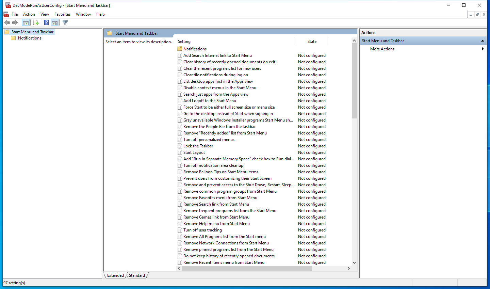

---
title: DevModeRunAsUserConfig.msc | 
excerpt: What is DevModeRunAsUserConfig.msc?
---

# DevModeRunAsUserConfig.msc 

* File Path: `C:\Windows\system32\en-US\DevModeRunAsUserConfig.msc`
* Description: DevModeRunAsUserConfig - [Start Menu and Taskbar] (Window Title)

## Screenshot

## Hashes

Type | Hash
-- | --
MD5 | `A6E1718A4D5727A10968F78944889D40`
SHA1 | `2ABE4B667B59C8A389221B4BFC4E4DE261BF7609`
SHA256 | `E61C31C7454C4F8D2F344A0C9A5BC26F3E09EF9BCC8F55D02A64C92818F4F111`
SHA384 | `C9A171677AE0C9D0411B99ACDCBADC687FEAD14812F2C7063B445350E6B35A0E997651A31B5C9239237194C37EEB0B1E`
SHA512 | `5A1A28DAA2AA7BD3DECFA40FCD7258F129A7130867D41A27C64DE23190102F4672B51F58CC7D407E5F0E64BF6D12AEF7975874365831BAF2E05CA01BE0C83931`
SSDEEP | `192:9PuFevtFvv9FF6kvnWFFPpvhCc8hH2v+WqHdbW9:+GbEEcQ/WcNW9`
PESHA1 | `2ABE4B667B59C8A389221B4BFC4E4DE261BF7609`
PE256 | `E61C31C7454C4F8D2F344A0C9A5BC26F3E09EF9BCC8F55D02A64C92818F4F111`

## Runtime Data

### Window Title:
DevModeRunAsUserConfig - [Start Menu and Taskbar]

### Open Handles:

Path | Type
-- | --
(R-D)   C:\Windows\apppatch\DirectXApps_FOD.sdb | File
(R-D)   C:\Windows\Fonts\StaticCache.dat | File
(R-D)   C:\Windows\Microsoft.NET\assembly\GAC_64\Microsoft.GroupPolicy.AdmTmplEditor\v4.0_10.0.0.0__31bf3856ad364e35\Microsoft.GroupPolicy.AdmTmplEditor.dll | File
(R-D)   C:\Windows\Microsoft.NET\assembly\GAC_64\mscorlib\v4.0_4.0.0.0__b77a5c561934e089\mscorlib.dll | File
(R-D)   C:\Windows\Microsoft.NET\assembly\GAC_MSIL\System.Windows.Forms\v4.0_4.0.0.0__b77a5c561934e089\System.Windows.Forms.dll | File
(R-D)   C:\Windows\System32\atl.dll | File
(R-D)   C:\Windows\System32\en-US\aclui.dll.mui | File
(R-D)   C:\Windows\System32\en-US\AdmTmpl.dll.mui | File
(R-D)   C:\Windows\System32\en-US\AuditNativeSnapIn.dll.mui | File
(R-D)   C:\Windows\System32\en-US\certmgr.dll.mui | File
(R-D)   C:\Windows\System32\en-US\dot3gpui.dll.mui | File
(R-D)   C:\Windows\System32\en-US\gpedit.dll.mui | File
(R-D)   C:\Windows\System32\en-US\ieframe.dll.mui | File
(R-D)   C:\Windows\System32\en-US\ipsecsnp.dll.mui | File
(R-D)   C:\Windows\System32\en-US\KernelBase.dll.mui | File
(R-D)   C:\Windows\System32\en-US\MFC42u.dll.mui | File
(R-D)   C:\Windows\System32\en-US\mmc.exe.mui | File
(R-D)   C:\Windows\System32\en-US\mmcbase.dll.mui | File
(R-D)   C:\Windows\System32\en-US\mmcndmgr.dll.mui | File
(R-D)   C:\Windows\System32\en-US\mshtml.dll.mui | File
(R-D)   C:\Windows\System32\en-US\nlmgp.dll.mui | File
(R-D)   C:\Windows\System32\en-US\urlmon.dll.mui | File
(R-D)   C:\Windows\System32\en-US\user32.dll.mui | File
(R-D)   C:\Windows\System32\en-US\winmm.dll.mui | File
(R-D)   C:\Windows\System32\en-US\wlangpui.dll.mui | File
(R-D)   C:\Windows\System32\en-US\wsecedit.dll.mui | File
(R-D)   C:\Windows\System32\mmc.exe | File
(R-D)   C:\Windows\System32\stdole2.tlb | File
(R-D)   C:\Windows\SystemResources\AuthFWGP.dll.mun | File
(R-D)   C:\Windows\SystemResources\gpedit.dll.mun | File
(R-D)   C:\Windows\SystemResources\ipsecsnp.dll.mun | File
(R-D)   C:\Windows\SystemResources\mmcbase.dll.mun | File
(R-D)   C:\Windows\SystemResources\mmcndmgr.dll.mun | File
(R-D)   C:\Windows\SystemResources\SrpUxNativeSnapIn.dll.mun | File
(R-D)   C:\Windows\SystemResources\wlangpui.dll.mun | File
(R-D)   C:\Windows\SystemResources\wsecedit.dll.mun | File
(RW-)   C:\Users\user | File
(RW-)   C:\Windows\System32 | File
(RW-)   C:\Windows\WinSxS\amd64_microsoft.windows.common-controls_6595b64144ccf1df_5.82.19041.488_none_4238de57f6b64d28 | File
(RW-)   C:\Windows\WinSxS\amd64_microsoft.windows.common-controls_6595b64144ccf1df_6.0.19041.746_none_ca02b4b61b8320a4 | File
(RW-)   C:\Windows\WinSxS\amd64_microsoft.windows.gdiplus_6595b64144ccf1df_1.1.19041.789_none_faf0a7e97612e7bb | File
(RWD)   C:\Windows\Fonts\segoeui.ttf | File
\...\Cor_SxSPublic_IPCBlock | Section
\BaseNamedObjects\__ComCatalogCache__ | Section
\BaseNamedObjects\C:\*ProgramData\*Microsoft\*Windows\*Caches\*{6AF0698E-D558-4F6E-9B3C-3716689AF493}.2.ver0x0000000000000002.db | Section
\BaseNamedObjects\C:\*ProgramData\*Microsoft\*Windows\*Caches\*{DDF571F2-BE98-426D-8288-1A9A39C3FDA2}.2.ver0x0000000000000002.db | Section
\BaseNamedObjects\C:\*ProgramData\*Microsoft\*Windows\*Caches\*cversions.2 | Section
\BaseNamedObjects\Cor_Private_IPCBlock_v4_8912 | Section
\BaseNamedObjects\NLS_CodePage_1252_3_2_0_0 | Section
\BaseNamedObjects\NLS_CodePage_437_3_2_0_0 | Section
\BaseNamedObjects\windows_shell_global_counters | Section
\Sessions\1\BaseNamedObjects\22d0HWNDInterface:2603c0 | Section
\Sessions\1\BaseNamedObjects\22d0HWNDInterface:2603dc | Section
\Sessions\1\BaseNamedObjects\22d0HWNDInterface:5e03ee | Section
\Sessions\1\BaseNamedObjects\22d0HWNDInterface:6804aa | Section
\Sessions\1\BaseNamedObjects\22d0HWNDInterface:7104c8 | Section
\Sessions\1\BaseNamedObjects\22d0HWNDInterface:8a0500 | Section
\Sessions\1\BaseNamedObjects\22d0HWNDInterface:8a059c | Section
\Sessions\1\BaseNamedObjects\22d0HWNDInterface:8d031a | Section
\Sessions\1\BaseNamedObjects\22d0HWNDInterface:a2051a | Section
\Sessions\1\BaseNamedObjects\22d0HWNDInterface:c70592 | Section
\Sessions\1\BaseNamedObjects\22d0HWNDInterface:cd0558 | Section
\Sessions\1\BaseNamedObjects\22d0HWNDInterface:d00544 | Section
\Sessions\1\BaseNamedObjects\22d0HWNDInterface:d60778 | Section
\Sessions\1\BaseNamedObjects\22d0HWNDInterface:f0404 | Section
\Sessions\1\BaseNamedObjects\SessionImmersiveColorPreference | Section
\Sessions\1\BaseNamedObjects\UrlZonesSM_user | Section
\Sessions\1\BaseNamedObjects\windows_ie_global_counters | Section
\Sessions\1\BaseNamedObjects\windows_shell_global_counters | Section
\Sessions\1\BaseNamedObjects\windows_webcache_counters_{9B6AB5B3-91BC-4097-835C-EA2DEC95E9CC}_S-1-5-21-2047949552-857980807-821054962-504 | Section
\Sessions\1\Windows\Theme3205582532 | Section
\Windows\Theme3800351183 | Section

### Loaded Modules:

Path |
-- |
C:\Windows\SYSTEM32\apphelp.dll |
C:\Windows\System32\KERNEL32.DLL |
C:\Windows\System32\KERNELBASE.dll |
C:\Windows\SYSTEM32\mmc.exe |
C:\Windows\SYSTEM32\ntdll.dll |

## Signature

* Status: Signature verified.
* Serial: `330000026551AE1BBD005CBFBD000000000265`
* Thumbprint: `E168609353F30FF2373157B4EB8CD519D07A2BFF`
* Issuer: CN=Microsoft Windows Production PCA 2011, O=Microsoft Corporation, L=Redmond, S=Washington, C=US
* Subject: CN=Microsoft Windows, O=Microsoft Corporation, L=Redmond, S=Washington, C=US

## File Metadata

* Original Filename: 
* Product Name: 
* Company Name: 
* File Version: 
* Product Version: 
* Language: 
* Legal Copyright: 

## File Scan

* VirusTotal Detections: 0/72
* VirusTotal Link: https://www.virustotal.com/gui/file/e61c31c7454c4f8d2f344a0c9a5bc26f3e09ef9bcc8f55d02a64c92818f4f111/detection

## File Similarity (ssdeep match)

File | Score
-- | --
[C:\Windows\system32\DevModeRunAsUserConfig.msc](DevModeRunAsUserConfig.msc-A99DE223E49E2253426D3DF4746437EC.md) | 86

MIT License. Copyright (c) 2020-2021 Strontic.

