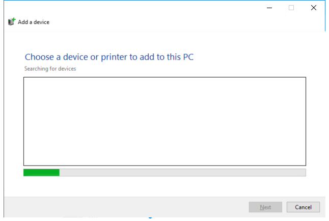

---
title: DevicePairingWizard.exe | Device Pairing Application
excerpt: What is DevicePairingWizard.exe?
---

# DevicePairingWizard.exe 

* File Path: `C:\Windows\SysWOW64\DevicePairingWizard.exe`
* Description: Device Pairing Application

## Screenshot

## Hashes

Type | Hash
-- | --
MD5 | `2A4C038870FD0083037A7B07FEAAEDE5`
SHA1 | `7D67612E310AD2EFC424B313AAF067CE10F3EF1C`
SHA256 | `E681BAF7AFF55B0D22C8AC7034100B532F45F760847A969658159043F930AE78`
SHA384 | `8A3A6C9F3BBFC683674DDB43D867FD26AB3783A43EBE30DDECC4C73DE802B1808F91A2B6643F6059AD636A306FA76DCF`
SHA512 | `D1B8B8AE347D7328EDB901DC33B2842FD240EF4314D5C6E222E2327877FBFCBE095A5EAD305A8E88200695A14BD9404D3EE94F43E1144B9C82CB25B3BFC29331`
SSDEEP | `1536:w9B9jBpFkkmgXWW4wyYjXAOyb8Z3qOTU:u9jBpFkkW2yYE7loU`
IMP | `E22F4F896B9960494DDA33E77FEBFA53`
PESHA1 | `65D0B88C8493C954CAA67A4697C68488F9FBC439`
PE256 | `F0DD25B4DBB3207700D3C240844013772EFC5D5AA8006BF3E2F58F3F0DA1DBA7`

## Runtime Data

### Window Title:
Add a device

### Open Handles:

Path | Type
-- | --
(R-D)   C:\Windows\Fonts\StaticCache.dat | File
(R-D)   C:\Windows\System32\en-US\dui70.dll.mui | File
(R-D)   C:\Windows\System32\en-US\MFC42u.dll.mui | File
(R-D)   C:\Windows\System32\en-US\oleaccrc.dll.mui | File
(R-D)   C:\Windows\SystemResources\DevicePairing.dll.mun | File
(R-D)   C:\Windows\SysWOW64\en-US\DevicePairing.dll.mui | File
(R-D)   C:\Windows\WinSxS\x86_microsoft.windows.c..-controls.resources_6595b64144ccf1df_6.0.19041.1_en-us_130e63d987a738df\comctl32.dll.mui | File
(RW-)   C:\Users\user | File
(RW-)   C:\Windows | File
(RW-)   C:\Windows\WinSxS\x86_microsoft.windows.c..-controls.resources_6595b64144ccf1df_6.0.19041.1_en-us_130e63d987a738df | File
(RW-)   C:\Windows\WinSxS\x86_microsoft.windows.common-controls_6595b64144ccf1df_6.0.19041.488_none_11b1e5df2ffd8627 | File
\BaseNamedObjects\__ComCatalogCache__ | Section
\BaseNamedObjects\C:\*ProgramData\*Microsoft\*Windows\*Caches\*{6AF0698E-D558-4F6E-9B3C-3716689AF493}.2.ver0x0000000000000002.db | Section
\BaseNamedObjects\C:\*ProgramData\*Microsoft\*Windows\*Caches\*{DDF571F2-BE98-426D-8288-1A9A39C3FDA2}.2.ver0x0000000000000002.db | Section
\BaseNamedObjects\C:\*ProgramData\*Microsoft\*Windows\*Caches\*cversions.2 | Section
\BaseNamedObjects\NLS_CodePage_1252_3_2_0_0 | Section
\BaseNamedObjects\NLS_CodePage_437_3_2_0_0 | Section
\Sessions\1\BaseNamedObjects\SessionImmersiveColorPreference | Section
\Sessions\1\BaseNamedObjects\windows_shell_global_counters | Section
\Sessions\1\Windows\Theme1175649999 | Section
\Windows\Theme601709542 | Section

### Loaded Modules:

Path |
-- |
C:\Windows\SYSTEM32\ntdll.dll |
C:\Windows\System32\wow64.dll |
C:\Windows\System32\wow64cpu.dll |
C:\Windows\System32\wow64win.dll |
C:\Windows\SysWOW64\DevicePairingWizard.exe |

## Signature

* Status: Signature verified.
* Serial: `3300000266BD1580EFA75CD6D3000000000266`
* Thumbprint: `A4341B9FD50FB9964283220A36A1EF6F6FAA7840`
* Issuer: CN=Microsoft Windows Production PCA 2011, O=Microsoft Corporation, L=Redmond, S=Washington, C=US
* Subject: CN=Microsoft Windows, O=Microsoft Corporation, L=Redmond, S=Washington, C=US

## File Metadata

* Original Filename: DevicePairing.exe
* Product Name: Microsoft Windows Operating System
* Company Name: Microsoft Corporation
* File Version: 10.0.19041.1 (WinBuild.160101.0800)
* Product Version: 10.0.19041.1
* Language: English (United States)
* Legal Copyright:  Microsoft Corporation. All rights reserved.
* Machine Type: 32-bit

## File Scan

* VirusTotal Detections: 0/75
* VirusTotal Link: https://www.virustotal.com/gui/file/e681baf7aff55b0d22c8ac7034100b532f45f760847a969658159043f930ae78/detection

## File Similarity (ssdeep match)

File | Score
-- | --
[C:\Windows\SysWOW64\DevicePairingWizard.exe](DevicePairingWizard.exe-BC95978508CD50D1A831B9DE752D0B15.md) | 33
[C:\WINDOWS\SysWOW64\DevicePairingWizard.exe](DevicePairingWizard.exe-C1C61B9A1EBE38489E6873CB60B67266.md) | 46

MIT License. Copyright (c) 2020-2021 Strontic.

