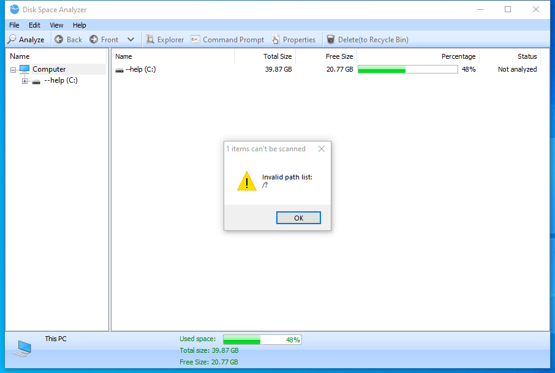

---
title: DiskAnalysis.exe | Glary Utilities DiskAnalysis
---

# DiskAnalysis.exe 

* File Path: `C:\program files (x86)\Glary Utilities 5\DiskAnalysis.exe`
* Description: Glary Utilities DiskAnalysis

## Screenshot

## Hashes

Type | Hash
-- | --
MD5 | `626F1A864C4B3A72E9BD1FE4872296C0`
SHA1 | `A4D5EB36C0B75BF68EC5A5616B4F5DE4EF80835C`
SHA256 | `A74D3854752B36CDDF11D2586A88D4A0DF8DAF16C9B3590164DB8205E130422B`
SHA384 | `1CDD1302F593DB4A4F5104CE97E4234F5662B28E0ECE8D381D6254AFEBEF811B2C36E3402D52995F78D5D32C48D04F11`
SHA512 | `799F6D55B20DCDDD29CFEF2236C476A661791D2110EC6840F3A4ACE55178EA1B2A586CF4E995C0327DC02CD5906CF766FAF6B390A93D666E007F9420D63B41C9`
SSDEEP | `12288:y0zqFDA2VoceDkVyHyBrOp0dgdC/DsvyXsn9koQOUS:ylN3VyHg6KWfvqsn9kJOz`

## Runtime Data

### Window Title:
Disk Space Analyzer

### Open Handles:

Path | Type
-- | --
(R-D)   C:\Windows\Fonts\StaticCache.dat | File
(R-D)   C:\Windows\System32\en-US\windows.storage.dll.mui | File
(R-D)   C:\Windows\SystemResources\imageres.dll.mun | File
(R-D)   C:\Windows\SysWOW64\en-US\user32.dll.mui | File
(RW-)   C:\Program Files (x86)\Glary Utilities 5 | File
(RW-)   C:\Users\user\Documents | File
(RW-)   C:\Windows | File
(RW-)   C:\Windows\WinSxS\x86_microsoft.vc90.crt_1fc8b3b9a1e18e3b_9.0.30729.9625_none_508ef7e4bcbbe589 | File
(RW-)   C:\Windows\WinSxS\x86_microsoft.windows.common-controls_6595b64144ccf1df_6.0.19041.1_none_fd031af45b0106f2 | File
(RW-)   C:\Windows\WinSxS\x86_microsoft.windows.gdiplus_6595b64144ccf1df_1.1.19041.450_none_4294d6e08a97344a | File
(RWD)   C:\Users\Public\Desktop | File
(RWD)   C:\Users\user\AppData\Local\Microsoft\Windows\Explorer\iconcache_16.db | File
(RWD)   C:\Users\user\AppData\Local\Microsoft\Windows\Explorer\iconcache_32.db | File
(RWD)   C:\Users\user\AppData\Local\Microsoft\Windows\Explorer\iconcache_idx.db | File
(RWD)   C:\Users\user\Desktop | File
\BaseNamedObjects\__ComCatalogCache__ | Section
\BaseNamedObjects\C:\*ProgramData\*Microsoft\*Windows\*Caches\*{6AF0698E-D558-4F6E-9B3C-3716689AF493}.2.ver0x0000000000000002.db | Section
\BaseNamedObjects\C:\*ProgramData\*Microsoft\*Windows\*Caches\*{DDF571F2-BE98-426D-8288-1A9A39C3FDA2}.2.ver0x0000000000000001.db | Section
\BaseNamedObjects\C:\*ProgramData\*Microsoft\*Windows\*Caches\*cversions.2.ro | Section
\BaseNamedObjects\NLS_CodePage_1252_3_2_0_0 | Section
\BaseNamedObjects\NLS_CodePage_437_3_2_0_0 | Section
\BaseNamedObjects\windows_shell_global_counters | Section
\Sessions\1\BaseNamedObjects\windows_shell_global_counters | Section
\Sessions\1\Windows\Theme4048709601 | Section
\Windows\Theme603176458 | Section

### Loaded Modules:

Path |
-- |
C:\program files (x86)\Glary Utilities 5\DiskAnalysis.exe |
C:\Windows\SYSTEM32\ntdll.dll |
C:\Windows\System32\wow64.dll |
C:\Windows\System32\wow64cpu.dll |
C:\Windows\System32\wow64win.dll |

## Signature

* Status: Signature verified.
* Serial: `0F05AE21CDC17B9F3CF09D7BFC659BA3`
* Thumbprint: `362EBB303E088105BDCC07D94E6B7875D30C0D06`
* Issuer: CN=DigiCert Assured ID Code Signing CA-1, OU=www.digicert.com, O=DigiCert Inc, C=US
* Subject: CN=Glarysoft LTD, O=Glarysoft LTD, S=Beijing, C=CN

## File Metadata

* Original Filename: DiskAnalysis.exe
* Product Name: Glary Utilities
* Company Name: Glarysoft Ltd
* File Version: 5.27.0.65
* Product Version: 5.27.0.1
* Language: Chinese (Simplified, China)
* Legal Copyright: Copyright (c) 2003-2020 Glarysoft Ltd

## File Similarity (ssdeep match)

File | Score
-- | --
[C:\Program Files (x86)\Glary Utilities 5\DiskAnalysis.exe](DiskAnalysis.exe-DCFE500A9617530CADA595E96C90E80B.md) | 96

MIT License. Copyright (c) 2020 Strontic.

