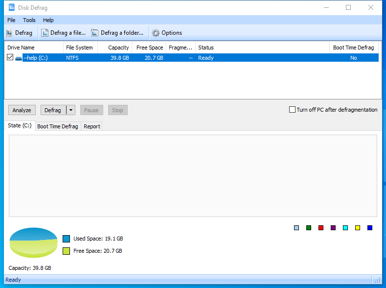

---
title: DiskDefrag.exe | Glary Utilities Defragmenter
---

# DiskDefrag.exe 

* File Path: `C:\Program Files (x86)\Glary Utilities 5\DiskDefrag.exe`
* Description: Glary Utilities Defragmenter

## Screenshot

## Hashes

Type | Hash
-- | --
MD5 | `4A99FBF2D2459C3608C35B4C48623E80`
SHA1 | `A4BF43647DF7FC89EBAB2574A0E432A486043030`
SHA256 | `07D6FEB9267EBA70BEBBB865B8FD9F3BAAEFB3442172D361B14C67596A3353E2`
SHA384 | `A2FF1CD1EA449E8E262DEC6C00A6B50DD7054D51DBD126BA9B5520840D2E55A8E480677FF1DB91A7CEA47ED17CA21701`
SHA512 | `881C9919A592C498239BD033DF79603F1683228BC95E0ACE14EA15E799CCF69B4EC3DC0156356AFED8FB2AECFCDB2F59B337C08A6AFD79361CAB8163F62E4EED`
SSDEEP | `12288:Up/6ZdVfzZLmabliLHqqyNIPyDVEB//90MiRYlKIwITNj0:Up/Kdm1DqSPyDISMmYEIhj0`

### Loaded Modules:

Path |
-- |
C:\program files (x86)\Glary Utilities 5\DiskDefrag.exe |
C:\Windows\SYSTEM32\ntdll.dll |
C:\Windows\System32\wow64.dll |
C:\Windows\System32\wow64cpu.dll |
C:\Windows\System32\wow64win.dll |

## Signature

* Status: Signature verified.
* Serial: `0F05AE21CDC17B9F3CF09D7BFC659BA3`
* Thumbprint: `362EBB303E088105BDCC07D94E6B7875D30C0D06`
* Issuer: CN=DigiCert Assured ID Code Signing CA-1, OU=www.digicert.com, O=DigiCert Inc, C=US
* Subject: CN=Glarysoft LTD, O=Glarysoft LTD, S=Beijing, C=CN

## File Metadata

* Original Filename: DiskDefrag.exe
* Product Name: Glary Utilities
* Company Name: Glarysoft Ltd
* File Version: 5.0.0.66
* Product Version: 5.0.0.1
* Language: Chinese (Simplified, China)
* Legal Copyright: Copyright (c) 2003-2020 Glarysoft Ltd

## File Similarity (ssdeep match)

File | Score
-- | --
[C:\program files (x86)\Glary Utilities 5\DiskDefrag.exe](DiskDefrag.exe-3716DFBEAF4C7D9481A20E725AA7A9FD.md) | 97

MIT License. Copyright (c) 2020 Strontic.

