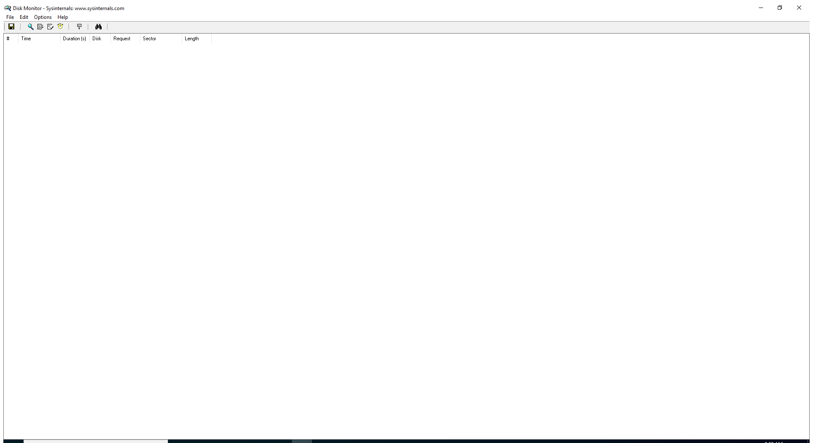
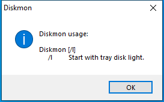

---
title: Diskmon.exe | Disk Monitor
excerpt: What is Diskmon.exe?
---

# Diskmon.exe 

* File Path: `C:\SysinternalsSuite\Diskmon.exe`
* Description: Disk Monitor

## Screenshot




## Hashes

Type | Hash
-- | --
MD5 | `0942C078FE8941282372BB6B5D73E2C8`
SHA1 | `7641A96E88AE6ECCD1EFEFEE75A3F00A86E31CCE`
SHA256 | `955FAA2FCEC977B29FB7DC49A80B8C7916C410B70AD973C7883ED8537126F81F`
SHA384 | `42A5837C09DA94CD1951D4380EA4E334AFF2ADF347E6E1D9C97FD3241ABEC42CF95FE185FAB996EDCF3E6EDD7D270E2A`
SHA512 | `AFDDBF7356F2EE467F85064E715BC644C45E072A5308AB49253A0E371DCA159181A0E7B161DE406417E49322AD0D3E786FD661BACCF9EF9751B090EF6B5C0FE0`
SSDEEP | `1536:EORIuzZYHJ8DHhbEGRs4gaSZ8DxyTpL67Bo6+DDJKKBsdXsxJ6OVPBtvdkmVnTAG:EOR2JgWw5g3LKByhmeJ6OVJthh0k6U`
IMP | `934543D446CF80015B5041258A567C79`
PESHA1 | `D91D76F1E54D32A763BFF3F9F15E29496FC0D0C4`
PE256 | `A8B199A1FFB32C9B6E9D61CBADB359F23B46525ABC119466FF85912AD602CB42`

## Runtime Data

### Usage (stdout):
```cmhg
0,0
0,0
0x4D929A00, 0xFFFFF805, 0x00000000,        0,       -1, 0x00000000,  7159808, 0, 0,0
0x3D062040, 0xFFFF9481, 0x00000004,        0,       -1, 0x00000103,  7159808, 0, "",0,0
0x3D0EC080, 0xFFFF9481, 0x0000007C,        4,       -1, 0x00000103, 960667648, 0, "",0,0
0x3DA4C0C0, 0xFFFF9481, 0x000001AC,        4,       -1, 0x00000103, 993796096, 0, "",0,0
0x3DEA0140, 0xFFFF9481, 0x00000210,      516,        0, 0x00000103, 829599744, 0, "",0,0
0x400020C0, 0xFFFF9481, 0x00000258,      516,        0, 0x00000103, 831782912, 0, "",0,0
0x400E9080, 0xFFFF9481, 0x00000284,      600,        0, 0x00000103, 835764224, 0, "",0,0
0x40114080, 0xFFFF9481, 0x00000298,      600,        0, 0x00000103, 836935680, 0, 0,0
0x3DC9E240, 0xFFFF9481, 0x00000308,      644,        0, 0x00000103, 881852416, 0, 0,0
0x40878080, 0xFFFF9481, 0x0000032C,      600,        0, 0x00000103, 848584704, 0, 0,0
0x408AA300, 0xFFFF9481, 0x0000034C,      644,        0, 0x00000103, 849227776, 0, 0,0
0x40920240, 0xFFFF9481, 0x000003C8,      644,        0, 0x00000103, 726716416, 0, 0,0
0x40922300, 0xFFFF9481, 0x000003D8,      644,        0, 0x00000103, 727068672, 0, 0,0
0x40928280, 0xFFFF9481, 0x000003FC,      644,        0, 0x00000103, 727609344, 0, 0,0
0x40A0D300, 0xFFFF9481, 0x00000428,      644,        0, 0x00000103, 695771136, 0, 0,0
0x40A0E080, 0xFFFF9481, 0x00000438,      644,        0, 0x00000103, 692559872, 0, 0,0
0x40A33040, 0xFFFF9481, 0x00000454,        4,       -1, 0x00000103, 739577856, 0, "",0,0
0x40B46300, 0xFFFF9481, 0x00000508,      644,        0, 0x00000103, 636784640, 0, 0,0
0x40BA5300, 0xFFFF9481, 0x00000544,      644,        0, 0x00000103, 638697472, 0, 0,0
0x41C0F300, 0xFFFF9481, 0x00000588,      644,        0, 0x00000103, 604454912, 0, 0,0
0x41C10080, 0xFFFF9481, 0x00000594,      644,        0, 0x00000103, 604377088, 0, 0,0
0x41CD2200, 0xFFFF9481, 0x00000618,      644,        0, 0x00000103, 598749184, 0, 0,0
0x41D1E300, 0xFFFF9481, 0x00000694,      644,        0, 0x00000103, 599535616, 0, 0,0
0x40E7E240, 0xFFFF9481, 0x000007C8,      644,        0, 0x00000103, 24702976, 0, 0,0
0x40E5D300, 0xFFFF9481, 0x000007E4,      644,        0, 0x00000103, 54800384, 0, 0,0
0x40E62080, 0xFFFF9481, 0x000004A8,      644,        0, 0x00000103, 478883840, 0, 0,0
0x40FF0240, 0xFFFF9481, 0x00000868,      644,        0, 0x00000103, 470749184, 0, 0,0
0x422B5080, 0xFFFF9481, 0x000006E0,      644,        0, 0x00000103, 78397440, "System", 0,0
0x422B4340, 0xFFFF9481, 0x000009A4,     2268,        1, 0x00000103, 301068288, 0, "",0,0
0x4232D080, 0xFFFF9481, 0x000009B4,     2268,        1, 0x00000103, 88002560, "System", 0,0
0x422B0080, 0xFFFF9481, 0x00000A98,     2484,        1, 0x00000103, 95719424, "System", 0,0
0x409FB280, 0xFFFF9481, 0x00000AAC,      644,        0, 0x00000103, 96935936, "System", "F\HostProcess-5008a698-3d99-4cc4-b340-87785375ed84 -SystemEventPortName:\UMDFCommunicationPorts\WUDF\HostProcess-67bed9b0-b09c-4ea2-b90e-05427dba3257 -IoCancelEventPortName:\UMDFCommunicationPorts\WUDF\HostProcess-2a684d20-30c0-448d-9d62-b51c5e27b1e1 -NonStateChangingEventPortName:\UMDFCommunicationPorts\WUDF\HostProcess-b2f1abd3-39b3-4f97-990d-6383d6745dc0 -LifetimeId:3addc031-bae",0,0
0x4232C080, 0xFFFF9481, 0x00000BD0,     2484,        1, 0x00000103, 70131712, "System", 0,0
0x42BD9080, 0xFFFF9481, 0x00000C88,      644,        0, 0x00000103, 34304000, "System", 0,0
0x42BCF240, 0xFFFF9481, 0x00000CB4,      644,        0, 0x00000103, 75534336, "System", 0,0
0x423D0080, 0xFFFF9481, 0x00000DD0,      984,        1, 0x00000103,  8491008, "System", 0,0
0x42DBA300, 0xFFFF9481, 0x00000DF8,      968,        1, 0x00000103, 4108165120, 0, 0,0
0x42E68180, 0xFFFF9481, 0x00000E50,      644,        1, 0x00000103, 4112629760, 0, 0,0
0x42E81080, 0xFFFF9481, 0x00000E84,      968,        1, 0x00000103, 4120535040, 0, 0,0
0x42EDD080, 0xFFFF9481, 0x00000F4C,      644,        0, 0x00000103, 4102332416, 0, 0,0
0x42E802C0, 0xFFFF9481, 0x00000F8C,     3916,        1, 0x00000103, 4056756224, 0, 0,0
0x42E7E2C0, 0xFFFF9481, 0x00000F9C,     3884,        1, 0x00000103, 4081876992, 0, 0,0
0x43233
```

### Window Title:
Disk Monitor - Sysinternals: www.sysinternals.com

### Open Handles:

Path | Type
-- | --
(R-D)   C:\Windows\Fonts\StaticCache.dat | File
(RW-)   C:\Windows | File
(RW-)   C:\Windows\WinSxS\x86_microsoft.windows.common-controls_6595b64144ccf1df_6.0.19041.488_none_11b1e5df2ffd8627 | File
(RW-)   C:\xCyclopedia | File
\BaseNamedObjects\__ComCatalogCache__ | Section
\BaseNamedObjects\NLS_CodePage_1252_3_2_0_0 | Section
\BaseNamedObjects\NLS_CodePage_437_3_2_0_0 | Section
\Sessions\1\Windows\Theme2036293991 | Section
\Windows\Theme1324212991 | Section


### Loaded Modules:

Path |
-- |
C:\SysinternalsSuite\Diskmon.exe |
C:\Windows\SYSTEM32\ntdll.dll |
C:\Windows\System32\wow64.dll |
C:\Windows\System32\wow64cpu.dll |
C:\Windows\System32\wow64win.dll |


## Signature

* Status: Signature verified.
* Serial: `61469ECB000400000065`
* Thumbprint: `564E01066387F26C912010D06BD78D3CF1E845AB`
* Issuer: CN=Microsoft Code Signing PCA, OU=Copyright (c) 2000 Microsoft Corp., O=Microsoft Corporation, L=Redmond, S=Washington, C=US
* Subject: CN=Microsoft Corporation, O=Microsoft Corporation, L=Redmond, S=Washington, C=US

## File Metadata

* Original Filename: Diskmon.exe
* Product Name: Sysinternals Diskmon
* Company Name: Sysinternals
* File Version: 2.01
* Product Version: 2.01
* Language: English (United States)
* Legal Copyright: Copyright  1996-2003 Mark Russinovich
* Machine Type: 32-bit

## File Scan

* VirusTotal Detections: 0/67
* VirusTotal Link: https://www.virustotal.com/gui/file/955faa2fcec977b29fb7dc49a80b8c7916c410b70ad973c7883ed8537126f81f/detection/

## File Similarity (ssdeep match)

File | Score
-- | --
[C:\SysinternalsSuite\AccessEnum.exe](AccessEnum.exe-F4CD850FDAB64FFBBCC249374BA17F5B.md) | 24
[C:\SysinternalsSuite\adrestore.exe](adrestore.exe-03B7E47241775016B74BEC1B10894974.md) | 24
[C:\SysinternalsSuite\Cacheset.exe](Cacheset.exe-99936EC7843663C081BA7AD33AAB9D17.md) | 27
[C:\SysinternalsSuite\ctrl2cap.exe](ctrl2cap.exe-C100EA4F0C45C916C795860FD1EB74CC.md) | 29
[C:\SysinternalsSuite\efsdump.exe](efsdump.exe-4CEF8412C762F4840349E5622A05A307.md) | 27
[C:\SysinternalsSuite\ldmdump.exe](ldmdump.exe-202119E519DD179DE64AFD195F0DDA42.md) | 24
[C:\SysinternalsSuite\pagedfrg.exe](pagedfrg.exe-24898BA51CBAAD01A046541CC0A8D26F.md) | 22


MIT License. Copyright (c) 2020 Strontic.


