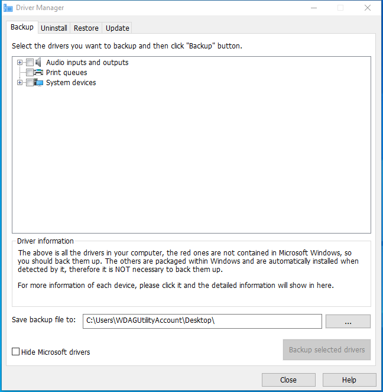

---
title: DriverBackup.exe | Driver Backup/Restore
excerpt: What is DriverBackup.exe?
---

# DriverBackup.exe 

* File Path: `C:\program files (x86)\Glary Utilities 5\DriverBackup.exe`
* Description: Driver Backup/Restore

## Screenshot

## Hashes

Type | Hash
-- | --
MD5 | `3E460856D5421A40B5B075F1F772502B`
SHA1 | `E880FFD907A24698257F9AEF70244156EE2D561E`
SHA256 | `D944426846DC00BB45F5A578BC2543204253EDC2C5F705929EE080BF6189F1AE`
SHA384 | `45A52A56D4630E694248BFC80CED4F0952E5DD7A8A38B684436C59F916345C493DAA4F485987768727D84E8F6FFC6F3C`
SHA512 | `EBAFB2A0886D040FC8575F7CF9416F65D6E9AD20A13ACFF38663C690D66B063DC03BACB1493CDBE813EAE69D9F32102605C127E99CC85876E4AC1B0C09F6EDC9`
SSDEEP | `6144:N3HvDnYIwGo94UTqAL4TA0NEB/aMQXmnlBGGyObmx+cX/fWAOWtAOHoJTq5MLi89:N3HvDnYIwx4UH8TjE0YwtvfjATti82W`

## Runtime Data

### Child Processes:
MemfilesService.exe

### Window Title:
Driver Manager

### Open Handles:

Path | Type
-- | --
(R-D)   C:\Windows\Fonts\StaticCache.dat | File
(R-D)   C:\Windows\System32\en-US\setupapi.dll.mui | File
(R-D)   C:\Windows\SystemResources\shell32.dll.mun | File
(R-D)   C:\Windows\SysWOW64\en-US\user32.dll.mui | File
(RW-)   C:\Program Files (x86)\Glary Utilities 5 | File
(RW-)   C:\Users\user\Documents | File
(RW-)   C:\Windows | File
(RW-)   C:\Windows\WinSxS\x86_microsoft.vc90.crt_1fc8b3b9a1e18e3b_9.0.30729.9625_none_508ef7e4bcbbe589 | File
(RW-)   C:\Windows\WinSxS\x86_microsoft.windows.common-controls_6595b64144ccf1df_6.0.19041.1_none_fd031af45b0106f2 | File
(RW-)   C:\Windows\WinSxS\x86_microsoft.windows.gdiplus_6595b64144ccf1df_1.1.19041.450_none_4294d6e08a97344a | File
\BaseNamedObjects\NLS_CodePage_1252_3_2_0_0 | Section
\BaseNamedObjects\NLS_CodePage_437_3_2_0_0 | Section
\Sessions\1\BaseNamedObjects\windows_shell_global_counters | Section
\Sessions\1\Windows\Theme4048709601 | Section
\Windows\Theme603176458 | Section

### Loaded Modules:

Path |
-- |
C:\program files (x86)\Glary Utilities 5\DriverBackup.exe |
C:\Windows\SYSTEM32\ntdll.dll |
C:\Windows\System32\wow64.dll |
C:\Windows\System32\wow64cpu.dll |
C:\Windows\System32\wow64win.dll |

## Signature

* Status: Signature verified.
* Serial: `0F05AE21CDC17B9F3CF09D7BFC659BA3`
* Thumbprint: `362EBB303E088105BDCC07D94E6B7875D30C0D06`
* Issuer: CN=DigiCert Assured ID Code Signing CA-1, OU=www.digicert.com, O=DigiCert Inc, C=US
* Subject: CN=Glarysoft LTD, O=Glarysoft LTD, S=Beijing, C=CN

## File Metadata

* Original Filename: DriverBackup.exe
* Product Name: Glary Utilities
* Company Name: Glarysoft Ltd
* File Version: 5, 17, 1, 4
* Product Version: 5.17.1.4
* Language: Chinese (Simplified, China)
* Legal Copyright: Copyright (c) 2003-2020 Glarysoft Ltd

## File Similarity (ssdeep match)

File | Score
-- | --
[C:\Program Files (x86)\Glary Utilities 5\DriverBackup.exe](DriverBackup.exe-2C6AE9F631DD50B87F604221CB37FEE6.md) | 97

MIT License. Copyright (c) 2020 Strontic.

