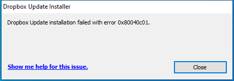

---
title: DropboxUpdate.exe | Dropbox Update
excerpt: What is DropboxUpdate.exe?
---

# DropboxUpdate.exe 

* File Path: `C:\Program Files (x86)\Dropbox\Update\DropboxUpdate.exe`
* Description: Dropbox Update

## Screenshot

## Hashes

Type | Hash
-- | --
MD5 | `A1F58FFF448E4099297D6EE0641D4D0E`
SHA1 | `D3A77E94D08F2EB9A8276F32CA16F65D1CE8B524`
SHA256 | `47839789332AAF8861F7731BF2D3FBB5E0991EA0D0B457BB4C8C1784F76C73DC`
SHA384 | `B4D7039D61C64AF84EF7D5C0134DE627DA12368DF769E1F689885DC199ECC7688D35F5242A4697B6A141BF8CD9D91DC0`
SHA512 | `860DE9EA16B3F5B5C0EAF81A57A857AC60BF035877BCC1CFE489109735F7A8D784F38F0961B0C5584309C3825501DB9B3AA2F385C860E149B020967468EDC556`
SSDEEP | `3072:gZOOxLE4GTnpcyKP5FRHGR7YCzfk5F2Bav8PtNQHYkKw6cbhk87LSzCRJJ9TJTxG:XOxLEbTD+RHaTDkAwU1O4vj+OWO2DL9s`
IMP | `907BD326A444DBC0E31CEF85B0646F45`
PESHA1 | `09FFE9C4C352E345C35614BAC75FE08D4B27CB2D`
PE256 | `77632845B015AF5A0654A4694D771983B317AB67EE92BCFFE9CD020C00536A8C`

## Runtime Data

### Window Title:
Dropbox Update Installer

### Open Handles:

Path | Type
-- | --
(R-D)   C:\Windows\Fonts\StaticCache.dat | File
(R-D)   C:\Windows\SysWOW64\en-US\user32.dll.mui | File
(RW-)   C:\Program Files (x86)\Dropbox\Update\1.3.335.1 | File
(RW-)   C:\ProgramData\Dropbox\Update\Log\DropboxUpdate.log-2020-09-24-22-43-40-822-2668 | File
(RW-)   C:\Windows | File
(RW-)   C:\Windows\WinSxS\x86_microsoft.windows.common-controls_6595b64144ccf1df_6.0.19041.488_none_11b1e5df2ffd8627 | File
\BaseNamedObjects\NLS_CodePage_1252_3_2_0_0 | Section
\BaseNamedObjects\NLS_CodePage_437_3_2_0_0 | Section
\Sessions\1\BaseNamedObjects\windows_shell_global_counters | Section
\Sessions\1\Windows\Theme2547664911 | Section
\Windows\Theme3854699184 | Section

### Loaded Modules:

Path |
-- |
C:\Program Files (x86)\Dropbox\Update\DropboxUpdate.exe |
C:\Windows\SYSTEM32\ntdll.dll |
C:\Windows\System32\wow64.dll |
C:\Windows\System32\wow64cpu.dll |
C:\Windows\System32\wow64win.dll |

## Signature

* Status: Signature verified.
* Serial: `017CA19B5859E83F44D874C1CE506E6D`
* Thumbprint: `812B375B94E624E9C00781E485B1E362AE30EB44`
* Issuer: CN=DigiCert Assured ID Code Signing CA-1, OU=www.digicert.com, O=DigiCert Inc, C=US
* Subject: CN="Dropbox, Inc", O="Dropbox, Inc", L=San Francisco, S=California, C=US

## File Metadata

* Original Filename: DropboxUpdate.exe
* Product Name: Dropbox Update
* Company Name: Dropbox, Inc.
* File Version: 1.3.27.73
* Product Version: 1.3.27.73
* Language: English (United States)
* Legal Copyright: Copyright: Dropbox, Inc. 2015 (Omaha Copyright Google Inc.)
* Machine Type: 32-bit

## File Scan

* VirusTotal Detections: 0/67
* VirusTotal Link: https://www.virustotal.com/gui/file/47839789332aaf8861f7731bf2d3fbb5e0991ea0d0b457bb4c8c1784f76c73dc/detection/

## File Similarity (ssdeep match)

File | Score
-- | --
[C:\Program Files (x86)\Dropbox\Update\1.3.335.1\DropboxCrashHandler.exe](DropboxCrashHandler.exe-A1F58FFF448E4099297D6EE0641D4D0E.md) | 100
[C:\Program Files (x86)\Dropbox\Update\1.3.335.1\DropboxUpdate.exe](DropboxUpdate.exe-A1F58FFF448E4099297D6EE0641D4D0E.md) | 100

MIT License. Copyright (c) 2020 Strontic.

