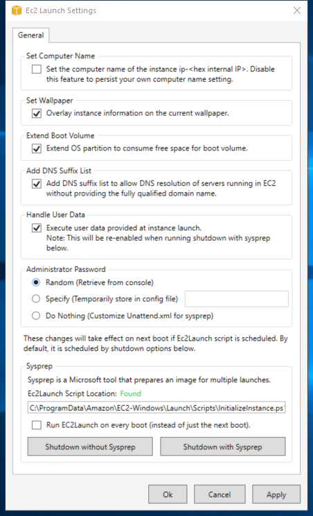

---
title: Ec2LaunchSettings.exe | Ec2Launch.Settings
excerpt: What is Ec2LaunchSettings.exe?
---

# Ec2LaunchSettings.exe 

* File Path: `C:\ProgramData\Amazon\EC2-Windows\Launch\Settings\Ec2LaunchSettings.exe`
* Description: Ec2Launch.Settings

## Screenshot

## Hashes

Type | Hash
-- | --
MD5 | `981D6BB8FEE39AF0D1760E1B84ED0EFA`
SHA1 | `1EA583CEC654C222539E2A6A41FAA798164D7DEC`
SHA256 | `DCA07840BD8B4F24F545C005865821B767393B6E1B0598E2DC6420802E067A22`
SHA384 | `813737705FF4AE96D62397A07934C1952A1DCE7523D8197C7C5DCB56390DDBF6AE083C647DABE3AAFC2BBF42111E4855`
SHA512 | `50B8990EF121C32A9F9A40A146853D432216E2B9471E43EC56A9CC2470775FFF5E982299DBBEB07081FE934CFCEF2388CFEF4FE29F4C1990E45DAF40B66985F2`
SSDEEP | `768:rryexlvbR9EgDpXz73kQfCFX2MpOXdDUkoMYKAnkzYc5tuTV7KYhJLJtKKQAUf2e:yexlvbR9NDpD73kNXvpOXdDUcWiCTV7g`
PESHA1 | `3886D80DF93F15D8950BE189EDB10AFD0CCF8EB6`
PE256 | `7C7DAD55DD91C5ADC15C025B5D70DF2A07045B0989C78A9D33AAF813B91AC0E3`

## Runtime Data

### Window Title:
Ec2 Launch Settings

### Open Handles:

Path | Type
-- | --
(R-D)   C:\ProgramData\Amazon\EC2-Windows\Launch\Settings\Newtonsoft.Json.dll | File
(R-D)   C:\Windows\Microsoft.NET\assembly\GAC_64\System.Data\v4.0_4.0.0.0__b77a5c561934e089\System.Data.dll | File
(R-D)   C:\Windows\System32\en-US\msctfui.dll.mui | File
(RW-)   C:\Users\user | File
(RWD)   C:\Windows\Fonts\segoeui.ttf | File
\...\Cor_SxSPublic_IPCBlock | Section
\BaseNamedObjects\__ComCatalogCache__ | Section
\BaseNamedObjects\C:\*ProgramData\*Microsoft\*Windows\*Caches\*{6AF0698E-D558-4F6E-9B3C-3716689AF493}.2.ver0x0000000000000004.db | Section
\BaseNamedObjects\C:\*ProgramData\*Microsoft\*Windows\*Caches\*{DDF571F2-BE98-426D-8288-1A9A39C3FDA2}.2.ver0x0000000000000004.db | Section
\BaseNamedObjects\C:\*ProgramData\*Microsoft\*Windows\*Caches\*cversions.2.ro | Section
\BaseNamedObjects\Cor_Private_IPCBlock_v4_4536 | Section
\BaseNamedObjects\NLS_CodePage_1252_3_2_0_0 | Section
\BaseNamedObjects\NLS_CodePage_437_3_2_0_0 | Section
\RPC Control\DSEC11B8 | Section
\Sessions\2\BaseNamedObjects\11b8HWNDInterface:4b06c8 | Section
\Sessions\2\BaseNamedObjects\windows_shell_global_counters | Section
\Sessions\2\Windows\Theme2131664586 | Section
\Windows\Theme966197582 | Section

### Loaded Modules:

Path |
-- |
C:\ProgramData\Amazon\EC2-Windows\Launch\Settings\Ec2LaunchSettings.exe |
C:\Windows\assembly\NativeImages_v4.0.30319_64\mscorlib\5543cca0df435801e2303ff46a482ed5\mscorlib.ni.dll |
C:\Windows\assembly\NativeImages_v4.0.30319_64\Presentatio49d6fefe#\2765d5dfb05e889760491cc0e1f68a4e\PresentationFramework-SystemXml.ni.dll |
C:\Windows\assembly\NativeImages_v4.0.30319_64\Presentatio4b37ff64#\a518ad0e93e801a17388ac66da43fd46\PresentationFramework-SystemXmlLinq.ni.dll |
C:\Windows\assembly\NativeImages_v4.0.30319_64\Presentatio5ae0f00f#\d1101640429a2c3d8c6c257103ad22c1\PresentationFramework.ni.dll |
C:\Windows\assembly\NativeImages_v4.0.30319_64\Presentatio84a7b877#\9b847af53f97de789af8b6c182043a67\PresentationFramework-SystemData.ni.dll |
C:\Windows\assembly\NativeImages_v4.0.30319_64\Presentatioaec034ca#\fc91c5553de4f5b4c206769962382b62\PresentationFramework.Aero2.ni.dll |
C:\Windows\assembly\NativeImages_v4.0.30319_64\PresentationCore\8fad18d47be73b98845c53d0e6d3b964\PresentationCore.ni.dll |
C:\Windows\assembly\NativeImages_v4.0.30319_64\System.Configuration\875dc3cfd53efc9f9a5c63016cd239d7\System.Configuration.ni.dll |
C:\Windows\assembly\NativeImages_v4.0.30319_64\System.Core\f29b1120627489754c4b8dd317bbe950\System.Core.ni.dll |
C:\Windows\assembly\NativeImages_v4.0.30319_64\System.Data\a39e284ddde9013349d1f350607766b8\System.Data.ni.dll |
C:\Windows\assembly\NativeImages_v4.0.30319_64\System.Numerics\65da063a028c3cfc846f5ddfffc32558\System.Numerics.ni.dll |
C:\Windows\assembly\NativeImages_v4.0.30319_64\System.Runteb92aa12#\0a20c3e2769862d42803de9732fcf620\System.Runtime.Serialization.ni.dll |
C:\Windows\assembly\NativeImages_v4.0.30319_64\System.Xaml\12c01954752c224882de75b4418c8382\System.Xaml.ni.dll |
C:\Windows\assembly\NativeImages_v4.0.30319_64\System.Xml.Linq\1f8e15c27df619e8116461e283dac636\System.Xml.Linq.ni.dll |
C:\Windows\assembly\NativeImages_v4.0.30319_64\System.Xml\488d073901c2c0fb8ccbcbe182b6b160\System.Xml.ni.dll |
C:\Windows\assembly\NativeImages_v4.0.30319_64\System\6885802f40fd803e49150d8a2b43a09b\System.ni.dll |
C:\Windows\assembly\NativeImages_v4.0.30319_64\UIAutomationTypes\f898d852ca0a3bf2329018f1997c623a\UIAutomationTypes.ni.dll |
C:\Windows\assembly\NativeImages_v4.0.30319_64\WindowsBase\7766b716f453669f6453022ce957c6ad\WindowsBase.ni.dll |
C:\Windows\Microsoft.Net\assembly\GAC_64\System.Data\v4.0_4.0.0.0__b77a5c561934e089\System.Data.dll |
C:\Windows\Microsoft.NET\Framework64\v4.0.30319\clr.dll |
C:\Windows\Microsoft.NET\Framework64\v4.0.30319\clrjit.dll |
C:\Windows\Microsoft.NET\Framework64\v4.0.30319\mscoreei.dll |
C:\Windows\Microsoft.NET\Framework64\v4.0.30319\WPF\PresentationNative_v0400.dll |
C:\Windows\Microsoft.NET\Framework64\v4.0.30319\WPF\wpfgfx_v0400.dll |
C:\Windows\System32\ADVAPI32.dll |
C:\Windows\SYSTEM32\Bcp47Langs.dll |
C:\Windows\System32\bcrypt.dll |
C:\Windows\System32\bcryptPrimitives.dll |
C:\Windows\System32\cfgmgr32.dll |
C:\Windows\System32\clbcatq.dll |
C:\Windows\System32\combase.dll |
C:\Windows\System32\CRYPT32.dll |
C:\Windows\SYSTEM32\CRYPTBASE.dll |
C:\Windows\System32\CRYPTSP.dll |
C:\Windows\SYSTEM32\d3d10warp.dll |
C:\Windows\system32\d3d11.dll |
C:\Windows\SYSTEM32\d3d9.dll |
C:\Windows\system32\dataexchange.dll |
C:\Windows\system32\dcomp.dll |
C:\Windows\system32\dwmapi.dll |
C:\Windows\SYSTEM32\dwrite.dll |
C:\Windows\system32\dxgi.dll |
C:\Windows\System32\GDI32.dll |
C:\Windows\System32\gdi32full.dll |
C:\Windows\System32\IMM32.DLL |
C:\Windows\System32\kernel.appcore.dll |
C:\Windows\System32\KERNEL32.dll |
C:\Windows\System32\KERNELBASE.dll |
C:\Windows\System32\MSASN1.dll |
C:\Windows\SYSTEM32\MSCOREE.DLL |
C:\Windows\System32\MSCTF.dll |
C:\Windows\system32\msctfui.dll |
C:\Windows\System32\msvcp_win.dll |
C:\Windows\SYSTEM32\MSVCP120_CLR0400.dll |
C:\Windows\SYSTEM32\MSVCR120_CLR0400.dll |
C:\Windows\System32\msvcrt.dll |
C:\Windows\SYSTEM32\ntdll.dll |
C:\Windows\System32\ole32.dll |
C:\Windows\System32\OLEAUT32.dll |
C:\Windows\System32\powrprof.dll |
C:\Windows\System32\profapi.dll |
C:\Windows\system32\RMCLIENT.dll |
C:\Windows\System32\RPCRT4.dll |
C:\Windows\system32\rsaenh.dll |
C:\Windows\System32\sechost.dll |
C:\Windows\System32\shcore.dll |
C:\Windows\System32\shell32.dll |
C:\Windows\System32\SHLWAPI.dll |
C:\Windows\system32\twinapi.appcore.dll |
C:\Windows\System32\ucrtbase.dll |
C:\Windows\SYSTEM32\UIAutomationCore.dll |
C:\Windows\System32\USER32.dll |
C:\Windows\system32\uxtheme.dll |
C:\Windows\SYSTEM32\VERSION.dll |
C:\Windows\System32\win32u.dll |
C:\Windows\System32\windows.storage.dll |
C:\Windows\SYSTEM32\WINSTA.dll |
C:\Windows\System32\WS2_32.dll |
C:\Windows\SYSTEM32\wtsapi32.dll |

## Signature

* Status: Signature verified.
* Serial: `060699CB065A7891D6EC94199F4A604B`
* Thumbprint: `445F3553D886D857AA35528F4A298EECADEA1179`
* Issuer: CN=DigiCert EV Code Signing CA (SHA2), OU=www.digicert.com, O=DigiCert Inc, C=US
* Subject: CN="Amazon Web Services, Inc.", OU=Amazon EC2, O="Amazon Web Services, Inc.", L=Seattle, S=Washington, C=US, SERIALNUMBER=4152954, OID.2.5.4.15=Private Organization, OID.1.3.6.1.4.1.311.60.2.1.2=Delaware, OID.1.3.6.1.4.1.311.60.2.1.3=US

## File Metadata

* Original Filename: Ec2LaunchSettings.exe
* Product Name: Ec2Launch.Settings
* Company Name: Amazon.com
* File Version: 1.0.0.0
* Product Version: 1.0.0.0
* Language: Language Neutral
* Legal Copyright: Copyright  Amazon.com 2016
* Machine Type: 64-bit

## File Scan

* VirusTotal Detections: 0/70
* VirusTotal Link: https://www.virustotal.com/gui/file/dca07840bd8b4f24f545c005865821b767393b6e1b0598e2dc6420802e067a22/detection/

## File Similarity (ssdeep match)

File | Score
-- | --
[C:\ProgramData\Amazon\EC2-Windows\Launch\Settings\Ec2LaunchSettings.exe](Ec2LaunchSettings.exe-94A250AB6712481C1B5892201141F30F.md) | 88

MIT License. Copyright (c) 2020-2021 Strontic.

