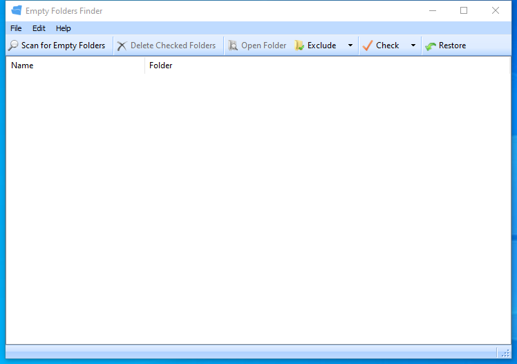

---
title: EmptyFolderFinder.exe | EmptyFolderFinder
excerpt: What is EmptyFolderFinder.exe?
---

# EmptyFolderFinder.exe 

* File Path: `C:\Program Files (x86)\Glary Utilities 5\EmptyFolderFinder.exe`
* Description: EmptyFolderFinder

## Screenshot

## Hashes

Type | Hash
-- | --
MD5 | `C235AC8DE8368F8BA30DEB0D93F8FBE5`
SHA1 | `2F785CF56FCAA27DF144ADBB58FDF5157F441C7D`
SHA256 | `7A79C6331B592D37150513C29DF8663096EED519899788B8B66C8264704602A0`
SHA384 | `E32671163C529B2CE6361E46B271945FA5BF88C78ABE1C9AAA49F9A1ACFFC696505651752E66E33655A127F2EE3BCEC0`
SHA512 | `5ECE822D886AF8862FD2C488E675A3F7A1C133F6240BFD38802348FCCB5492B1102AF6E4E77C7CD6C7FE62A89F8045728C6A42580625EA7C4BF3D4F34644DD81`
SSDEEP | `6144:I9WQhfEyKOOYjDbyVziSso2lUtD4fiO9hqA:I3fTKOO4/OiSso2caqA`

## Runtime Data

### Child Processes:
MemfilesService.exe

## Signature

* Status: Signature verified.
* Serial: `0F05AE21CDC17B9F3CF09D7BFC659BA3`
* Thumbprint: `362EBB303E088105BDCC07D94E6B7875D30C0D06`
* Issuer: CN=DigiCert Assured ID Code Signing CA-1, OU=www.digicert.com, O=DigiCert Inc, C=US
* Subject: CN=Glarysoft LTD, O=Glarysoft LTD, S=Beijing, C=CN

## File Metadata

* Original Filename: EmptyFolderFinder.exe
* Product Name: Glary Utilities
* Company Name: Glarysoft Ltd
* File Version: 5.0.0.28
* Product Version: 5.0.0.28
* Language: Chinese (Simplified, China)
* Legal Copyright: Copyright (c) 2003-2020 Glarysoft Ltd

## File Similarity (ssdeep match)

File | Score
-- | --
[C:\program files (x86)\Glary Utilities 5\EmptyFolderFinder.exe](EmptyFolderFinder.exe-20AAE75E3D008135842535BBC127FC2E.md) | 94
[C:\Program Files (x86)\Glary Utilities 5\EmptyFolderFinder.exe](EmptyFolderFinder.exe-E414B13E5875190B056E237AAC6AA58B.md) | 96

MIT License. Copyright (c) 2020 Strontic.

