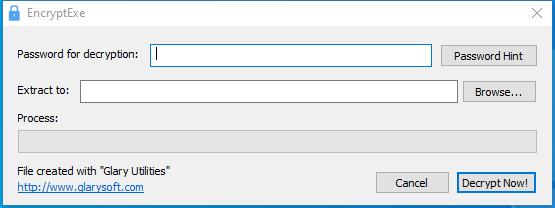

---
title: EncryptExe.exe | File Decrypter
---

# EncryptExe.exe 

* File Path: `C:\Program Files (x86)\Glary Utilities 5\EncryptExe.exe`
* Description: File Decrypter

## Screenshot

## Hashes

Type | Hash
-- | --
MD5 | `ABABE91AF0A24804D3655A0890C18AEB`
SHA1 | `E1B14083DBBF76EC2B5A1D4B45D2E41C93234F05`
SHA256 | `3855BACDAFFFF9DAF7CC1D209393BF7AE64096C6CE1A573F5AC5A340EF75C345`
SHA384 | `56B2A57FC8440CB15856C910789E860F078073DE16AF08574F16A82EE10B2E271103456D5E9A896FA0240E1DE32C32C7`
SHA512 | `B06FE97B506AE2242D600CB67582C35DE3A23C306E90AA11210E5637D23DAE77608F06E67FBFF603C4550FCFBC358BF8DB772953487CAF65C7E7B4A7F763E25F`
SSDEEP | `12288:2utyYb5qr2vMaewYTW/wxvZbyUU1yj3/R:91B0RC4xvZO87/R`

## Signature

* Status: Signature verified.
* Serial: `0F05AE21CDC17B9F3CF09D7BFC659BA3`
* Thumbprint: `362EBB303E088105BDCC07D94E6B7875D30C0D06`
* Issuer: CN=DigiCert Assured ID Code Signing CA-1, OU=www.digicert.com, O=DigiCert Inc, C=US
* Subject: CN=Glarysoft LTD, O=Glarysoft LTD, S=Beijing, C=CN

## File Metadata

* Original Filename: EncryptExe.exe
* Product Name: Glary Utilities
* Company Name: Glarysoft Ltd
* File Version: 5, 0, 0, 38
* Product Version: 5.0.0.1
* Language: Chinese (Simplified, China)
* Legal Copyright: Copyright (c) 2003-2020 Glarysoft Ltd

## File Similarity (ssdeep match)

File | Score
-- | --
[C:\program files (x86)\Glary Utilities 5\EncryptExe.exe](EncryptExe.exe-E4BC633AA6720A3C5C4B9FD18C23BF62.md) | 96

MIT License. Copyright (c) 2020 Strontic.

