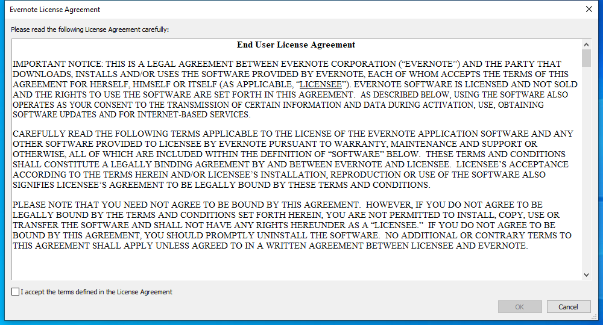

---
title: Evernote.exe | Evernote
---

# Evernote.exe 

* File Path: `C:\program files (x86)\Evernote\Evernote\Evernote.exe`
* Description: Evernote

## Screenshot

## Hashes

Type | Hash
-- | --
MD5 | `55FF086EA1F3F67716038501CC91E96A`
SHA1 | `7B5CC02D7B2002FF3BC3C1A99BDA0C517B02D532`
SHA256 | `47F8271F2F6EAF39987DC966BB2D3BA22E6491DE316A2860F4071CA56DE8298A`
SHA384 | `6671A4174D39333AF3812E4CC9413E7241940BEEEF084D0C444DE8241165DE608D9D127DDDB3DF570CCD0ECE51A3BD80`
SHA512 | `5D42FA0E04C54ACBB2D98E7A5DA007F543F2F798F86F96D2716152E34DA62CD8B8A3462215B135D3DF15514E606C36F1FE0BD2B8BFC0DA4D3D4DB48453184CA2`
SSDEEP | `393216:SPKZzhiINVPHCcdjs/KGIJqp7Oc+C5nj5QwWv:SS2INVPCGw/KG0ljw6`

## Runtime Data

### Window Title:
Evernote License Agreement

### Open Handles:

Path | Type
-- | --
(R--)   C:\Users\user\AppData\Local\Temp\Evernote_exe_PID8592_2020830_175151012891c0.lock | File
(R-D)   C:\Windows\Fonts\StaticCache.dat | File
(R-D)   C:\Windows\SysWOW64\en-US\ntdll.dll.mui | File
(R-D)   C:\Windows\SysWOW64\en-US\user32.dll.mui | File
(RW-)   C:\Users\user\Documents | File
(RW-)   C:\Users\user\Evernote\Logs\AppLog_2020-08-30.txt | File
(RW-)   C:\Windows | File
(RW-)   C:\Windows\WinSxS\x86_microsoft.windows.common-controls_6595b64144ccf1df_6.0.19041.1_none_fd031af45b0106f2 | File
(RW-)   C:\Windows\WinSxS\x86_microsoft.windows.gdiplus_6595b64144ccf1df_1.1.19041.450_none_4294d6e08a97344a | File
\BaseNamedObjects\NLS_CodePage_1252_3_2_0_0 | Section
\BaseNamedObjects\NLS_CodePage_437_3_2_0_0 | Section
\Sessions\1\BaseNamedObjects\ENInstancesSM | Section
\Sessions\1\BaseNamedObjects\ENLogListener | Section
\Sessions\1\BaseNamedObjects\windows_shell_global_counters | Section
\Sessions\1\Windows\Theme4048709601 | Section
\Windows\Theme603176458 | Section

### Loaded Modules:

Path |
-- |
C:\program files (x86)\Evernote\Evernote\Evernote.exe |
C:\Windows\SYSTEM32\ntdll.dll |
C:\Windows\System32\wow64.dll |
C:\Windows\System32\wow64cpu.dll |
C:\Windows\System32\wow64win.dll |

## Signature

* Status: Signature verified.
* Serial: `0F6C6C76C237FDBD4775DF1EEC48E4E7`
* Thumbprint: `AC51E96E30DB8C8AB1657078805399F405626259`
* Issuer: CN=DigiCert Assured ID Code Signing CA-1, OU=www.digicert.com, O=DigiCert Inc, C=US
* Subject: CN=Evernote Corporation, O=Evernote Corporation, L=Redwood City, S=CA, C=US

## File Metadata

* Original Filename: Evernote.exe
* Product Name: Evernote
* Company Name: Evernote Corp., 305 Walnut Street, Redwood City, CA 94063
* File Version: 6,25,1,9091
* Product Version: 6,25,1,9091
* Language: English (United States)
* Legal Copyright: Copyright 2020 Evernote Corporation.
All rights reserved.

## Possible Misuse

*The following table contains possible examples of `Evernote.exe` being misused. While `Evernote.exe` is **not** inherently malicious, its legitimate functionality can by abused for malicious purposes.*

Source | Source File | Example | License
-- | -- | -- | --
[malware-ioc](https://github.com/eset/malware-ioc) | [misp-dukes-operation-ghost-event.json](https://github.com/eset/malware-ioc/blob/master/dukes/misp-dukes-operation-ghost-event.json) | `"value": "http://www.evernote.com/shard/s675/sh/6686ff4e-8896-499b-8cdb-a2bbf2cc4db9/fc7fbe66c820f17c30147235e95d31b8",` | [© ESET 2014-2018](https://github.com/eset/malware-ioc/blob/master/LICENSE)
[malware-ioc](https://github.com/eset/malware-ioc) | [dukes](https://github.com/eset/malware-ioc/blob/master/dukes/README.adoc) | `http://www.evernote[.]com/shard/s675/sh/6686ff4e-8896-499b-8cdb-a2bbf2cc4db9/fc7fbe66c820f17c30147235e95d31b8` | [© ESET 2014-2018](https://github.com/eset/malware-ioc/blob/master/LICENSE)

MIT License. Copyright (c) 2020 Strontic.

