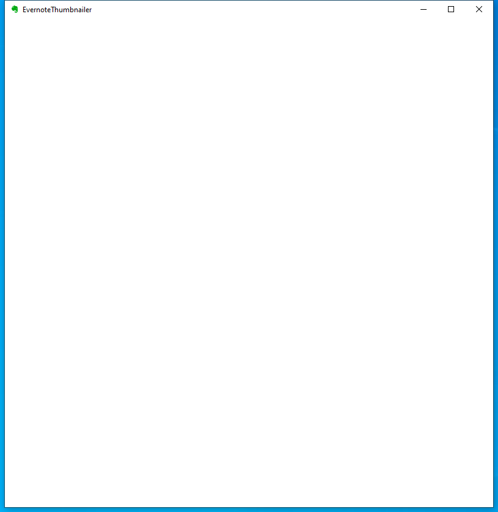

---
title: EvernoteThumbnailer.exe | Evernote Thumbnailer Application
---

# EvernoteThumbnailer.exe 

* File Path: `C:\Program Files (x86)\Evernote\Evernote\EvernoteThumbnailer.exe`
* Description: Evernote Thumbnailer Application

## Screenshot

## Hashes

Type | Hash
-- | --
MD5 | `A18E8DEE804F5A9C69F641989D7FEBE6`
SHA1 | `2096D1D3B09887E46B8C2B76836241E1E1C7A1EC`
SHA256 | `2BCF6CB71EBF8C6C67235454F545F8E564E6302B4430CDA34CA3853E6AE8C070`
SHA384 | `4ABA9864160AFAF22E25225B23644818AFE9917D7C36E5E82293A9C4EE02FADFDA7F9ECC0E3BAE00C6C121662B5D52C7`
SHA512 | `C220185F5BC7DDE0439A4D7ABCC6710E3EA8C382E6D75E44082FAA9DFC7A0C6775F824A9A786A5130ECD503F3705F26290D9CDEBC87B4981F4DB57ABBE2BDE7C`
SSDEEP | `12288:gAiUcwWe1hjMHh5UTmDrCWswuHPIYLlSPVBBjj+k4GKdcTEjJjHGAcgGp6gbYqu5:ghjpKjMHh5UT2CWswuHPBLlSPhjjnlon`

## Signature

* Status: Signature verified.
* Serial: `0F6C6C76C237FDBD4775DF1EEC48E4E7`
* Thumbprint: `AC51E96E30DB8C8AB1657078805399F405626259`
* Issuer: CN=DigiCert Assured ID Code Signing CA-1, OU=www.digicert.com, O=DigiCert Inc, C=US
* Subject: CN=Evernote Corporation, O=Evernote Corporation, L=Redwood City, S=CA, C=US

## File Metadata

* Original Filename: EvernoteThumbnailer.exe
* Product Name: Evernote
* Company Name: Evernote Corp., 305 Walnut Street, Redwood City, CA 94063
* File Version: 6,25,1,9091
* Product Version: 6,25,1,9091
* Language: English (United States)
* Legal Copyright: Copyright 2020 Evernote Corporation.
All rights reserved.

MIT License. Copyright (c) 2020 Strontic.

