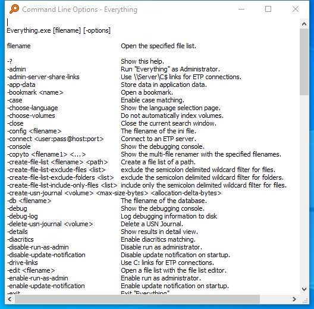
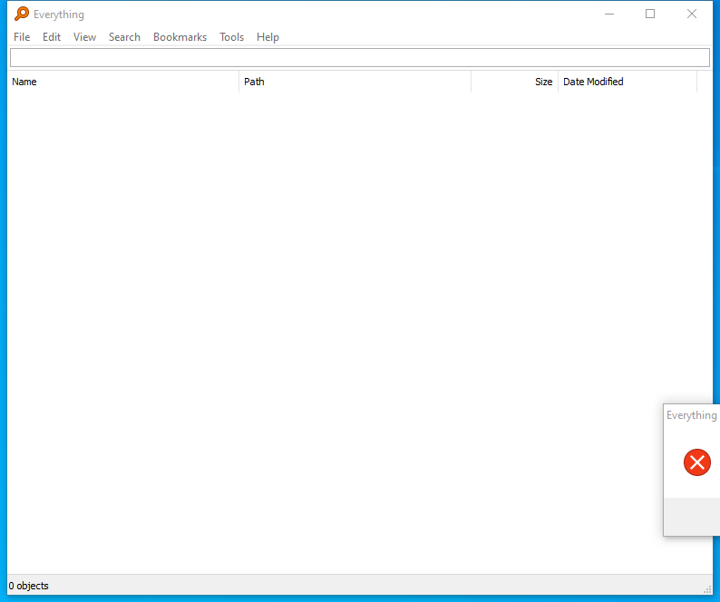

---
title: Everything.exe | Everything
excerpt: What is Everything.exe?
---

# Everything.exe 

* File Path: `C:\Program Files\Everything\Everything.exe`
* Description: Everything

## Screenshot

## Hashes

Type | Hash
-- | --
MD5 | `241931B176498EA29A29C6C05DCC0194`
SHA1 | `7F0034829EBE4FB0DE4E2BE776DF9BB88C54F138`
SHA256 | `71BE6DA3F9E4D7B9F965BBE5C77AB77C22C09557683D271E452EB2B9F4ED588A`
SHA384 | `8D29800F7E656661A53681343EB7F75C6DD1A37EAD8C6CE18C1339632DD1D6DBD69BBAC789830592AB6A81D0F2C955BF`
SHA512 | `A507BF259E191D405DE5359FE429C3137FC45A7C782E0B20EB20FE4DCE19B914FE61DBD879BC9C288F7532502BB73F4F7A88FE81EF3ABEE0067FB219BAD07015`
SSDEEP | `49152:YorYL8OnAKgReoL6lZBaDcXi5tiQSRdMli+OAFwSZAttKr8:Yoco5cAsJyFwSZAtko`
IMP | `1AEDACFB186F381089A405C6FF922BAB`
PESHA1 | `1EAC32914CA1BC29D25919BB06A9A1C3068AC367`
PE256 | `91FF6AE3CE3DFD116BDD4A7997CA9AF5380DB5135FCA111924E7D3090BEE37D0`

## Runtime Data

### Window Title:
Everything

### Open Handles:

Path | Type
-- | --
(R-D)   C:\Windows\Fonts\StaticCache.dat | File
(R-D)   C:\Windows\System32\en-US\windows.storage.dll.mui | File
(R-D)   C:\Windows\SystemResources\imageres.dll.mun | File
(RW-)   C:\Windows\WinSxS\amd64_microsoft.windows.common-controls_6595b64144ccf1df_6.0.19041.488_none_ca04af081b815d21 | File
(RW-)   C:\xCyclopedia | File
\BaseNamedObjects\__ComCatalogCache__ | Section
\BaseNamedObjects\NLS_CodePage_1252_3_2_0_0 | Section
\BaseNamedObjects\NLS_CodePage_437_3_2_0_0 | Section
\BaseNamedObjects\windows_shell_global_counters | Section
\Sessions\1\BaseNamedObjects\1accHWNDInterface:1807f4 | Section
\Sessions\1\BaseNamedObjects\windows_shell_global_counters | Section
\Sessions\1\Windows\Theme2547664911 | Section
\Windows\Theme3854699184 | Section

### Loaded Modules:

Path |
-- |
C:\Program Files\Everything\Everything.exe |
C:\Windows\System32\ADVAPI32.dll |
C:\Windows\System32\combase.dll |
C:\Windows\System32\comdlg32.dll |
C:\Windows\System32\GDI32.dll |
C:\Windows\System32\gdi32full.dll |
C:\Windows\SYSTEM32\iertutil.dll |
C:\Windows\System32\IMM32.DLL |
C:\Windows\System32\KERNEL32.DLL |
C:\Windows\System32\KERNELBASE.dll |
C:\Windows\System32\msvcp_win.dll |
C:\Windows\System32\msvcrt.dll |
C:\Windows\SYSTEM32\ntdll.dll |
C:\Windows\System32\ole32.dll |
C:\Windows\System32\psapi.dll |
C:\Windows\System32\RPCRT4.dll |
C:\Windows\System32\sechost.dll |
C:\Windows\System32\shcore.dll |
C:\Windows\System32\SHELL32.dll |
C:\Windows\System32\SHLWAPI.dll |
C:\Windows\System32\ucrtbase.dll |
C:\Windows\system32\urlmon.dll |
C:\Windows\System32\USER32.dll |
C:\Windows\system32\uxtheme.dll |
C:\Windows\System32\win32u.dll |
C:\Windows\System32\WS2_32.dll |
C:\Windows\WinSxS\amd64_microsoft.windows.common-controls_6595b64144ccf1df_6.0.19041.488_none_ca04af081b815d21\COMCTL32.dll |

## Signature

* Status: Signature verified.
* Serial: `0554D03D517345589F62CA21C7789A22`
* Thumbprint: `D729CE691A8FC342ED6B0F607C7457B05B5AACF9`
* Issuer: CN=DigiCert SHA2 Assured ID Code Signing CA, OU=www.digicert.com, O=DigiCert Inc, C=US
* Subject: CN=voidtools, O=voidtools, L=Wilmington, S=South Australia, C=AU

## File Metadata

* Original Filename: Everything.exe
* Product Name: Everything
* Company Name: voidtools
* File Version: 1.4.1.992
* Product Version: 1.4.1.992
* Language: English (United States)
* Legal Copyright: Copyright  2020 voidtools
* Machine Type: 64-bit

## File Scan

* VirusTotal Detections: 0/68
* VirusTotal Link: https://www.virustotal.com/gui/file/71be6da3f9e4d7b9f965bbe5c77ab77c22c09557683d271e452eb2b9f4ed588a/detection/

## Possible Misuse

*The following table contains possible examples of `Everything.exe` being misused. While `Everything.exe` is **not** inherently malicious, its legitimate functionality can be abused for malicious purposes.*

Source | Source File | Example | License
-- | -- | -- | --
[atomic-red-team](https://github.com/redcanaryco/atomic-red-team) | [atomic-red-team](https://github.com/redcanaryco/atomic-red-team/blob/master/README.md) | - **Teams need to be able to test everything from specific technical controls to outcomes.** | [MIT License. © 2018 Red Canary](https://github.com/redcanaryco/atomic-red-team/blob/master/LICENSE.txt)
[atomic-red-team](https://github.com/redcanaryco/atomic-red-team) | [T1114.001.md](https://github.com/redcanaryco/atomic-red-team/blob/master/atomics/T1114.001/T1114.001.md) | Search through local Outlook installation, extract mail, compress the contents, and saves everything to a directory for later exfiltration. | [MIT License. © 2018 Red Canary](https://github.com/redcanaryco/atomic-red-team/blob/master/LICENSE.txt)
[atomic-red-team](https://github.com/redcanaryco/atomic-red-team) | [T1176.md](https://github.com/redcanaryco/atomic-red-team/blob/master/atomics/T1176/T1176.md) | <blockquote>Adversaries may abuse Internet browser extensions to establish persistence access to victim systems. Browser extensions or plugins are small programs that can add functionality and customize aspects of Internet browsers. They can be installed directly or through a browser's app store and generally have access and permissions to everything that the browser can access. (Citation: Wikipedia Browser Extension) (Citation: Chrome Extensions Definition) | [MIT License. © 2018 Red Canary](https://github.com/redcanaryco/atomic-red-team/blob/master/LICENSE.txt)
[atomic-red-team](https://github.com/redcanaryco/atomic-red-team) | [contributing.md](https://github.com/redcanaryco/atomic-red-team/blob/master/docs/contributing.md) | everything is working correctly. | [MIT License. © 2018 Red Canary](https://github.com/redcanaryco/atomic-red-team/blob/master/LICENSE.txt)
[atomic-red-team](https://github.com/redcanaryco/atomic-red-team) | [contributing.md](https://github.com/redcanaryco/atomic-red-team/blob/master/docs/contributing.md) | Submit a Pull Request once your test is complete and everything validates. | [MIT License. © 2018 Red Canary](https://github.com/redcanaryco/atomic-red-team/blob/master/LICENSE.txt)
[atomic-red-team](https://github.com/redcanaryco/atomic-red-team) | [index.md](https://github.com/redcanaryco/atomic-red-team/blob/master/docs/index.md) | ## Teams need to be able to test everything from specific technical controls to outcomes. | [MIT License. © 2018 Red Canary](https://github.com/redcanaryco/atomic-red-team/blob/master/LICENSE.txt)
[signature-base](https://github.com/Neo23x0/signature-base) | [airbnb_binaryalert.yar](https://github.com/Neo23x0/signature-base/blob/master/vendor/yara/airbnb_binaryalert.yar) | $s3 = "-cmdfile local.bat                #will execute everything from local.bat" ascii wide | [CC BY-NC 4.0](https://github.com/Neo23x0/signature-base/blob/master/LICENSE)
[signature-base](https://github.com/Neo23x0/signature-base) | [apt_eqgrp.yar](https://github.com/Neo23x0/signature-base/blob/master/yara/apt_eqgrp.yar) | $s4 = "Not everything is set yet" fullword ascii | [CC BY-NC 4.0](https://github.com/Neo23x0/signature-base/blob/master/LICENSE)
[signature-base](https://github.com/Neo23x0/signature-base) | [apt_eqgrp_apr17.yar](https://github.com/Neo23x0/signature-base/blob/master/yara/apt_eqgrp_apr17.yar) | $x4 = "[!] nothing looks vulnerable, trying everything" fullword ascii | [CC BY-NC 4.0](https://github.com/Neo23x0/signature-base/blob/master/LICENSE)

MIT License. Copyright (c) 2020-2021 Strontic.

