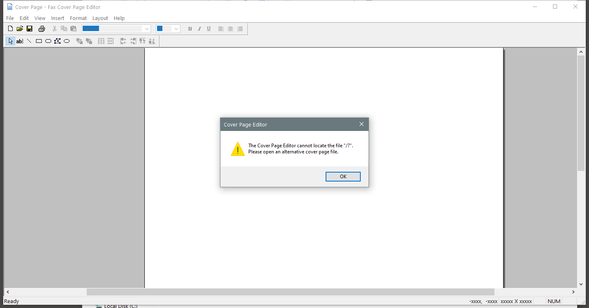

---
title: FXSCOVER.exe | Microsoft  Fax Cover Page Editor
excerpt: What is FXSCOVER.exe?
---

# FXSCOVER.exe 

* File Path: `C:\Windows\system32\FXSCOVER.exe`
* Description: Microsoft  Fax Cover Page Editor

## Screenshot

## Hashes

Type | Hash
-- | --
MD5 | `CC45C7238FC4238C8A5A8D270AFB7F40`
SHA1 | `A53004F5A8D4E25D3A2B9735645B4A7A8476AA80`
SHA256 | `2C4A4B206E941E938E2FA93B2D034432DD4C040293F933BC1EEC9DC539E83EC9`
SHA384 | `3F695F656D6B9877A8AA249601AF557A82BF9F8A9957FA047653585EAF9F62B12DEE1C09FA88AFCAB6ECAA81F784D3D9`
SHA512 | `9B0380B9583C4E3E7A9A0B6DF8FFA130A25461A45834105E1F71E4F9E7D750AE6B3D99BF2E48F3F7C4BDE55B2C203CC0173ED08631917178C208D1F132E880F7`
SSDEEP | `6144:7UsVXQny/Zwvg2xe/xHq3PnIrUTHleDb6OB4/:Wy/ZwI2xSJGFtK4/`
IMP | `27CE374153A8DD50DDF6F59B17C8348A`
PESHA1 | `5DEF3A042DDE181ED2AA4DC4A1BC750873660938`
PE256 | `A7602AB0BD092548AD7FAFB35CEC9BACD1BF00DAA42F4CECDF388521906683E9`

## Runtime Data

### Window Title:
Cover Page - Fax Cover Page Editor

### Open Handles:

Path | Type
-- | --
(R-D)   C:\Windows\Fonts\StaticCache.dat | File
(R-D)   C:\Windows\System32\en-US\FXSRESM.dll.mui | File
(R-D)   C:\Windows\System32\en-US\MFC42u.dll.mui | File
(R-D)   C:\Windows\SystemResources\imageres.dll.mun | File
(RW-)   C:\Users\user\Documents\Fax\Personal CoverPages | File
(RW-)   C:\Windows\WinSxS\amd64_microsoft.windows.common-controls_6595b64144ccf1df_6.0.19041.488_none_ca04af081b815d21 | File
\BaseNamedObjects\__ComCatalogCache__ | Section
\BaseNamedObjects\C:\*ProgramData\*Microsoft\*Windows\*Caches\*{6AF0698E-D558-4F6E-9B3C-3716689AF493}.2.ver0x0000000000000002.db | Section
\BaseNamedObjects\C:\*ProgramData\*Microsoft\*Windows\*Caches\*{DDF571F2-BE98-426D-8288-1A9A39C3FDA2}.2.ver0x0000000000000002.db | Section
\BaseNamedObjects\C:\*ProgramData\*Microsoft\*Windows\*Caches\*cversions.2 | Section
\BaseNamedObjects\NLS_CodePage_1252_3_2_0_0 | Section
\BaseNamedObjects\NLS_CodePage_437_3_2_0_0 | Section
\BaseNamedObjects\windows_shell_global_counters | Section
\Sessions\1\BaseNamedObjects\windows_shell_global_counters | Section
\Sessions\1\Windows\Theme1175649999 | Section
\Windows\Theme601709542 | Section

### Loaded Modules:

Path |
-- |
C:\Windows\System32\ADVAPI32.dll |
C:\Windows\System32\combase.dll |
C:\Windows\System32\COMDLG32.dll |
C:\Windows\system32\FXSCOVER.exe |
C:\Windows\System32\GDI32.dll |
C:\Windows\System32\gdi32full.dll |
C:\Windows\System32\KERNEL32.DLL |
C:\Windows\System32\KERNELBASE.dll |
C:\Windows\system32\MFC42u.dll |
C:\Windows\System32\msvcp_win.dll |
C:\Windows\System32\msvcrt.dll |
C:\Windows\SYSTEM32\ntdll.dll |
C:\Windows\System32\OLE32.dll |
C:\Windows\System32\OLEAUT32.dll |
C:\Windows\System32\RPCRT4.dll |
C:\Windows\System32\sechost.dll |
C:\Windows\System32\shcore.dll |
C:\Windows\System32\SHELL32.dll |
C:\Windows\System32\SHLWAPI.dll |
C:\Windows\System32\ucrtbase.dll |
C:\Windows\System32\USER32.dll |
C:\Windows\System32\win32u.dll |
C:\Windows\WinSxS\amd64_microsoft.windows.common-controls_6595b64144ccf1df_6.0.19041.488_none_ca04af081b815d21\COMCTL32.dll |

## Signature

* Status: Signature verified.
* Serial: `3300000266BD1580EFA75CD6D3000000000266`
* Thumbprint: `A4341B9FD50FB9964283220A36A1EF6F6FAA7840`
* Issuer: CN=Microsoft Windows Production PCA 2011, O=Microsoft Corporation, L=Redmond, S=Washington, C=US
* Subject: CN=Microsoft Windows, O=Microsoft Corporation, L=Redmond, S=Washington, C=US

## File Metadata

* Original Filename: FXSCOVER.EXE
* Product Name: Microsoft Windows Operating System
* Company Name: Microsoft Corporation
* File Version: 10.0.19041.508 (WinBuild.160101.0800)
* Product Version: 10.0.19041.508
* Language: English (United States)
* Legal Copyright:  Microsoft Corporation. All rights reserved.
* Machine Type: 64-bit

## File Scan

* VirusTotal Detections: 0/73
* VirusTotal Link: https://www.virustotal.com/gui/file/2c4a4b206e941e938e2fa93b2d034432dd4c040293f933bc1eec9dc539e83ec9/detection

MIT License. Copyright (c) 2020-2021 Strontic.

