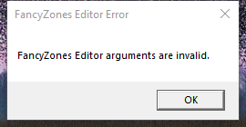

---
title: FancyZonesEditor.exe | FancyZonesEditor
excerpt: What is FancyZonesEditor.exe?
---

# FancyZonesEditor.exe 

* File Path: `C:\Program Files\PowerToys\modules\FancyZones\FancyZonesEditor.exe`
* Description: FancyZonesEditor
* Comments: PowerToys FancyZones Editor

## Screenshot

## Hashes

Type | Hash
-- | --
MD5 | `DE8F669623601C0148EBFD16A7FAE5FA`
SHA1 | `A3A895D50A79CDD58132BE7B8399D09B00AB3464`
SHA256 | `34400BAB5CDB0C1CCA240A6AA487D9D8F10D6919C9264677DC74C09BC2403F97`
SHA384 | `A1E0C092FE155017B8726DDF744D7B8132BB1FED7A7DA031FC455DB7FE01C4093F41F91912DBD6415FDA40F407A0D4E9`
SHA512 | `F70EC15CE96C364A42920DBF09459AE70B261F3A9F0EBE77BAF0FF92A507C24F58DAA5D5736A6D254C465A3056FAFA7BE64CCBB950D4A00CF66905C7B41F61A2`
SSDEEP | `3072:E63e0xf5i8Pbe4bZKdmwAejb8EQk4D70rjDgvHU+/5xggvycbtG:ht+mijb4n0rj89/5x5tw`
IMP | `n/a`
PESHA1 | `E4E849E5892B91B1A2AF842A0FDB7AE35BD7E4C6`
PE256 | `4CB5668613B03077D863028AD84AC839BB0FEE88D2FC287FF6D184BF579370A8`

## Runtime Data

### Window Title:
FancyZones Editor Error

### Open Handles:

Path | Type
-- | --
(R-D)   C:\Windows\Fonts\StaticCache.dat | File
(R-D)   C:\Windows\Microsoft.NET\assembly\GAC_64\mscorlib\v4.0_4.0.0.0__b77a5c561934e089\mscorlib.dll | File
(R-D)   C:\Windows\Microsoft.NET\assembly\GAC_64\PresentationCore\v4.0_4.0.0.0__31bf3856ad364e35\PresentationCore.dll | File
(R-D)   C:\Windows\Microsoft.NET\assembly\GAC_MSIL\PresentationFramework\v4.0_4.0.0.0__31bf3856ad364e35\PresentationFramework.dll | File
(R-D)   C:\Windows\Microsoft.NET\assembly\GAC_MSIL\System.Configuration\v4.0_4.0.0.0__b03f5f7f11d50a3a\System.Configuration.dll | File
(R-D)   C:\Windows\Microsoft.NET\assembly\GAC_MSIL\System.Core\v4.0_4.0.0.0__b77a5c561934e089\System.Core.dll | File
(R-D)   C:\Windows\Microsoft.NET\assembly\GAC_MSIL\System.Xaml\v4.0_4.0.0.0__b77a5c561934e089\System.Xaml.dll | File
(R-D)   C:\Windows\Microsoft.NET\assembly\GAC_MSIL\System.Xml\v4.0_4.0.0.0__b77a5c561934e089\System.XML.dll | File
(R-D)   C:\Windows\Microsoft.NET\assembly\GAC_MSIL\System\v4.0_4.0.0.0__b77a5c561934e089\System.dll | File
(R-D)   C:\Windows\Microsoft.NET\assembly\GAC_MSIL\WindowsBase\v4.0_4.0.0.0__31bf3856ad364e35\WindowsBase.dll | File
(RW-)   C:\xCyclopedia | File
\...\Cor_SxSPublic_IPCBlock | Section
\BaseNamedObjects\Cor_Private_IPCBlock_v4_4932 | Section
\BaseNamedObjects\NLS_CodePage_1252_3_2_0_0 | Section
\BaseNamedObjects\NLS_CodePage_437_3_2_0_0 | Section
\Sessions\1\BaseNamedObjects\windows_shell_global_counters | Section
\Sessions\1\Windows\Theme289354956 | Section
\Windows\Theme1665484522 | Section

### Loaded Modules:

Path |
-- |
C:\Program Files\PowerToys\modules\FancyZones\FancyZonesEditor.exe |
C:\Windows\Microsoft.NET\Framework64\v4.0.30319\mscoreei.dll |
C:\Windows\System32\ADVAPI32.dll |
C:\Windows\System32\KERNEL32.dll |
C:\Windows\System32\KERNELBASE.dll |
C:\Windows\SYSTEM32\MSCOREE.DLL |
C:\Windows\System32\msvcrt.dll |
C:\Windows\SYSTEM32\ntdll.dll |
C:\Windows\System32\RPCRT4.dll |
C:\Windows\System32\sechost.dll |

## Signature

* Status: Signature verified.
* Serial: `33000001864D2175A0D907BE2C000000000186`
* Thumbprint: `8EE1E4E037942BE5BC7E58B061FB559BDC381D82`
* Issuer: CN=Microsoft Code Signing PCA 2011, O=Microsoft Corporation, L=Redmond, S=Washington, C=US
* Subject: CN=Microsoft Corporation, O=Microsoft Corporation, L=Redmond, S=Washington, C=US

## File Metadata

* Original Filename: FancyZonesEditor.exe
* Product Name: PowerToys
* Company Name: Microsoft Corp.
* File Version: 0.23.2.0
* Product Version: 0.23.2.0
* Language: Language Neutral
* Legal Copyright: Copyright (C) 2020 Microsoft Corporation
* Machine Type: 64-bit

## File Scan

* VirusTotal Detections: 0/69
* VirusTotal Link: https://www.virustotal.com/gui/file/34400bab5cdb0c1cca240a6aa487d9d8f10d6919c9264677dc74c09bc2403f97/detection/

MIT License. Copyright (c) 2020 Strontic.

