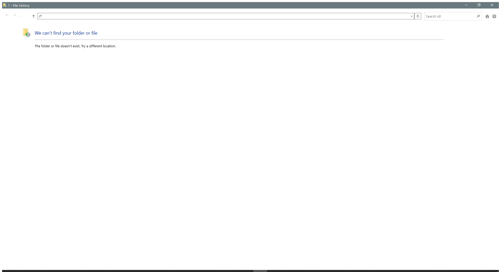

---
title: FileHistory.exe | File History
excerpt: What is FileHistory.exe?
---

# FileHistory.exe 

* File Path: `C:\Windows\system32\FileHistory.exe`
* Description: File History

## Screenshot

## Hashes

Type | Hash
-- | --
MD5 | `11FCDD6D3B8F0381AC9E90F9B4EC0865`
SHA1 | `EB1E8F4AC804DD8D92B328841FEC1E1D64548946`
SHA256 | `A495F0059E9A68C99BE88FCA44B2C5E75E6345374C44F58DC3218839A1CBF05A`
SHA384 | `B6E74F7F3A88DD16038402E7B790DC96A534411F651FA36EFD98231A5A8E97E7024B57C40BC8947C217A3485984F79B8`
SHA512 | `3FE1F51134D7C513E8CE2C5117C065E5D44D78100554375637B06244D243A14C05687A2E6BCF3234694698E3FB8A8B8BE26E1675939B2C1D4F654A9018F75032`
SSDEEP | `3072:Yc6avDu8+NorasBZOsdC6VD7xvxzYuVD8C+cxICGQWcMh4N6obdmyTVulAyXbwN:Yc6XvIvxzYuVD8CnxICGJcTIobd`
IMP | `0C153A28F0F3D65D93238BD2C448D417`
PESHA1 | `79412F37972DF575071403A105E419B92B66B57B`
PE256 | `E2C2F13FB184F3C9A86368387B8DB553D459AEE72F86CA4A469B3F7AF0C271CF`

## Runtime Data

### Window Title:
--help - File History

### Open Handles:

Path | Type
-- | --
(R-D)   C:\Windows\apppatch\DirectXApps_FOD.sdb | File
(R-D)   C:\Windows\Fonts\StaticCache.dat | File
(R-D)   C:\Windows\Microsoft.NET\assembly\GAC_64\mscorlib\v4.0_4.0.0.0__b77a5c561934e089\mscorlib.dll | File
(R-D)   C:\Windows\Microsoft.NET\assembly\GAC_MSIL\System.Core\v4.0_4.0.0.0__b77a5c561934e089\System.Core.dll | File
(R-D)   C:\Windows\Microsoft.NET\assembly\GAC_MSIL\System\v4.0_4.0.0.0__b77a5c561934e089\System.dll | File
(R-D)   C:\Windows\System32\en-US\explorerframe.dll.mui | File
(R-D)   C:\Windows\System32\en-US\FileHistory.exe.mui | File
(R-D)   C:\Windows\System32\en-US\user32.dll.mui | File
(R-D)   C:\Windows\System32\fhuxadapter.dll | File
(R-D)   C:\Windows\System32\fhuxapi.dll | File
(R-D)   C:\Windows\System32\fhuxcommon.dll | File
(R-D)   C:\Windows\System32\fhuxgraphics.dll | File
(R-D)   C:\Windows\System32\fhuxpresentation.dll | File
(R-D)   C:\Windows\SystemResources\ExplorerFrame.dll.mun | File
(R-D)   C:\Windows\WinSxS\amd64_microsoft.windows.c..-controls.resources_6595b64144ccf1df_6.0.19041.1_en-us_cb612d02732b0fd9\comctl32.dll.mui | File
(RW-)   C:\Users\user | File
(RW-)   C:\Windows\System32 | File
(RW-)   C:\Windows\WinSxS\amd64_microsoft.windows.c..-controls.resources_6595b64144ccf1df_6.0.19041.1_en-us_cb612d02732b0fd9 | File
(RW-)   C:\Windows\WinSxS\amd64_microsoft.windows.common-controls_6595b64144ccf1df_6.0.19041.488_none_ca04af081b815d21 | File
(RW-)   C:\Windows\WinSxS\amd64_microsoft.windows.gdiplus_6595b64144ccf1df_1.1.19041.685_none_faeca4db76168538 | File
\...\Cor_SxSPublic_IPCBlock | Section
\BaseNamedObjects\__ComCatalogCache__ | Section
\BaseNamedObjects\C:\*ProgramData\*Microsoft\*Windows\*Caches\*{6AF0698E-D558-4F6E-9B3C-3716689AF493}.2.ver0x0000000000000002.db | Section
\BaseNamedObjects\C:\*ProgramData\*Microsoft\*Windows\*Caches\*{DDF571F2-BE98-426D-8288-1A9A39C3FDA2}.2.ver0x0000000000000002.db | Section
\BaseNamedObjects\C:\*ProgramData\*Microsoft\*Windows\*Caches\*cversions.2 | Section
\BaseNamedObjects\Cor_Private_IPCBlock_v4_2540 | Section
\BaseNamedObjects\NLS_CodePage_1252_3_2_0_0 | Section
\BaseNamedObjects\NLS_CodePage_437_3_2_0_0 | Section
\Sessions\1\BaseNamedObjects\UrlZonesSM_user | Section
\Sessions\1\BaseNamedObjects\windows_shell_global_counters | Section
\Sessions\1\Windows\Theme1175649999 | Section
\Windows\Theme601709542 | Section

### Loaded Modules:

Path |
-- |
C:\Windows\System32\combase.dll |
C:\Windows\system32\FileHistory.exe |
C:\Windows\System32\GDI32.dll |
C:\Windows\System32\gdi32full.dll |
C:\Windows\System32\KERNEL32.dll |
C:\Windows\System32\KERNELBASE.dll |
C:\Windows\SYSTEM32\MSCOREE.DLL |
C:\Windows\System32\msvcp_win.dll |
C:\Windows\System32\msvcrt.dll |
C:\Windows\SYSTEM32\ntdll.dll |
C:\Windows\System32\ole32.dll |
C:\Windows\System32\RPCRT4.dll |
C:\Windows\System32\SHLWAPI.dll |
C:\Windows\System32\ucrtbase.dll |
C:\Windows\System32\USER32.dll |
C:\Windows\system32\UxTheme.dll |
C:\Windows\System32\win32u.dll |
C:\Windows\WinSxS\amd64_microsoft.windows.common-controls_6595b64144ccf1df_6.0.19041.488_none_ca04af081b815d21\COMCTL32.dll |

## Signature

* Status: Signature verified.
* Serial: `3300000266BD1580EFA75CD6D3000000000266`
* Thumbprint: `A4341B9FD50FB9964283220A36A1EF6F6FAA7840`
* Issuer: CN=Microsoft Windows Production PCA 2011, O=Microsoft Corporation, L=Redmond, S=Washington, C=US
* Subject: CN=Microsoft Windows, O=Microsoft Corporation, L=Redmond, S=Washington, C=US

## File Metadata

* Original Filename: FileHistory.exe.mui
* Product Name: Microsoft Windows Operating System
* Company Name: Microsoft Corporation
* File Version: 10.0.19041.1 (WinBuild.160101.0800)
* Product Version: 10.0.19041.1
* Language: English (United States)
* Legal Copyright:  Microsoft Corporation. All rights reserved.
* Machine Type: 64-bit

## File Scan

* VirusTotal Detections: 0/73
* VirusTotal Link: https://www.virustotal.com/gui/file/a495f0059e9a68c99be88fca44b2c5e75e6345374c44f58dc3218839a1cbf05a/detection

## File Similarity (ssdeep match)

File | Score
-- | --
[C:\WINDOWS\system32\FileHistory.exe](FileHistory.exe-154C634AC5FCC1AC49FC189D1308FF26.md) | 77

## Possible Misuse

*The following table contains possible examples of `FileHistory.exe` being misused. While `FileHistory.exe` is **not** inherently malicious, its legitimate functionality can be abused for malicious purposes.*

Source | Source File | Example | License
-- | -- | -- | --
[malware-ioc](https://github.com/eset/malware-ioc) | [nukesped_lazarus](https://github.com/eset/malware-ioc/blob/master/nukesped_lazarus/README.adoc) | `.`FileHistory.exe``{:.highlight .language-cmhg} | [© ESET 2014-2018](https://github.com/eset/malware-ioc/blob/master/LICENSE)

MIT License. Copyright (c) 2020-2021 Strontic.

