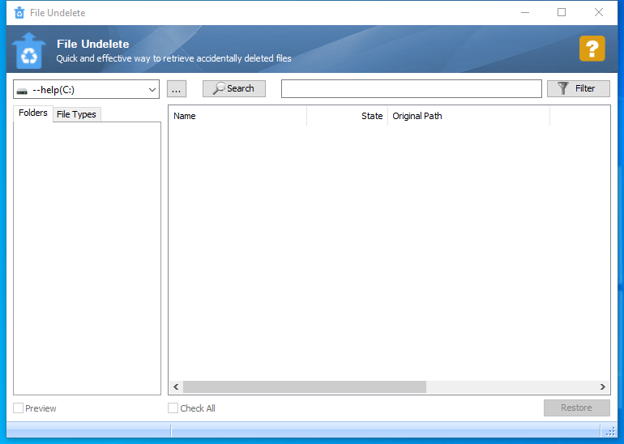

---
title: FileUndelete.exe | Glary Utilities FileUndelete
excerpt: What is FileUndelete.exe?
---

# FileUndelete.exe 

* File Path: `C:\program files (x86)\Glary Utilities 5\FileUndelete.exe`
* Description: Glary Utilities FileUndelete

## Screenshot

## Hashes

Type | Hash
-- | --
MD5 | `455DB3ECB77821FAC9070B7C53EFF220`
SHA1 | `FBE55E47028321E75775F621E184D8CCD997A3A8`
SHA256 | `9C0878A09729D625BE7DB0B4DDB182826DB73E50DCA4DE922256ABF076B8341D`
SHA384 | `A863373C069F05F0F6E7C9E174822F105649BCD732279FE68652B2231E9943AEEC613B2ADC11FCB810036EC53E3419B8`
SHA512 | `DD5B7D2BFD6CAF27A598ADF497C68F4835B6B3849B652271C994328CDCEFDED6291525C06927C04723D6CEC62682B4090C18B6DF667BCC4B969F6E90B63E9216`
SSDEEP | `24576:oh1E/T5FFUsPOVIBkMt577B/tgl6nRbBrIvUVQnGLfiT4xzNZ:KEHFpDE6JRz2TY3`

## Runtime Data

### Window Title:
File Undelete

### Open Handles:

Path | Type
-- | --
(R-D)   C:\Windows\Fonts\StaticCache.dat | File
(R-D)   C:\Windows\SysWOW64\en-US\user32.dll.mui | File
(RW-)   C:\Program Files (x86)\Glary Utilities 5 | File
(RW-)   C:\Users\user\Documents | File
(RW-)   C:\Windows | File
(RW-)   C:\Windows\WinSxS\x86_microsoft.vc90.crt_1fc8b3b9a1e18e3b_9.0.30729.9625_none_508ef7e4bcbbe589 | File
(RW-)   C:\Windows\WinSxS\x86_microsoft.windows.common-controls_6595b64144ccf1df_6.0.19041.1_none_fd031af45b0106f2 | File
(RW-)   C:\Windows\WinSxS\x86_microsoft.windows.gdiplus_6595b64144ccf1df_1.1.19041.450_none_4294d6e08a97344a | File
(RWD)   C:\Users\user\AppData\Local\Microsoft\Windows\Explorer\iconcache_16.db | File
(RWD)   C:\Users\user\AppData\Local\Microsoft\Windows\Explorer\iconcache_idx.db | File
\BaseNamedObjects\__ComCatalogCache__ | Section
\BaseNamedObjects\C:\*ProgramData\*Microsoft\*Windows\*Caches\*{6AF0698E-D558-4F6E-9B3C-3716689AF493}.2.ver0x0000000000000002.db | Section
\BaseNamedObjects\C:\*ProgramData\*Microsoft\*Windows\*Caches\*{DDF571F2-BE98-426D-8288-1A9A39C3FDA2}.2.ver0x0000000000000001.db | Section
\BaseNamedObjects\C:\*ProgramData\*Microsoft\*Windows\*Caches\*cversions.2.ro | Section
\BaseNamedObjects\NLS_CodePage_1252_3_2_0_0 | Section
\BaseNamedObjects\NLS_CodePage_437_3_2_0_0 | Section
\BaseNamedObjects\windows_shell_global_counters | Section
\Sessions\1\BaseNamedObjects\windows_shell_global_counters | Section
\Sessions\1\Windows\Theme4048709601 | Section
\Windows\Theme603176458 | Section

### Loaded Modules:

Path |
-- |
C:\program files (x86)\Glary Utilities 5\FileUndelete.exe |
C:\Windows\SYSTEM32\ntdll.dll |
C:\Windows\System32\wow64.dll |
C:\Windows\System32\wow64cpu.dll |
C:\Windows\System32\wow64win.dll |

## Signature

* Status: Signature verified.
* Serial: `0F05AE21CDC17B9F3CF09D7BFC659BA3`
* Thumbprint: `362EBB303E088105BDCC07D94E6B7875D30C0D06`
* Issuer: CN=DigiCert Assured ID Code Signing CA-1, OU=www.digicert.com, O=DigiCert Inc, C=US
* Subject: CN=Glarysoft LTD, O=Glarysoft LTD, S=Beijing, C=CN

## File Metadata

* Original Filename: FileUndelete.exe
* Product Name: Glary Utilities
* Company Name: Glarysoft Ltd
* File Version: 5.0.0.23
* Product Version: 5.0.0.1
* Language: Chinese (Simplified, China)
* Legal Copyright: Copyright (c) 2003-2020 Glarysoft Ltd

## File Similarity (ssdeep match)

File | Score
-- | --
[C:\Program Files (x86)\Glary Utilities 5\FileUndelete.exe](FileUndelete.exe-316D03530F8CE10E22670C5006A610D1.md) | 97
[C:\Program Files (x86)\Glary Utilities 5\FileUndelete.exe](FileUndelete.exe-D5DB4E8BCDEC47FA1BB38EE5CD8DBE08.md) | 97

MIT License. Copyright (c) 2020-2021 Strontic.

