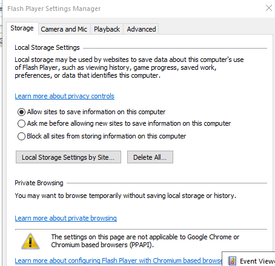

---
title: FlashPlayerApp.exe | Adobe Flash Player Control Panel Applet
---

# FlashPlayerApp.exe 

* File Path: `C:\windows\SysWOW64\FlashPlayerApp.exe`
* Description: Adobe Flash Player Control Panel Applet
* Comments: 

## Screenshot



## Hashes

Type | Hash
-- | --
MD5 | `D283ACC1C4AC03C1356D215E90C0875C`
SHA1 | `A9941463857D42AE64D6741E88AE3F69E6577BCF`
SHA256 | `9BDE284BFC577DC8C0EF29706AE160CAE7B382E19C0A5E4D8A9EB316ED654A28`
SHA384 | `C4EA4A8BAD99A88A34BC3A724CC6DC9802495ACD06C79D805EF1586E3DB9AFDF34748BB062FF194E5A78F055AC63CF3A`
SHA512 | `EF09C80490A68FCB9E7A8625357135FAEC9A880905D740E26098C2F99B0B6C264581F9D729C7EE8B7DB89BD7252A063DC051C7B21536CE02BE4C256F1F7C1050`
SSDEEP | `12288:fNAgxDRKumETAq9RKWqQqEd1BtOkodxduog/TXJa/x82IErOJsEV/QtBAz:mavnKWNmuog/TXJmxONIg`

## Runtime Data

### Usage (stdout):
```Batchfile

```

### Usage (stderr):
```Batchfile

```

### Child Processes:


## Signature

* Status: Signature verified.
* Serial: `33000001C422B2F79B793DACB20000000001C4`
* Thumbprint: `AE9C1AE54763822EEC42474983D8B635116C8452`
* Issuer: CN=Microsoft Windows Production PCA 2011, O=Microsoft Corporation, L=Redmond, S=Washington, C=US
* Subject: CN=Microsoft Windows, O=Microsoft Corporation, L=Redmond, S=Washington, C=US

## File Metadata

* Original Filename: FlashPlayerCPLApp.cpl
* Product Name: Adobe Flash Player Control Panel Applet
* Company Name: Adobe Systems Incorporated
* File Version: 31,0,0,108
* Product Version: 31,0,0,108
* Language: English (United States)
* Legal Copyright: Copyright  1996-2018 Adobe Systems Incorporated. All Rights Reserved. Adobe and Flash are either trademarks or registered trademarks in the United States and/or other countries.

## File Similarity (ssdeep match)

File | Score
-- | --
[C:\Windows\SysWOW64\FlashPlayerApp.exe](FlashPlayerApp.exe-60499A695209C07EE815A098A6DDEA68.md) | 60
[C:\WINDOWS\SysWOW64\FlashPlayerApp.exe](FlashPlayerApp.exe-6A54EEB33860B37DCE52149FE7F8713A.md) | 60


MIT License. Copyright (c) 2020 Strontic.


