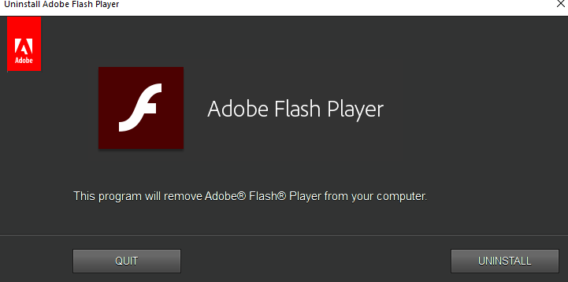
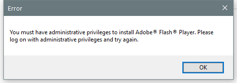

---
title: FlashUtil_ActiveX.exe | Adobe Flash Player Utility
excerpt: What is FlashUtil_ActiveX.exe?
---

# FlashUtil_ActiveX.exe 

* File Path: `C:\Windows\SysWOW64\Macromed\Flash\FlashUtil_ActiveX.exe`
* Description: Adobe Flash Player Utility

## Screenshot

## Hashes

Type | Hash
-- | --
MD5 | `E2E8BF8FDAD0E1BF988A6830BA8FD4EA`
SHA1 | `7E9E12588C2112F9EBAA27917686C057D78D160E`
SHA256 | `5DA7FE49B7F2F946F5E5D979BBCD0EBDC00FA52C76C0E931C09477B5C6B6FC65`
SHA384 | `0A652870BFE600D37DC18AA5383D88AC565D35C8F33D0CF53B14F7A980F43720A42F2657169B97EFE003C9D1AEE0FBDA`
SHA512 | `883B89E8BC17C219B4AA8AD08A6286AE10CC0D3DCF28EF8B6243D8DFD2C032CA140D411017AB683F34EE4B16F72B74DF035EB3AAF47486DEE31214647A151D69`
SSDEEP | `24576:6zcuarw+OoetMjwoNUTJE5HLaHh3NXYtVvMGNAOfBPCQgtkBfodSKfskl:6zd+detMjwcUTWo5KkGNA+CQikBfOSvc`
IMP | `828CF460486847D5A3B6F929569311D0`
PESHA1 | `FEB79662A5CE3F8308FA34E4CCA5D887347EC853`
PE256 | `E48862638EB63AAC2B3F5F20AA84C567DDB7854846FCA7268FA3967314C60B4E`

## Runtime Data

### Window Title:
Uninstall Adobe Flash Player

### Open Handles:

Path | Type
-- | --
(R-D)   C:\Windows\Fonts\StaticCache.dat | File
(RW-)   C:\Windows | File
(RW-)   C:\Windows\SysWOW64 | File
(RW-)   C:\Windows\WinSxS\x86_microsoft.windows.common-controls_6595b64144ccf1df_6.0.19041.488_none_11b1e5df2ffd8627 | File
\BaseNamedObjects\C:\*ProgramData\*Microsoft\*Windows\*Caches\*{6AF0698E-D558-4F6E-9B3C-3716689AF493}.2.ver0x0000000000000002.db | Section
\BaseNamedObjects\C:\*ProgramData\*Microsoft\*Windows\*Caches\*{DDF571F2-BE98-426D-8288-1A9A39C3FDA2}.2.ver0x0000000000000002.db | Section
\BaseNamedObjects\C:\*ProgramData\*Microsoft\*Windows\*Caches\*cversions.2 | Section
\BaseNamedObjects\NLS_CodePage_1252_3_2_0_0 | Section
\BaseNamedObjects\NLS_CodePage_437_3_2_0_0 | Section
\Sessions\1\BaseNamedObjects\windows_shell_global_counters | Section
\Sessions\1\Windows\Theme1175649999 | Section
\Windows\Theme601709542 | Section

### Loaded Modules:

Path |
-- |
C:\Windows\SYSTEM32\ntdll.dll |
C:\Windows\System32\wow64.dll |
C:\Windows\System32\wow64cpu.dll |
C:\Windows\System32\wow64win.dll |
C:\Windows\SysWOW64\Macromed\Flash\FlashUtil_ActiveX.exe |

## Signature

* Status: Signature verified.
* Serial: `330000008D391F9E635AAD4D5000000000008D`
* Thumbprint: `B8A71534F400FF263831F8FD44D22053A3F6857F`
* Issuer: CN=Microsoft Windows Third Party Component CA 2013, O=Microsoft Corporation, L=Redmond, S=Washington, C=US
* Subject: CN=Microsoft Windows Third Party Application Component, O=Microsoft Corporation, L=Redmond, S=Washington, C=US

## File Metadata

* Original Filename: FlashUtil.exe
* Product Name: Adobe Flash Player Utility
* Company Name: Adobe
* File Version: 32,0,0,445
* Product Version: 32,0,0,445
* Language: English (United States)
* Legal Copyright: Copyright  1996-2020 Adobe
* Machine Type: 32-bit

## File Scan

* VirusTotal Detections: 0/76
* VirusTotal Link: https://www.virustotal.com/gui/file/5da7fe49b7f2f946f5e5d979bbcd0ebdc00fa52c76c0e931c09477b5c6b6fc65/detection

MIT License. Copyright (c) 2020 Strontic.

